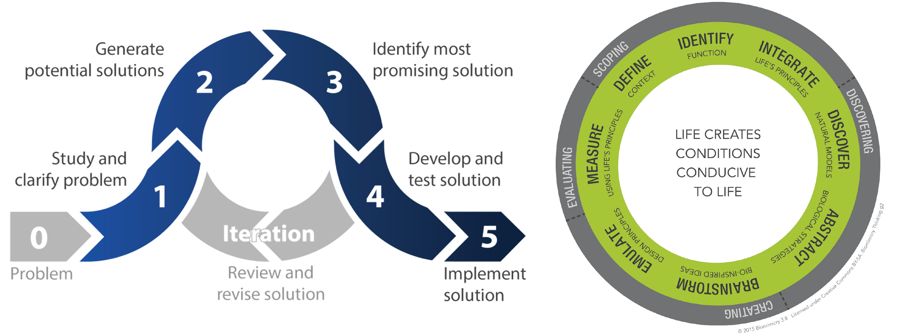

- toc
{:toc}
## Material Resources & Productivity

<<<<<<< HEAD
What is a supply chain?

**Supply chain** is a sequence of activities to the delivery of a product or service to the *end user*. Supply chain consists of resource gathering, manufacturing, etc.

### Material Consumption

From [module 1](module1), the individual consumption is increasing.
=======
### Cotton Clothing Supply Chain

The supply chain for cotton clothing consists of:

1. Fiber production: uses land, water, and energy
2. Spinning, weaving, and dyeing: uses water and energy
3. Cutting, sewing, and finishing: uses water, poor human health and labor practices
4. Distribution: energy use, and produce packaging
5. Retail: energy use
6. Use: water and energy use
7. End of life: ecotoxity from landfill, which leads to poorer health

`fill in notes here from friday`

The industrial products depends on natural resources. Natural resources are important source of income and jobs, provide ecosystem services, and necessary for human and economic development.

Amount of material extracted in 2010 is 72Gt, doubled since 1980. This is projected to 100Gt by 2030.

Material consumption is mostly construction materials (36%), fossil fuel (28%), and biomass for food and feed (20%).

### Decoupling Material Consumption

**Decoupling** of material resource means to increase GDP without increasing material consumption. The **dematerialization** requires:

1. Government level policies
   - Promoting life-cycle orientated approaches (Apple's LIAM)
   - Fees for use of resources (decrease incentive to over use)
   - Charges for environmental damage (decrease incentive to pollute)
   - Supporting longer product lifespans such as:
     - Increased legal minimum warranty periods
     - Right to repair
2. New business models based on process efficiencies.
3. Consumer awareness
>>>>>>> 163f64e... Added module 5 lesson 1-2

## Biomimicry in Engineering Design

**Biomimicry** is innovation inspired by nature. Biologist are stakeholders of the design and we look at nature to see how they solve the problems we're trying to solve.

Biomimicry design process is similar to the engineering design process ([from APSC 100](/documents)).

**Similarities**

- Both processes starts with studying the problem, defining the scope and context.
- Both has a brainstorming/idea generation phase.
- Both iterates (loops) to incrementally improve the design.
- Both has a testing phase (emulation step)

**Differences**

- An additional step for biomimicry design process (*discovery*) which involves studying the nature and abstracting its functions.
- There's a further evaluation phase for biomimicry design process.
- There seem to be lack of screening/selection (identify most promising solution) phase for biomimicry design process.

### Design Principles

There are six design principles that life on earth follows:

1. **Evolve to survive**: continuously improving performance through generations by replicating strategies that work, learn from mistakes, and has random mutation.
2. **Adapting to change**: responds to dynamic contexts by incorporating diversity, self renewal (healing), resilience through variation, redundancy, and decentralization.
3. **Locally attuned and responsive**: fit in by take advantage of repeating events, use abundant resources, use information feedback, and co-operate in win-win situations.
4. **Integrate development with growth**: invest in strategies that promote long term development and growth.
5. **Resource efficient**: minimize energy use
6. **Life-friendly chemistry**

.png)

### Consumer Products

Here are some of the consumer products that follow biomimicry: 

**Colored Fabric Without Dyes**

Chemical dyes require pigments from nature (natural resource usage), toxic, and require energy to process and apply. :face_with_head_bandage: Butterflies wings are to refract light that changes the wavelength of light, giving it colors.

**Mussel and Gecko Adhesion**

Glues lose their stickiness when wet. An adhesive can be made inspired from dry gecko feet and wet mussel adhesion. The end result works in both wet and dry conditions.

### Construction Products

Here are some of the construction products that follow biomimicry:

**Self-Healing Concrete**

Concrete is known to deteriorate over time. Self-healing concrete uses microfibers to fill in cracks. A chemical reaction occurs similar to ones found in seashells and renews the concreate strength.

## Industrial Ecology

## The Circular Economy & Construction Waste

## The Life-Cycle-Assessment Methodology