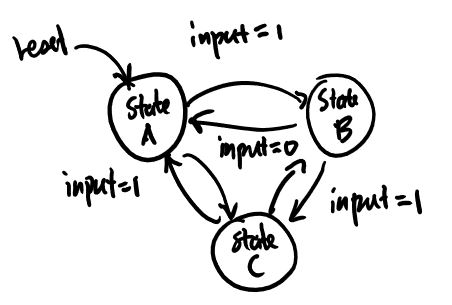

A **finite state machine** (FSM) is a system of circuit made up of sequential and combinational logic that has multiple states. The output of a FSM depends on the current input as well as the current state. This is a *Mealy* machine. If the FSM only depends on the current state, it is a *Moore* machine. [^fsm]

**State diagrams** are used to visualize and describe the behavior of a state machine. Each bubble is a state, which may also describe the output. The arrow between the bubbles are transitions. Alongside are the input condition for which the transition occur.



## Implementation

There are three parts to any FSM:


1. The next-state logic that takes current input and current state and determine what the next state should be.
2. The registers that holds the memory of the current state.
3. The output logic that takes current state (and current input sometimes) and produces an appropriate output.

In Verilog, it should look like:

```verilog
module FSM(...);

    // Use enumerations for states
    enum {
        INIT,
        // ...
    } current, next;

    // Combinational next state logic
    always_comb begin
        case (current)
            // Assign next state based on input and current state
        endcase
    end

    // Non blocking sequential logic
    always_ff @(posedge clk, negedge rst) begin
        current <= rst == 0 ? INIT : next;
    end

    // Combinational output logic
    always_comb begin
        // Logic for output here
    end
endmodule
```

(Note: this isn't proper Verilog and it won't synthesize)

[^fsm]: [https://en.wikipedia.org/wiki/Mealy_machine](https://en.wikipedia.org/wiki/Mealy_machine)
