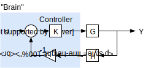
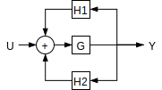

## Course Info

*Office Hour*: Thursday 14:00 - 16:00 KAIS 3026 [leos@ece.ubc.ca](mailto:leos@ece.ubc.ca)

## Introduction

### Systems Representation

Consider a ball getting hit:

- There is an impulse force ($$F\delta(t)$$) at the instance the ball is hit
- There is also a constant acceleration due to gravity ($$g\cdot u(t)$$ - gravity times unit step function in Laplace)

The position of the ball can be modelled as a system, which can be graphically represented as:

Where $$F\delta(t)$$ is the impulse force exerted on the ball, and $$g\cdot u(t)$$ is the constant downward gravitational acceleration. The gravitational acceleration is multiplied by the ball's mass $$m$$, and also multiplied by $$-1$$ for direction opposite of the impulse force. They are added together to form $$F'$$.

We then divide everything by $$m$$ to obtain the acceleration of the ball $$a$$, which equals to $$\dot v$$ or $$\ddot x$$. We integrate and get $$v=\dot x$$. We integrate again to get the position of the ball in time $$x$$.

This system is expressed mathematically as:

$$
x=\iint \frac{1}{m}(F\cdot\delta(t)-mg\cdot u(t))
$$

## Feedback Control

Feedback involves sampling or sensing the output and adding an input based on the output. As shown by the diagram below, the system $$G$$ not only does depend on the input $$U$$, but also depends on the reading from sensor $$H$$.

In this case, the **desired** value is given by $$U$$, the **actual** value is given by $$Y$$, and the **measured** value is the output of $$H$$. We take the difference of the desired value and the actual value to get the value needed to control the system $$G$$. When the measured value and the desired value is the same, 0 control will be fed into $$G$$, thus we expect 0 change to the output since we are already at the desired value.

### External Disturbances

External disturbances unintentional inputs that are modeled as inputs. These may be the random wind causing the flag to flap up and down, or turbulence in an airplane, etc.

Disturbances cannot be compensated without some form of feedback.

### Stability

Stability can only be one of two options: **Stable** or **Unstable**. When some system is unstable, it does not have a margin, the result will usually be *useless*. When the system is stable though, it could be **stable** or **marginally stable**.

For instance, a ball placed on peak of a hill is **marginally stable** because some force will cause it to become unstable (the ball will start rolling downhill, and the further away it is from the peak, the faster it moves away from it). On the other hand, a ball placed in a valley is **stable** because any nudge will have a opposing force trying to move it back to its stable position.

### Controller Design

The controller mainly handles the output of the feedback and the input of the system. It scales the output (i.e. voltage, etc.) based on the input (i.e. distance, voltage, etc.).

A PID Controller is an example of a controller that takes the *Proportional* gain, *Integral* gain, and *Derivative* gain, and outputs the control signal.

## Block Diagrams

Block diagrams are graphical representation of a system (Graphic Math). For example, the system with output $$Y(s)$$ equal to input $$U(s)$$ times the **transfer function** $$G(s)$$, $$Y(s)=G(s)U(s)$$ can be represented like this:

### Linear Time-Invariant (LTI)

**Linear**: linear systems support **superposition** of signals and **homogeneous** property.

**Superposition**: if $$Y_1=GU_1, Y_2=GU_2$$, then $$Y_1+Y_2=G(U_1+U_2)$$

**Homogeneous**: $$A\cdot Y = A\cdot GU$$

**Time-Invariant**: What matters in the system isn't changing with respect to time

These LTI properties essentially ensures that the *Laplace Transform* exists. These properties are also used to perform *block manipulation*.

### Laplace Transform

Put simply, Laplace transform makes solving problems easier by turning differentiation and integration into algebra.

General formula for Laplace Transform (single sided):

$$
F(s)=\mathcal{L}\{f(t)\}=\int_{0^-}^\infty{f(t)e^{-st}}\mathrm{d}t
$$

So we get some of these transforms:

The system transforms from time domain to complex frequency domain.

$$
Af(t)+Bg(t)\rightarrow AF(s)+BF(s)
$$

Differentiation becomes multiplication.

$$
\dot{f(t)}\rightarrow sF(s)-F(0)
$$

But since we are are taking the single sided Laplace transform that starts from 0-, $$F(0)$$ becomes 0 for convenience sake, so rewriting the above and we get:

$$
\dot{f(t)}\rightarrow sF(s)
$$

Integration becomes division.

$$
\int f(t) \mathrm d t \rightarrow \frac 1 s F(s)
$$

### Graphic Math

#### Multiplication

| Graphical                            | Mathematical                             |
| ------------------------------------ | ---------------------------------------- |
|  | $$Y=G_1\cdot U$$                           |
|  | $$Y=G_2G_1U = G_1G_2U$$ (LTI systems are commutative) |
|  | *same as above*                          |

#### Division

| Graphical                           | Mathematical            |
| ----------------------------------- | ----------------------- |
|  | $$Y=\frac 1 G_1 \cdot U$$ |

#### Addition

| Graphical                           | Mathematical                     |
| ----------------------------------- | -------------------------------- |
|  | $$Y=G_1\cdot U_1 + G_2 \cdot U_2$$ |

#### Pick-off Point

| Graphical                            | Mathematical                             |
| ------------------------------------ | ---------------------------------------- |
|  | $$Y=G_1\cdot U + G_2\cdot U = (G_1 + G_2)\cdot U$$ |

### Transfer Function

Transfer function is determined by taking the output and divided by input ($$\frac Y U$$). If the transfer function of a system is known, the output of the system can be determined easily by multiplying the transfer function by the input.

In the last example from the table in [Pick off point](#pick-off-point), the transfer function is $$\frac Y U = G_1 + G_2$$. 

> **Example**: find transfer function, and draw a equivalent block diagram
>
> 
>
> To find the transfer function, we first label the **hidden / internal signals**, and then write the mathematical representation.
>
> 
>
> Here, the error is $$e=U-x$$, the measured value is $$x=H\cdot Y$$, and the actual output is $$Y=G\cdot e$$
>
> We substitute the expressions into each other, and we get $$Y=G(U-H\cdot Y)$$. We can then rearrange to find the transfer function. The transfer function of this generic feedback system is:
> $$
> \frac Y U = \frac G {1+GH}
> $$
>
> The equivalent block diagram is:
>
> 

> **Example**: find the transfer function
>
> 
>
> In this example, the system is identical to the general feedback system described above. Except with $$G=1$$. Thus finding the transfer function only requires substituting $$G$$ with 1.
>
> Thus the transfer function for this system is $$\frac Y U = \frac 1 {1 + H}$$.

> **Example**: find the transfer function
>
> 
>
> The transfer function is $$\frac{V_o}{V_i}$$ which can be determined by calculating $$V_o$$ (as a voltage divider).

## Block Diagram Manipulation

Block diagrams elements such as blocks, signals, summing junctions, and pickoff points may be moved around to make representation or computation easier.

### Manipulation in the Same Node
Consider the block diagram representation below, find the transfer function

To help visualizing, we may move the block $$H_1​$$ around and split the summing junction into two. From here, we can think of the two feedback blocks as a single $$H_1 + H_2​$$ block. So we use the formula for feedback system, but plug in $$H_1+H_2​$$ for $$H​$$ and we get $$\frac Y U = \frac G {1+G(H_1 + H_2)}​$$.

Alternatively, we can also think of it as a nested feedback loops. So we would apply the feedback formula for $$H_1$$, then treat that term as a block and use the feedback formula again. The result would be the same as above.

### Manipulation Across Blocks

#### Summing Junctions

The block diagram above can be modified to become:

But we have to multiply $$U_2$$ by $$G$$. This is equivalent to the distributive property:

$$
Y=G\cdot(U_1 +U_2 )\rightarrow Y=G\cdot U_1 + G\cdot U_2
$$

Usually it's nicer to move summing junctions **to the right** since the "fix" only involves multiplication instead of division.

#### Pickoff Points

The block diagram above can be modified to become:

The same logic follows. But generally it's nicer to move pickoff points **to the left** to void division blocks.