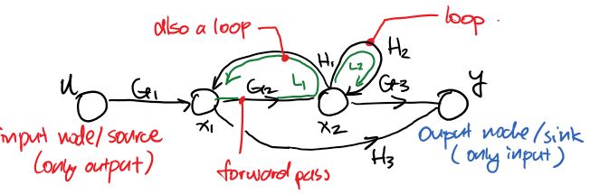
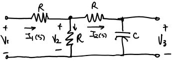

## Signal Flow Graphs

Block diagrams can be represented as signal flow graphs. Signals *flows* from left to right, hence the name. Each signal in the system is represented by a **node**. 

Here is an example of a SFG:

The arrow pointing to the right represents **Forward Path**, and the *gain* is the multiplication of the functions such as $$G_1$$ in order to get somewhere. (The *forward path gain* from $$u\rightarrow y=G_1G_2G_3$$, the *forward path gain* from $$x_1\rightarrow y=\{G_2G_3,H_3\}$$)

**Non-Touching Loops** are set of loops that do not share any common node. 

### Algorithm

The algorithm to drawing a signal flow graph is as follows.

1. Identify all the signals including the input signal and the output signal
2. Identify all relationship of the signals as equations
3. Draw all signals in a row as nodes
4. Connect the nodes with arrows; draw arrows merge into the same node for *summing junction*; draw arrows branch from the same node for *pickoff points*
5. Label the connection with its corresponding coefficient (gain) in the equation

The following steps are option, tedious, but is needed later on to find the transfer function of the entire system.

6. Identify all possible *forward paths*
7. Write down the *forward path gains* for each path; the coefficient (gain) for each connection multiplies
8. Identify any loops in the graph and label them
9. Write down the *loop gains* using the same method for *forward path gains* 
10. Write down any *non-touching loop* combinations

> **Example**: expressing a circuit as a SFG
>
> 
>
> First, we need to specify the relationship between all the signals (voltage and current):
> $$
> I_1=\frac{V_1-V_2}{R}\qquad V_2=V_1-I_1R=(I_1-I_2)R\\
> I_2=I_1-\frac{V_2}{R}\qquad V_3=V_2-I_2R=\frac{I_2}{sC}
> $$
> So we have five signals nodes: $$I_1, I_2, V_1, V_2, V_3$$ with $$V_1$$ being the input and $$V_3$$ being the output.
>
> We draw the SFG using the algorithm described above.
>
> 
>
> *Note that the equations we wrote down is not unique, thus the SFG is also not unique. But the resulting transfer function is unique*.
>
> We identify 3 loops:
> $$
> L_1=R(\frac 1 R)=-1\qquad L2=-R(\frac 1 R)=-1\qquad L_3=(\frac{1}{sC})(-\frac1 R)=\frac{-1}{RCs}
> $$
> We identify 1 pair of non-touching loops:
> $$
> L_1 \text{ and } L_2
> $$
> We identify 1 forward path:
> $$
> P=(\frac 1 R)(R)(\frac 1 R)(\frac 1 {sC})=\frac{1}{RCs}
> $$
>

## Mason's Gain Formula

The mason's gain formula is used to compute the **transfer function** from SFGs. 
$$
T=\frac{\displaystyle\sum_{k=1}^K\left(P_k\Delta_k\right)}{\Delta}
$$

- $$P_k$$ is the gain of $$k^{\text{th}}$$ path

- $$\Delta$$ is the determinant of the entire graph
  $$
  \Delta=1-\sum_{n=1}^NL_n+\sum_{n,m \text{ non-touching}}L_nL_m-\sum_{n,m,p\text{ non-touching}}L_nL_mL_p+\dotsc
  $$

- $$\Delta_k$$ is $$\Delta$$ with out all the loops touching $$k^{\text{th}}$$ path (setting those loops to 0)

> **Example**:
>
> Consider 7 loops, and $$L_1, L_2, L_3$$ are non-touching. Then
> $$
> \Delta = 1-(L_1+L_2+L_3+\dotsc+L_7)+[(L_1L_2)+(L_1L_3)+(L_2L_3)]-(L_1L_2L_3)
> $$
>

> **Example**: determinant practice
>
> 
>
> Paths:
>
> 1. $$P_1=G_1G_2G_3G_4$$
> 2. $$P_2=G_5G_6G_7G_8$$
>
> Loops:
>
> 1. $$L_1=G_2H_2$$
> 2. $$L_2=G_3H_3$$
> 3. $$L_3=G_6H_6$$
> 4. $$L_4=G_7H_7$$
>
> Non-touching Loops:
>
> - $$L_1$$ & $$L_3$$
> - $$L_2$$ & $$L_3$$
> - $$L_1$$ & $$L_4$$
> - $$L_2$$ & $$L_4$$
>
> $$
> \Delta=1-(L_1+L_2+L_3+L_4)+[(L_1L_3)+(L_2L_3)+(L_1L_4)+(L_2L_4)]
> $$
>
> $$
> \Delta_1=\Delta|_{L_1=0, L_2=0}=1-(L_3+L_4)\\
> \Delta_2=\Delta|_{L_3=0, L_4=0}=1-(L_1+L_2)
> $$
>

