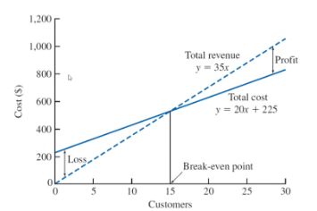
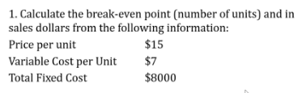
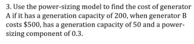
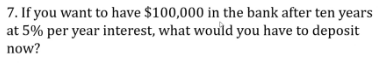
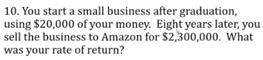
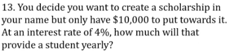
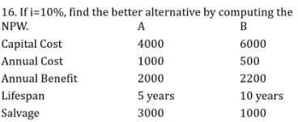

- toc
{:toc}

# Conference 5

## Agenda

- Midterm is take home: coming this weekend
  - Any software or tool is allowed (open book)
  - No collaboration
- Thesis is being looked at right now

## Midterm Review

### Engineering Costs

- **Fixed costs/benefit**: unchanging
- **Variable costs/benefit**: function of output
- **Marginal costs/benefit**: variable cost/benefit for one more unit
- **Average costs/benefit**: total divided by output
- **Break-even point**: level of output such that cost == revenue
- **Sunk costs**: :moneybag: spent and non-recoverable
- **Opportunity costs**: cost associated with resources being used for an alternative task
- **Incremental cost**: cost between alternatives

### Cost Models

"Basically what generates these lines":

- Know how to make a model (cost and revenue)
- Understand the graph
- Understand the regions

> **Practice**: break even
>
> 
>
> The marginal revenue is \$8 per unit, so the break even point is 1000 units.

#### Cost Indexes

Know how to calculate cost given how it change historically as a ration relationship.

$$
\frac{\text{Cost at }t_1}{\text{Cost at }t_2}=\frac{\text{Index value at }t_1}{\text{Index value at }t_2}
$$

> **Practice**: cost indexes
>
> 
>
> Plug in into the cost index formula and we get \$25518.35

#### Power Sizing Model

$$
\frac{\text{Cost of A}}{\text{Cost of B}}=\left(\frac{\text{Size (capacity) of A}}{\text{Size (capacity) of B}}\right)^x
$$

> **Practice**:
>
> 

#### Learning Curve

Productivity increases over time/repetition.

$$
T_N=T_0 \times N^b\\
\text{LC exponent}=\frac{\log(\text{LC percentage})}{\log2.0}, \qquad \text{LC percentage}=2^{\text{LC exponent}}
$$

> **Practice**:
>
> 

### Cashflow Diagrams

- Know how to create a cashflow diagram
- They start at time 0 (now)
- Cashflow usually due at the end of the period (unless otherwise specified **annuity due**)
- Costs are negative, incomes are positive

### Effective Interest Rate

- Know how to convert between nominal, yearly, and effective yearly rate.
- Effective monthly rate ($$i$$): $$i=\frac rm$$
- Effective yearly rate ($$i$$): $$i=(1+\frac rm)^m -1$$

> **Practice**:
>
> 
>
> Answer: 5.12% annually and 0.0962% weekly.

> **Practice**:
>
> 
>
> Answer: Nominal annual rate is $$1.5\%\times12$$ compounded monthly. The effective annual interest rate is 19.6%.

> **Practice**:
>
> 
>
> Answer: \$61,391

> **Practice**: uniform series
>
> 
>
> Answer: \$20,742

> **Practice**:
>
> 
>
> Answer: Use *capital recovery factor*

> **Practice:**
>
> 
>
> Answer: Use single compound payment, 80.96 (which is $$i$$)

> **Practice:**
>
> 
>
> Answer: this is a geometric series \$31,818

> **Practice:**
>
> 
>
> Answer: note **annuity due** and we are looking for the annuity, so we divide by the term $$(1+i)$$; find $$A$$ via $$(A/P, n, i)$$, which gives us

> **Practice**:
>
> 
>
> Answer: perpetuity, \$400 each year.

> **Practice**:
>
> 
>
> Answer: \$166,666 + \$1M for the initial capital cost
>
> Note: in certain cases, there might be overhaul, so we need to figure out the annuity for the future overhaul and convert that into the perpetual amount.

> **Practice**:
>
> 
>
> Answer: we need to make sure the analysis period is the same. Here it is convenient to use the LCM. Assumption is replacement placements for those that "die" out early.
>
> For set A, we replace it at year 0, 3, 6, 9; set B at year 0, 4, 8, and set C just at year 0. The net worth for A, B, C is \$, \$, \$24.
>
> **Alternative** way is to calculate the EACF because they are repeatable purchases.

> **Practice**:
>
> 
>
> Answer: B (higher NPW and higher internal rate of return (IRR))

*Practice 17 does not exist*

> **Practice**:
>
> 
>
> Answer: calculate incremental rate of return; incremental IRR of 14.3%

---

Answer key:

## Questions

**Q: In ASN 2, should we buy the machine for 8 or the full 10 years?**

> You could buy for only 8 years and do something else for the last 2 years.

**Q: Thesis outline example?**

> No, closest thing is the table of content from previous years.

**Q: In ASN 2, is the 19% annual MARR nominal or effective?**

> Should be 19% nominal compounded annually. So monthly rate would be 19% divided by 12.

**Q: For assignment 2 question 3 did we have to solve it monthly, or could we take yearly cashflows?**

> One can do it annually, but it's tricky because there would be mid-period payments

