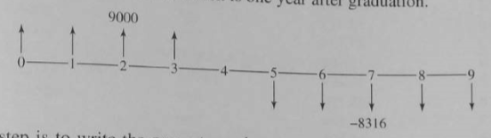

- toc
{:toc}

# Rate of Return Analysis

**Rate of return** is widely used in the industry and communicates desirability. For rate of return analysis, no interest rate is introduced as we compute the rate of return from the cashflow instead. The calculated rate of return is compared to the preselected **minimum attractive rate of return** (MARR). MARR will be the same value of $$i​$$ used for present worth and EACF analysis.

## Internal Rate of Return

### Definitions

**Internal rate of return** is the interest rate at which the [present worth](https://www.muchen.ca/documents/MECH431/l8) and [equivalent uniform annual worth](https://www.muchen.ca/documents/MECH431/l9) equal to 0. (present worth of :chart_with_upwards_trend: benefits equals to the present worth of the :chart_with_downwards_trend: costs)

$$
\begin{equation}
\text{PW of benefit}-\text{PW of costs}=0\\
\frac{\text{PW of benefit}}{\text{PW of costs}}=1\\
\text{PW}=\text{NPW}=0\\
\text{EUAW}=\text{EUAB}-\text{EUAC}=0\\
\end{equation}
$$

### Calculating Rate of Return

To calculate rate of return, convert various consequences into cash flow series, then solve for the unknown value of IRR $$i$$.

> **Example**: textbook example 7-1
>
> *Want to invest \$5000 each year for 40 years. What is $$i$$ if we want to have final value of \$1M?*
>
> ---
>
> Start with the definition that net present worth (which implies net future worth) is 0.
>
> $$
> \begin{aligned}
> 5000(F/A, i, 40)&=1\,000\,000\\
> (F/A, i, 40)&=200\\
> \implies i&=0.07
> \end{aligned}
> $$
>

> **Example**: textbook example 7-3
>
> *Borrows \$9000 a year for 4 years at the beginning of each year. At fifth year we need to pay back everything at 5% interest rate in 5 years. Find annual pay back amount and IRR.*
>
> ---
>
> Cash flow diagram:
>
> 
>
> Notice that the first \$9000 income comes at the beginning of year 1. The present worth of benefits is solely from the first four years. It is given as $$9000+9000(P/A,i, 3)$$.
>
> At the end of 4th year, we owe \$36,000. Then we use *capital recovery factor* to find the equal annual payments for for year 5 and beyond at 5% interest rate:
>
> $$
> A=36\,000(A/P,5\%,5)=\$8315
> $$
>
> Note that this $$A$$ only applies from year 5+. The "present worth" of all these payments at year 5 is given as $$8315(P/A, i, 5)$$. Then we have to treat it as future value and find the true present worth at the beginning by using the *present worth factor* $$(P/F, i, 4)$$.
>
> Now we write the present worth equation such that it equals to 0:
>
> $$
> \text{PW}(i)=\underbrace{9000+9000(P/A,i, 3)}_\text{benefit}-\underbrace{8315(P/A, i, 5)(P/F, i, 4)}_\text{cost}
> $$
>
> We setup two end points of $$i$$ and compute the present worth. First try $$i=0\%$$, then try $$i=3\%$$. Plugging into the equation above and we get $$\text{PW}(0)=-5180$$ and $$\text{PW}(2\%)=620.5$$.
>
> Using this we can plot PW vs interest rate $$i$$ and we get a line. The interest at which the NPW is 0 is the $$i$$ we are looking for, which is the IRR.
>
> > **Note** that the NPW vs. $$i$$ relationship is **not** linear, but gives an approximation.

`WIP: Missing Modified Rate of Return Analysis`
