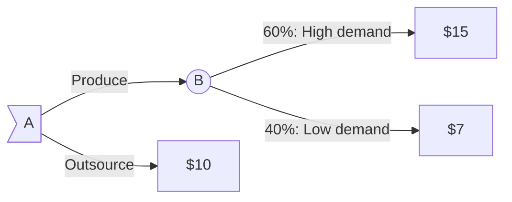

- toc
{:toc}

# Risk Analysis II

## Decision Tree

A **decision tree** is a logical structure of a problem in terms fo the sequences of decisions and outcomes of chances events. It visualizes possible paths for each outcome.

### Analysis Procedure

#### 1. Create Decision Tree

Suppose we're producing memes, we can choose to either outsource the production or produce it in-house. If outsource, then the expected profit/unit is \$10. Else then we have two cases: 40% low demand, which yields \$7 profit/unit or 60% high demand for \$15 profit/unit.

We draw the decision tree, and it looks like this:

Where **[A]** is a **decision node** and **(B)** is a **chance node**. The square nodes are outcome nodes.

#### 2. Roll Back

This is a back track step where we compute the expected value of the outcomes at each *chance node*. Then select the best option (best expected value fo outcomes) at each *decision node*.

Repeat this process until we reach the root node.

#### 3. Complete Analysis

Whiel rolling back, when we reach a *decision node*, we should eliminate the decisions that has a lower expected value.

At the end, we have conditional decisions optimized based on the outcome of the *chance nodes*.

## Simulation

`WIP`

