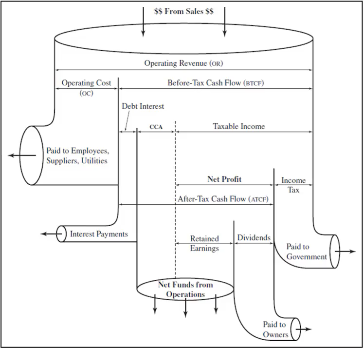

- toc
{:toc}

# Taxes

In Canada, governments levy taxes on individuals and businesses.

**Types of taxes**

- Income tax - taxes based on income (see [income tax](#Income-Tax))
- Sales tax - on purchases of products
- Property/wealth tax - tax based on the property one owns
- Tarrifs are taxes on specific imported goods with specific rates
  - They are to protect local businesses or restricting practices in the importing contries.
- Other (carbon tax, etc.)

There is a dfiferent between personal tax and corporate tax.

Taxes are fundings for the government:

- Federal
  - National defense
- Provincial
  - Education
  - Health care
  - Social assistence
- Municipal
  - Infrastructure
  - Police and fire departments
  - Municipal waste

## Income Tax

Income taxes are important in economic analysis because they directly affect the benefits received by an individual or corporation (reduces profits).

**Personal income tax** are based on gross income, where tax rate is larger for higher income level. Tax credits come from uitition, rRSP, which reduce tax payable.

**Corporate income tax** are based on net income (income minus expense). The tax rate is flat and vary on the size of the corporation.

### Calculating Income Tax

**For individuals:**

- Has federal and provincial components.
- **Average tax rate** is total taxes payable divided by taxable income.
- **Marginal tax rate** ($$t$$) is the tax rate for the next taxable dollar. This is the change in tax depending on income level.

Note that the higher tax rate in higher income brackets only gets applied to the extra income earned in that bracket. The rest will follow the tax rate in lower brackets.

**For corporates**:

- Also subject to federal and provincial taxes (10% federal and 2% (BC) for small businesses)
- Small Business Deductions apply to small companies and give tax credits
- *Income* refers to amount before tax; *profit* refers amount after tax

## Income Statement

The **operating revenue** is the money that comes from business's operating income. This does not include moeny borrowed or money from selling assets.

The **operating costs** is the cost to the ongoing business operations. Paying off a loan, repurchasing equity, payinf dividents are not included (non-operating costs).

<mark>**Before-tax cash flow (BTCF)**</mark> is $$OR-OC$$, which is our income.

Other legitamate business expenses such as **CCA**, the depreciation expense and **debt** interest is subtracted from our income. The result is <mark>**taxable income**</mark>.

**Income tax** is the taxable income times **tax rate**.

Subtracting income tax from taxable income, we get our **net profit**. Notice that we have CCA (a book cost) in the net profit expression. Net profit is not the same as cash!

If the CCA is large, we may get a negative net profit (even if the actual cash flow is positive). Generally government requires the CCA to be held on to until later time when income is large enough so net profit is not negative.

The <mark>**after tax cash flows (ATCF)**</mark> is taking BTCF and subtracting the income tax.

Recall **dividends** are a share of profits paid to the shareholders of the business.

The **Net cash from opertions (NCfO)** is the money back to operate the business.

**Working capital** is the money into an operating to cover the time lag between selling an asset and getting the cash for it. Working capital could be internal funds, line of credit, inventory, etc. Working capital does not gain value nor does it deprecaite in value during the project.

### Calculating After-Tax Cash Flows

Generally, calculating ATCF is straight forward: ATCF of operating revenue and cost is simply operating revenue, subtracting operating cost and the income tax. However, it is a bit trickier when accounting for capital costs, hence *capital tax factor*.

#### Capital Tax Factor

**Capital tax factor** is for calculating the *present value* of the net capital investment with some CCA.

$$
PV=B-\underbrace{B\left(\frac{td}{i+d}\right)\left(\frac{1+\frac{i}{2}}{1+i}\right)}_\text{PW of tax shield}
$$

Where $$B$$ is the capital cost of asset (cost basis), $$d$$ is the CCA rate for the specified asset class, $$t$$ is the marginal tax rate, and $$i$$ is the discount/interest rate.

### Disposing of Assets

#### Books-Open Assumption

Any difference between book value and actual salvage value is left in the CCA balance. They continue to deprecaite even though the asset is already sold.

`WIP`

#### Books-Closed Assumption

Calculate the recaptured CCA (tax must be paid) or loss (tax credit received) and apply it to the year's income statement.

We can find the net salvage value (NSV) of the asset:

$$
\text{NSV}=S+\text{DTE}
$$

and the *disposal tax effect* is the based on the difference between the existing book value and the salvage value.

$$
\text{DTE}=t(B_d-S)
$$

Where $$t$$ is the marginal tax rate and $$B_d$$ is the book value ($$\text{UCC}$$) at disposal.

Note that NSV occurs in the year where it's disposed, so we need to convert it to present value if we are considering present worth analysis.

`WIP`

**Exception:**

Capital cost recovery on teh full ammount that's deprecaited and pay tax rarte on a differnet rate.

