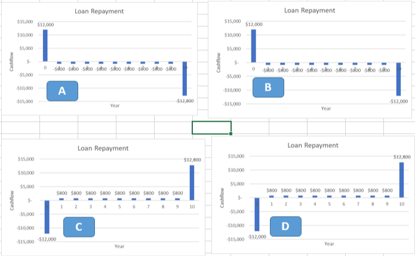
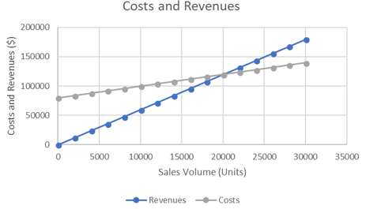

- toc
{:toc}

# Lesson 3 Practice Problems

## Question 1

Which cashflow diagram represents the following loan?

- Borrow \$12,000, and repay it over 10 years with the following schedule:Interest payments of \$800 per year
- At the end of the loan, repay the principle in its entirety.

> **Answer:** A

## Question 2

Based on the following chart, identify the fixed costs and break-even point for this manufacturer.

> **Answer:** Fixed cost: $80000 Break even: 20,000 units

## Question 3

Which of the following backup power options has the cheapest lifecycle costs?

Assume all will operate for 20 years, and a each time maintenance is required, there is a cost of $500 to service the equipment.

The salvage value is the money received when we sell the asset at the end of its life.

|  | Purchase Price      | Maintenance | Salvage value |
| ------------------- | ----------- | ------------- | ------ |
| Diesel Generator    | $$4,000      \vert  Monthly       \vert  $$1,000 |
| Battery UPS         | $$12,000     \vert  Semi-annual   \vert  $$2,000 |
| Fuel Cell Generator | $$15,000     \vert  Annual        \vert  $$2,000 |

> **Answer:**
>
> Total cost for diesel generator: 123k
>
> Total cost for UPS: 30k
>
> Total cost for fuel cell generator: 23k
>
> Thus the best option would be the **fuel cell generator**.

## Question 4

You purchase a data plan for your phone that provides 5 GB of data free per month, with a charge of \$20 per GB for each GB you go over the limit. You pay \$50 per month for this plan.

Assuming you use your full 5GB allotment per month, but do not go over, what is your average and marginal cost per GB? (for example, if you've used 3GB of data so far this month, what is the marginal cost of using one more GB?)

> **Answer:**
>
> One of the *hard*-constraints assumed in the question is that we will not go over the limit. So once we used 5GB, the marginal cost is \$0/GB.
>
> The average cost is then $$\$$50\div 5=$$10/GB.

## Question 5

You are adding a second line at a bakery to expand production. You know it takes some time to work out the kinks in the process, and based on past experience your learning curve percentage is 98%. If the first batch of bread takes 240 minutes to produce, how long would you estimate the 500th batch to take?

> **Answer:**
>
> Recall the learning-curve percentage formula: $$T_N=T_0 \times N^b$$, where $$b=\frac{\log(\text{LC percentage})}{\log2.0}$$.
>
> Plugging in the numbers:
>
> $$
> \begin{align}
> T_{500}&=240\times 500^{\frac{\log{(0.98)}}{\log(2.0)}}\\
> &=\boxed{200 \text{ minutes}}
> \end{align}
> $$
>
