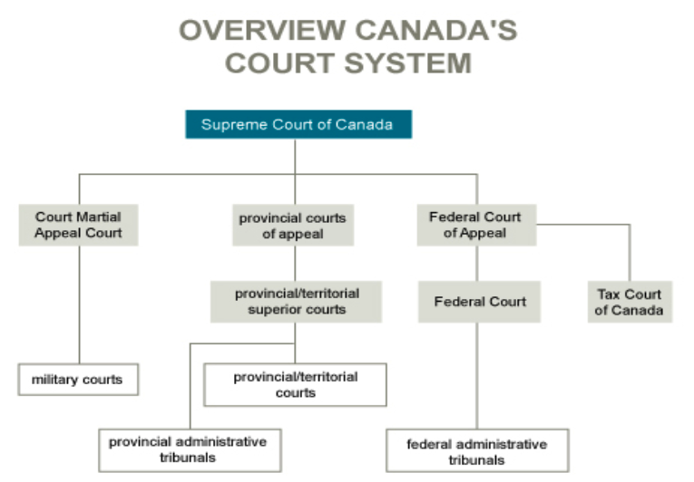

## Canadian Legal System

**Common laws** are judge made laws based on precedent and is practiced across Canada. **Civil law** are codified law practiced in Quebec.

Three levels of government that enacts law:

- **Federal** government affects the whole country (responsibility set in the *Constitution Act of 1867*)
- **Provincial** governments affect provincial education, health carea and some natural resources and infrastructure regulations (responsbility set in the *Constitution Act of 1867*)
- **Municipal** goverments receive authority from provincial governments.

Laws are made when parliament and provincial legislature pass *legislations*. The judiciary is a series of independent courts that interpret the laws.

### Canadian Courts

Court decisions are **jurisprudence** (***Stare Decisis***,  fundamental principle of precedent law). Laws are **binding** to when it is set by the higher level court (vertical). E.g. Supreme Court of Canada to all other courts, or provincial superior courts to provincial courts.

Decisions from different jurisdictions (horizontal) can be **persuasive** but not binding. E.g. decisions from a court of appeal in BC could only be **persuasive** to a court of appeal in Alberta.

Legislations can enact laws that supercede jurisprudence if it complies with *Canadian Charter of Rights and Freedom*; the judiciary interprets whether or not it complies.

**Tribunals** (board, agencies, associations) are for administrative laws to regulate highly specialized activities. Members of tribunals are not judges but practitioners and thus tribunals are not part of the court system. EGBC is a tribunal.

## Whistleblowing

**Whistleblowing** is release of information by a member of an organization not conducting in the public interest (immorally or illegally). 

- Must be information or evidence of misconduct
- Must be released outside normal channels of communication of the organization
- Must be done voluntarily
- Must be undertaken as a moral protest

Whistleblowing is a conflict between moral + public interest vs. loyalty, interest of the organization, protection of sensitive information, and employee’s consequences.

### Types

- **Internal**: when employees skip the immediate supervisor and release information to company CEO or board of directors.
- **External**: when employee reports the percived wrong-doing to journalists, outside-expert, or law-enforcements.

### Justifications

Whistleblowers must have clear **first-hand** knowledge of the misconduct and **relevant expertise**. It is justified when employee has exhausted all other options and internal communications.

# Quiz

- Whistleblowing is justified when the matter is important, the whistleblower has clear and first-hand knowledge of the violation, and all other actions within the power of the whistleblower to prevent the violation have been exhausted.
- One party to a claim may ask a higher level of court to review the outcome of their case.
- Binding decisions from a higher court must be followed by all lower courts without exception.
- A decision made by one jurisdiction may not be binding on another jurisdiction’s court of the same or lower level.
- Employee reporting to their company’s board of directors is an example of internal whistleblowing.
- One’s rights about their stolen properties are enforced under civil law. The punishment for the one who stole are enforced under criminal law.
- Whistleblowing is a duty for engineering professionals because they are supposed to sacrifise self-interest for public interest or the profession.
- Canada’s federal constitution is set out in the *Constitution Act of 1867*.
- A judge must follow the rulings of a similar case if the case is from a higher court of the same jurisdiction.
- Decisions of the Supreme Court of Canada are binding on all levels.
- When an engineer contravened ethics, the EGBA discipline committee is referred.

