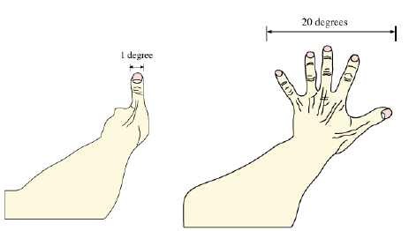

## Units

Units are used to standardize quantitative measurements. In this course we mostly use **mks** (meter, kilogram, seconds) system although **cgs** (centimeter, gram, seconds) is also common in astronomy as it makes Maxwell’s equations simpler.

### Light-Year

Light-year is a derived unit which describes a distance a beam of light travels in one year. The duration of a year is derived from the *Julian year* which is exactly 365&frac14; days. Light speed “C”, is a physical constant, and is exactly 2.99792&times;108 m/s. Therefore, a light year is exactly:
$$
\begin{aligned}
ly&=C\times365.25{\text{d}}\times24{\text{h/d}}\times60{\text{m/h}}\times 60 {\text{s/m}}\\
&=(2.99792\times10^8{\text{m/s}})\times(3.15576\times 10^7{\text{s}})\\
&=9.46072\times10^{15}\text{m}
\end{aligned}
$$

### Degrees, Arcminute, and Arcsecond

We can estimate angle in our field of view by extending our arms straight out and using the fingers as reference.

In a full revolution of a 2D circle, there are 360 degrees. In each single degree, there are 60 arcminutes. In each arcminute, there are 60 arcseconds.

