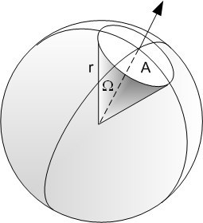
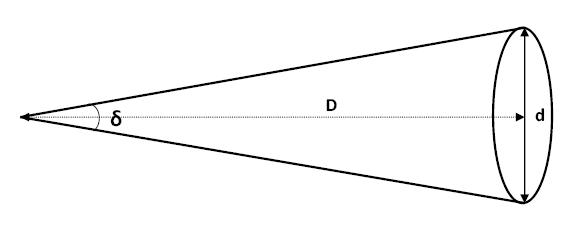

# Angles

In a full revolution there are 360 degrees. For each 1 degrees, there is 60 arc minutes, and for each arc minute, there is 60 arc seconds. Therefore, there are 3600 arcseconds in 1 degrees, or 1,296,000 arcseconds in a full revolution.

## Solid Angles

Solid angle is an “angular area” specified by 2 dimensions that describe an area that occupies a spherical view. Suppose we’re standing inside a sphere with radius $r$, and looking at an area $A$ on the surface of the sphere, then the solid angle $\Omega$ occupied by $A$ will be $A\over r^2$. Note that $r$ is not to be confused with radius of the circle of area $A$.

The unit for solid angles is *steradians*. It is also possible to specify solid angles with *square degrees*, *square arcminutes*, and *square arcseconds*.

> Given that the surface area of a sphere is $4\pi r^2$, then the solid angle that covers the entire sphere is therefore $4\pi$.

## Small Angle Approximation

If a given angle &theta; is very small, then there is very little practical difference between the *opposite* edge length of the angle versus the opposite arclength.

$$
\theta={c \over r}\approx \arctan\left({d\over l}\right)
$$

## Angular Diameter

Angular diameter $\delta$ is the one-dimensional angle that covers a specific diameter $d$ with $D$ distance away.

$$
\delta_\text{rad}=\frac{d}{D}
$$

> What is the angular diameter of an object 1,000km across, 10,000,000 km away?
>
> In radians:
> $$
> \delta=\frac{d}{D}=0.0001
> $$
> In arcseconds:
> $$
> \delta = 0.0001\times\left(\frac{180\deg}{\pi}\right)\left(\frac{3600"}{1\deg}\right)=20.6"
> $$
> To calculate solid angle, recall that the solid angle is given by the area of the object seen divided by the distance to the object squared.
>
> $$
> \Omega=\frac A {D^2}=\frac{\pi\left(\frac{1000\text{km}}{2}\right)^2}{(1\times10^7)^2}=7.85\times10^{-9}\text{sr}
> $$
>
> We obtain 7.85&times;10-9 steradians (sr). Because solid angle is a two-dimensional unit, when we convert between steradians to square degrees or square arcseconds, etc. we need to square all the conversion factors.
>
> The solid angle in square arcseconds is given by:
>
> $$
> \Omega_{\text{arcsec}^2}=\Omega\times\left(\frac{360\text{deg}}{2\pi}\right)^2\times(60\text{'/deg}\times60\text{"/'})^2
> $$
>
> Using this conversion, we get 334 square arcseconds.

