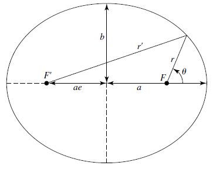
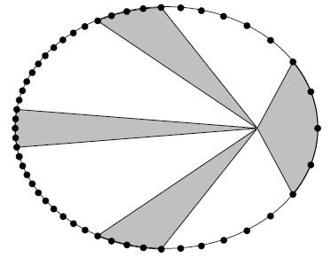

## Kepler’s Three Laws

Kepler’s three laws are descriptions based on physical observations and can be used to predict. 

### Law 1: Law of Ellipses

Planets travel on elliptical orbits around the sun, where the sun is located at one focus of the ellipse.

#### Properties of an Eclipse

- $a$ is the semimajor axis (long axis).
- $b$ is the semiminor axis (short axis).
- $e$ (0&leq; $e$ &leq; 1) is the eccentricity, the fractional distance of teh foci to the geometric center. 
- $r$ and $r'$ are the distances from the two foci to a point on the ellipse. $r+r'$ is always constant (definition of an ellipse).
- $F$ and $F'$ are the two foci, $F$ being the principal focus.
- **Perihelion** is the point on the ellipse closes to the principal focus.
- **Aphelion** is the point on the ellipse farthest from the principal focus.

In cartesian, the ellipse is given by:

$$
\frac{x^2}{a^2}+\frac{y^2}{b^2}=1
$$

An eclipse is also defined by a set of points that satisfies the equation
$$
r+r'=2a
$$
If $r=r’$, then using Pythagorean theorem, we can derive:
$$
b^2=a^2(1-e^2)
$$

### Law 2: Law of Equal Areas

A line connecting a planet to the sun sweeps out equal area in equal time interval, regardless of planet’s position. Thus the second law also implies that planet’s orbital speed depends on its loaction.
$$
r=\frac{a(1-e^2)}{1+e\cos\theta}
$$
The area of the ellipse is:
$$
A=\pi ab = \pi a^2 e
$$

### Law 3: The Harmonic Law

The harmonic law is given by:
$$
P^2=a^3
$$
Where $P$ is the orbit period of the planet in years, and $a$ is the average distance / average orbital altitude of the planet from the sun measured in *astronomical unit* (AU).