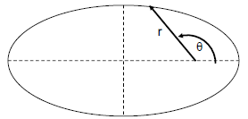
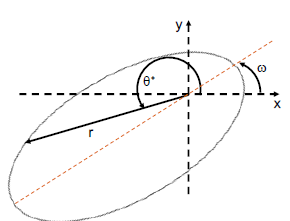
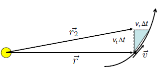

## Kepler’s Three Laws

Kepler’s three laws are descriptions based on physical observations and can be used to predict. 

### Law 1: Law of Ellipses

Planets travel on elliptical orbits around the sun, where the sun is located at one focus of the ellipse.

### Law 2: Law of Equal Areas

A line connecting a planet to the sun sweeps out equal area in equal time interval, regardless of planet’s position. Thus the second law also implies that planet’s orbital speed depends on its location.

### Law 3: The Harmonic Law

The harmonic law is given by:
$$
P^2=a^3
$$
Where $P$ is the orbit period of the planet in years, and $a$ is the average distance / average orbital altitude of the planet from the sun measured in *astronomical unit* (AU).

## Ellipses

### Properties of an Eclipse

In cartesian, the ellipse is given by:
$$
\frac{x^2}{a^2}+\frac{y^2}{b^2}=1
$$
An eclipse is also defined by a set of points that satisfies the equation
$$
r+r'=2a
$$

- $a$ is the semimajor axis (long axis).
- $b$ is the semi-minor axis (short axis).
- $e$ (0&leq; $e$ &leq; 1) is the eccentricity, the fractional distance of the foci to the geometric center. 
- $r$ and $r'$ are the distances from the two foci to a point on the ellipse. $r+r'$ is always constant (definition of an ellipse).
- $F$ and $F'$ are the two foci, $F$ being the principal focus.
- **Perihelion** is the point on the ellipse closes to the principal focus.
- **Aphelion** is the point on the ellipse farthest from the principal focus.

If $r=r’$, then using Pythagorean theorem, we can derive:
$$
b^2=a^2(1-e^2)
$$

### Area

The area of the ellipse is:
$$
A=\pi ab = \pi a^2 e
$$

### Polar Definition

The polar equation of ellipse centered around one of the focus given by:
$$
r=\frac{a(1-e^2)}{1+e\cos\theta}\quad (0\leq e \lt 1)
$$
When $e$ is in between 0 and 1, we use the above definition as it makes an ellipse. But an ellipse is one of the conic sections. For different ranges of $e$, we may get a parabola or hyperbola.
$$
\begin{cases}
\text{if }e =0:& r=a\quad\text{(circle)}\\
\text{if }0\leq e \lt 1:&r=\frac{a(1-e^2)}{1+e\cos\theta} \quad\text{(ellipse)}\\
\text{if }e =1:&r=\frac{a}{1+\cos\theta}\quad\text{(parabola)}\\
\text{if }e \gt 1:& r=\frac{a(e^2-1)}{1+e\cos\theta}\quad\text{(hyperbola)}
\end{cases}
$$

## Elliptical Motion

The elliptical motion of planets follow Newton’s law of motion and gravity.

Recall the ellipse in polar coordinates centered around one focus is
$$
r=\frac{a(1-e^2)}{1+e\cos\theta}
$$

This describes the following ellipse:

- When $\theta=0$, the planet is at its perihelion. The orbiting “altitude” $q$ is:

  $$
  q=\frac{a(1-e^2)}{1+e}=\frac{a(1-e)(1+e)}{1+e}=\boxed{a(1-e)}
  $$

- When $\theta=\pi$, the planet is at is aphelion. The orbiting altitude $Q$ is:

  $$
  Q=\frac{a(1-e)(1+e)}{1-e}=\boxed{a(1+e)}
  $$

### Slanted Ellipses

The ellipse may be slanted from our point of reference (x-y grid). The slant is described by **longitutde of perihelion** or $\omega$. The angle $\theta^\star$ is still in reference to the x-axis. The modified polar equation becomes:
$$
r=\frac{a(1-e^2)}{1+e\cos(\theta^\star-\omega)}
$$

### Velocity & Radius

The velocity and radius are inversely proportional due to *conservation of angular momentum*. 

Let the area $A$ be the area of the large white triangle. The change in area is
$$
\Delta A=\frac{1}{2}(v_t\Delta t)(r)
$$

>**Example**: Kepler’s 2nd law using calculus
>
>`insert slide diagram`
>
>Start at $\vec r$ and go a short timestep $\Delta t$ into the future. Then as $\Delta t\rarr 0$ ,the area of the blue triangle approaches 0. The blue triangle area is given by the vertical and horizontal position differences: $v_t\Delta t\times v_r \Delta t \over 2$.
>
>The area of the main triangle is basically:
>$$
>dA=\frac{1}{2}(v_t\Delta t)(r)
>$$
>As $\Delta t$ approaches 0, then we have $\frac{dA}{dt}=\frac12 r v_t=\frac{1}{2}rv$ which equals some constant (that’s Kepler’s 2nd law).
>
>Therefore $v$ is proportional to the inverse of the orbit altitude ($\frac{1}{r}$). AKA the planet speeds up at perihelion.
>
>Notice the relationship of $rv=C$ where $C$ is a constant is the conservation of angular momentum. Therefore the angular momentum is constant.

> `insert diagram in polar`
>
> **Example**: in polar
>
> The arclength $s$ is just $s=r\theta$ for $\theta$ in radians. Then the velocity $v_t=r\dot{\theta}$, where $\dot\theta=\frac{\mathrm d\theta}{\mathrm d t}$.
>
> $r^2\dot \theta = \frac L M $ is a conserved quantity. This is from $\frac{\mathrm dA}{\mathrm dt}=\frac12 (r)(r\dot\theta)$.

Finding an expression for $\theta$?

Kepler figured it out (Kepler’s method):

`insert slide 19`

1. Draw  a circle circumscribing the ellipse such that $r_{circ}=a$. Where $a$ is ellipse’s semimajor axis.
2. Position $r$ and $\theta$ for point $P$ on planet’s orbit, drop a perpendicular line from the point to the semimajor axis. Extend that line upward to meet the outer circle, make that intersection point $D$.
3. The angle between the x-axis and the line from geometric center to $D$ is the angle $E$, or “**eccentric anomaly**/angle”.

It turns out we can write:
$$
r=a(1-e\cos(E))
$$

where $e$ is eccentricity. We get this from $r_x=ae-a\cos E$ and $r_y=b \sin E$ (using small dashed circle).

We also find that:
$$
\tan\left(\frac{\theta}{2}\right)=\sqrt{\frac{1+e}{1-e}}\tan(E/2)
$$

4. As a function of time $t^*$ since perihelion, we get **Kepler’s equation** (this equation is a transcendental equation, which cannot be solved analytically):
   $$
   E-e\sin E =nt^*
   $$
   And **mean motion** is the average advance in radians per unit of time:
   $$
   n=\frac{2\pi}{P}
   $$
   And $nt^*$ is the **mean anomaly** which is a fictitious angle that advances uniformly in time.

