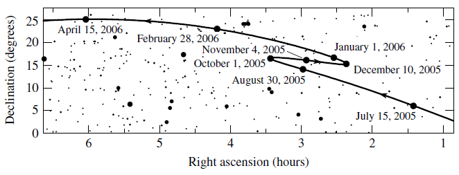
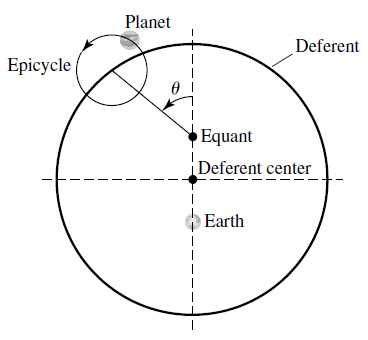
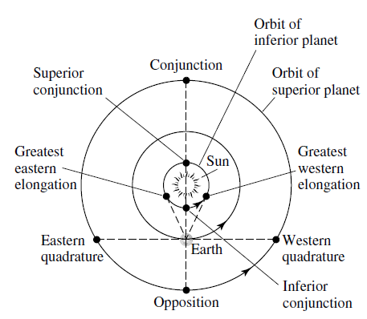

- toc
{:toc}

The **celestial sphere** is the observable sphere that surrounds our view point. 

## Geocentric System

The idea was because stars and constellations seems to stay fixed with respect to the celestial sphere.

### Retrograde Motion

**Retrograde motion** is when a celestial body reverses direction with respect to the celestial sphere. 

### Ptolemaic Model

In attempt to explain and predict retrograde motion of planets, Hipparchus and Ptolemy refined a modle known as the Ptolemaic model. Ptolemaic theory is to predict planetary motion to the limits of observational accuracy of 10 arcminutes.

## Heliocentric System

The Greek knew that this system could explain why planets produced retrograde motion. But the assumption was that all planetary orbits would be circular, such configuration could not predict planetary motion as well as Ptolemaic system.

It was also uncertain that stars were part of the solar system. Planets in the solar system are so far away that people could not find the difference in parallax compared to the background stars.

### Copernican Model

The Copernican model assumes that all planets have circular orbits, and that there are the following configurations with respect to Earth:

- **Superior planets** are planets with orbits outside of Earth’s. Example: Mars, Jupiter, etc.
  - **Conjunction** is the point in orbit where the planet aligns with the Earth and the sun (behind the sun).
  - **Opposition** is the point in orbit where the planet aligns with the sun but is behind Earth.
  - **Eastern quadrature** is the point in orbit where the line-of-sight makes a 90 degrees to the left from an imaginary line between Earth and sun.
  - **Western quadrature** is the same as eastern quadrature, except it’s 90 degrees to the right.
- **Inferior planets** are planets with orbits inside of Earth’s. Example: Mercury, Venus.
  - **Greatest eastern elongation** is the left-most position from Earth’s perspective. Planet at this point has the greatest angle span and the line-of-sight between the planet and Earth is tangent to the orbit.
  - **Greatest western elongation** is the right-most position from Earth’s perspective. 
  - **Inferior conjunction** is the point in orbit where the planet aligns *in front of* the sun.
  - **Superior conjunction** is the point in orbit where the planet aligns *behind* the sun.

### Sidereal Period

The **sidereal period** is the measured relative time interval of a planet’s orbit relative to background stars. i.e. the orbital period of the planet.

### Synodic Period

The **synodic period** is the time interval between repeating a configuration (e.g. from one conjunction to next conjunction, with respect to the sun). The general version of the formula is:

$$
\frac{1}{P_\text{syn}}=\frac{1}{P_\text{inner}}-\frac{1}{P_\text{outer}}
$$

We can rearrange the formula to:

$$
P_\text{syn}=\frac{P_\text{inner}P_\text{outer}}{P_\text{outer}-P_\text{inner}}
$$

Furthermore, suppose the orbital period $P$ has the unit of years, and set one of the $P$ to Earth’s orbtital period, then we get:

$$
P_{\text{syn}_\text{inferior}}=\frac{P_\text{inner}}{1-P_\text{inner}}\\
P_{\text{syn}_\text{superior}}=\frac{P_\text{outer}}{P_\text{outer}-1}
$$

Notice that if the period of the outer planet is the same as earth’s ($P_\text{outer}=1$), then the synodic period becomes $\infty$. If the outer planet is not moving ($P_\text{outer}=\infty$), then the period is practically 0.

