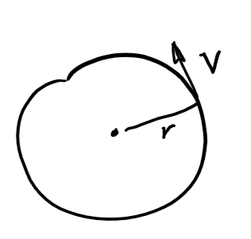
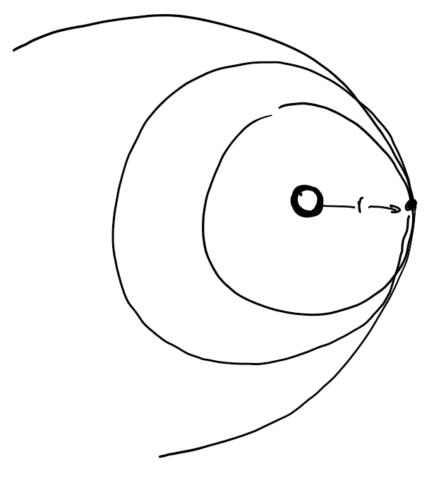
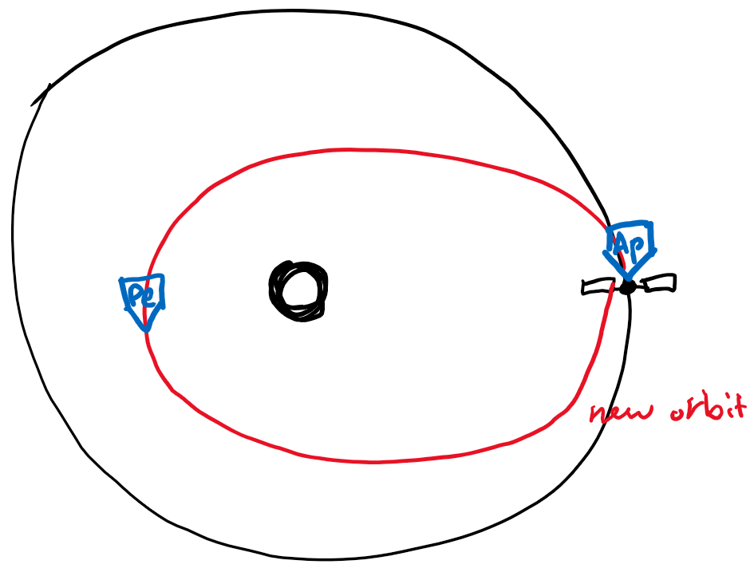
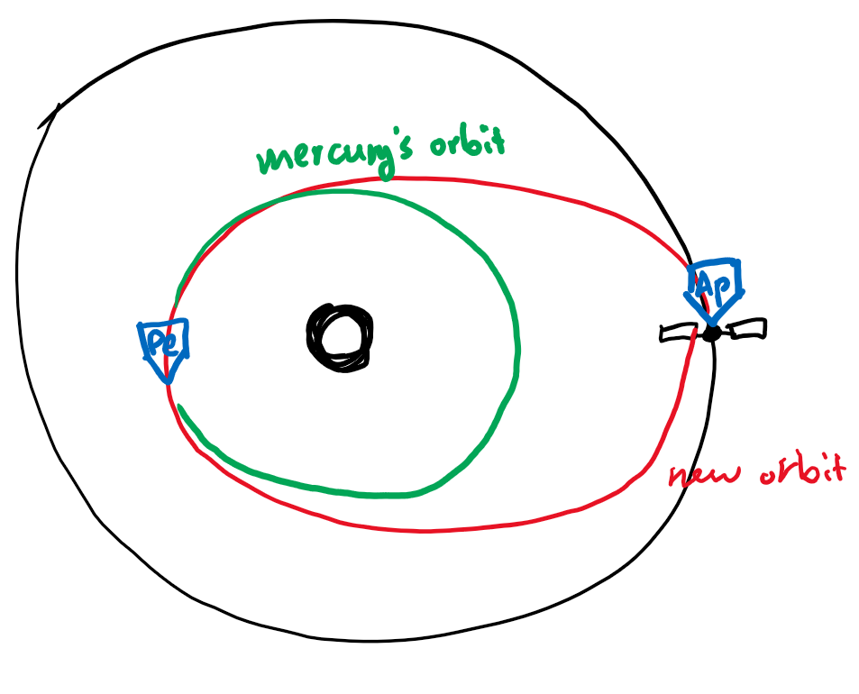

Kepler’s 3rd law is:
$$
P_\text{yr}^2=a^3_\text{au}
$$
This is not right in terms of dimensions, but it shows the proportionality.

---

`insert slide 5`

The acceleration experienced on the orbiting body is given by:
$$
\vert a_c\vert =\frac{v^2}{R}
$$
`slide 6`

Now we consider Newton’s 2nd law where $\vec F = m\vec a$, and law of gravity $\vert \vec F \vert = \frac{Gm_1 m_2}{r^2}$. The velocity for a circular orbit is given by $v_c=\sqrt{\frac{GM}{r}}$.

---

Object is moving uniformly in a circular orbit, then the average/constant angular rate is $n={2\pi\over n}$ [radians/time]. The constant speed is
$$
v=\frac{2\pi r}{P}=nr
$$
The acceleration needed to do this is due to gravity:
$$
a=\frac FM =\frac{GMm}{r^2}\cdot\frac 1m = \frac{GM}{r^2}=\frac{v_c^2}{r}
$$
This makes
$$
v_c=\sqrt{\frac{GM}{r}}
$$

---

We want to combine the first equation ($v=\frac{2\pi r}{P}=nr$) with the equation we just derived ($v_c=\sqrt{\dots}$):
$$
\begin{aligned}
\frac{GM}{r^2}=\frac{v_c^2}{r}&=\frac{\left(\frac{2\pi r}{P}\right)^2}{r}\\
P^2&=\frac{4\pi^2}{GM}\cdot\frac{r^2}{r}\cdot r^2\\
&=\frac{4\pi^2}{GM}r^3
\end{aligned}
$$

---

So far we have assumed that sun does not move, but in reality the sun is also affected by the orbiting masses.

To account for this, we use:
$$
P^2=\frac{4\pi^2}{G(M+m)}a^3
$$
Where $a$ is the semimajor axis instead of radius (for ellipses) and $m$ is the smaller mass. Generally the smaller mass is a lot less than the bigger mass $M$.

---

The total energy of an elliptical obrit per unit mass is:
$$
E=-GM/2a
$$
We can rearrange for vis-viva equation:
$$
v^2=GM(2/r-1/a)
$$
There are limiting cases:

1. Circular orbit or $r=a$, then $v=\sqrt{GM\over a}$ which we seen before
2. At aphelion, $r=a(1+e)$ so $v_{ap}^2=GM(\frac{2}{a(1+e)}-\frac1a)=\frac{GM}{a}(\frac{1-e}{1+e})$
3. At perihelion, $r=a(1-e)$, so $v_{ap}^2=\frac{GM}{a}(\frac{1+e}{1-e})$.

---

What about orbits with intersecting $r$?

Starting from the circular limiting case: $v^2=\frac{GM}{r}$ so $a=r$ always.

Second case, as $v^2\rarr\frac{2GM}{r}$, we have $\frac{1}{a}\rarr 0$ and the semi-major axis approaches infiinty. That means the elliipse gets bigger bigger eventually become a parabola. The object is **unbound**. AKA this means that object is at or above **escape orbiting velocity**
$$
v_{esc}=\sqrt{\frac{2GM}{r}}=\sqrt{2}v_{circ}
$$

>**Example**: what is Earth’s orbit speed around the sun?
>$$
>\begin{aligned}
>v_c&=\sqrt{\frac{GM}{a}}\\
>&=\sqrt{\frac{6.67\times10^{-11}\times2\times10^{30}}{1.5\times10^{11}}}\\
>&=30 km/s
>
>\end{aligned}
>$$

> **Example**: what about Saturn?
>
> We could do the above calculation again, but if given that we know Saturn’s orbit is 9 times farther out, we can just scale it:
> $$
> v_c\approx 30 km/s\times \frac{1}{\sqrt{9}}\approx 10 km/s
> $$

> **Example**: find escape velocity of Earth
> $$
> \begin{aligned}
> v_{esc}&=\sqrt{\frac{2GM}{a}}=\sqrt 2 v_{circ}\\
> &=\sqrt{2}\times 30 km/s\\
> &=42.4km/s
> \end{aligned}
> $$
> 

---

Simple way of transferring an object from one orbit to another. Suppose we have an object that has the same orbit of Earth’s ($v_c$=30km/s). And we’re given a boost of $\Delta v$ of 7.4km/s in the retrograde direction.

The difference is $v_c$=22.6km/s. 

Now we need to use the vis visa equation to see what the orbit looks like. 

First we find out the new semi-major axis:
$$
\begin{aligned}
\frac 1a &=\frac 2r - \frac{v^2}{GM_\odot}\\
&=\frac{2}{1\text{au}}-\frac{(30km/s)^2}{GM\odot}\\
&=1.43\\
a&=0.701\text{au}
\end{aligned}
$$

- notice that $r$ didn’t change because we’re still at aphelion.
- we have decreased our perihelion to 0.701 au.

Logic to why we are at aphelion: since $v_{final}$ is still perpendicular to $r$, then we must be still at aphelion. 

Now let’s find eccentricity $e$, we know that aphelion is still $Q=1$ au. and we also know that $Q=a(1+e)$ where the new semi-major axis is 0.701 au.

So
$$
e=0.701(1+e)=1\implies e=0.427
$$
Then we can find the perihelion:
$$
q=a(1-e)\implies q=0.402\text{au}
$$
Mercury has the orbit altitude of around 0.4au, so maneuver could take us to Mercury (if we time it correctly.)

But notice that we’re currently on the red ellipse (Hohmann transfer), which means that when we rendezvous with Mercury, the orbit speed doesn’t match and we will pass by Mercury.

We need to reduce speed (add delta V in the retrograde direction when we reach Perihelion).

**The encounter speed** is the difference in speed:

The speed of our spacecraft at perihelion is
$$
v_\text{pe}=\sqrt{\frac{GM}{a}}\sqrt{\frac{1+e}{1-e}}\\
=30km/s\times\frac{1}{\sqrt{0.701}}\times\sqrt{\frac{1.427}{1-0.427}}\\
=56.5km/s
$$
The orbit speed of mercury (assuming it is a perfectly circular orbit) is
$$
v_{\text{merc}}=\sqrt{\frac{GM}{a}}=30km/s \times \sqrt{\frac{1}{0.402au}}=47.4km/s
$$
Then to match the speed, we need to put in more delta V of 56.5-47.4 which is 9.1km/s. The total Delta V for the complete transfer is (7.4+9.1)=16.5km/s of Delta V.

---

What if we added Delta V in the *prograde* direction?

Then the final velocity has magnitude is 30+7.4=37.4km/s. Using the vis viva equation again, we will find that the new semi-major axis is 2.341 au.

Using the same arguments for perpendicularity, the spacecraft is now at perihelion of the new orbit. q=1au. The eccentricity is 0.5728, and the aphelion Q is 3.682au.

Notice that we can go further out (prograde) than in (retrograde) of orbit around the sun given the same Delta V. That’s because the gravitational potential scales with $1\over r$.

