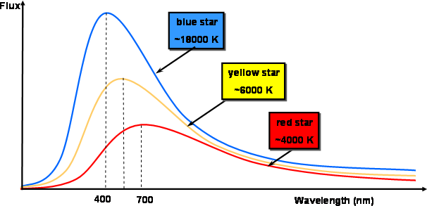

**Planetary energy balance**: 

## Blackbody Emission

AKA blackbody radiation.

There are two conditions required for blackbody radiation:

1. The body must be in thermal equilibrium - has a well-defined temperature T

2. The body is dense/opaque such that photos can’t simply pass through it but instead bounce around many times on the way to exiting.

The total flux of blackbody radiation is given by:
$$
F=\sigma T^4\quad[\text{Js}^{-1}\text{m}^{-2}]
$$
Where $\sigma$ is the Stefan-Boltzmann constant which is 5.56&times;10-8 Js-1m-2K-4.

> For humans, our body is at 310 K, objects radiate about 500Wm-2 where 1W is 1Js-1. If the average human surface area is 2m2 then we radiate about 1000W.

> The surface of the Sun is around 5780K. Which radiates about 6.3&times;106 Wm-2.

Now we looked at the *total* flux, it’s actually an integral of the intensity for all wavelengths:
$$
F=\sigma T^4 = \pi\int_0^\infty I_\lambda \mathrm d\lambda
$$
Where $I_\lambda$ is the **intensity** per unit wavelength.

Temperature is the only parameter needed to describe the blackbody radiation. 

