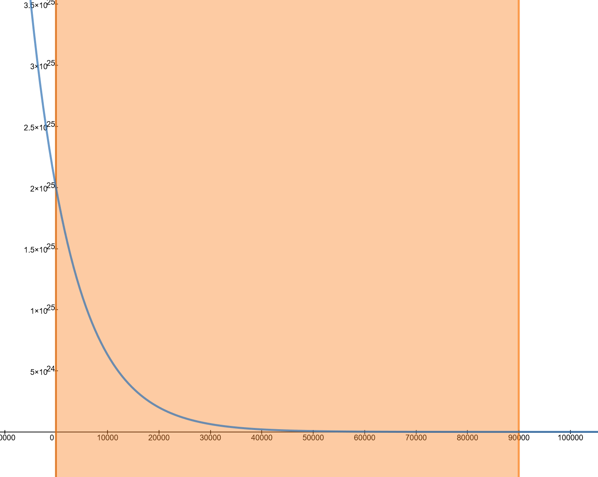

Muchen He - **44638154**

## 1. Angles Big and Small

*__(a)__ Imagine that you are at the centre of the Earth, which you can assume to be transparent. Consider two points on the Earth's surface that are separated by 10 arcseconds. What is the physical distance between the two points?*

The physical distance we’re looking for between the two points is the arclength we’re trying to find, where the angle is 10 arcseconds. First, we convert the angle from arcsec to radians:

$$
\theta=10{\small\text{arcsec}}\times\frac{1{\small\text{arcmin}}}{60{\small\text{arcsec}}}\times\frac{1{\small\deg}}{60{\small\text{arcmin}}}\times\frac{\pi}{180{\small\deg}}=4.85\times10^{-5}
$$

Then to find the arc length, we use the radius of Earth, which is $R_\oplus$=6371 km.

$$
\begin{aligned}
d&=\theta r\\
&=\theta R_\oplus\\
&=(4.85\times10^{-5})(6371\text{ km})\\
&=\boxed{0.309\text{ km}}
\end{aligned}
$$

Therefore the distance between the two points is **0.309 km** or **308.8 m**.

---

*__(b)__ How many square degrees are on the full celestial sphere?*

The full celestial sphere is a whole sphere with surface area $A=4\pi r^2$. The square angle of a full celestial sphere is simply the area divided by $r^2$ which gives us $\Omega=4\pi$ steradians.

To convert to square degrees, we use the conversion factor to convert from radians to degrees **except** we need to square the conversion factor because we’re working with two-dimensional units.

$$
\Omega_{\deg}=\Omega\times\left(\frac{180\deg}{\pi}\right)^2
$$

Plugging in the numbers:

$$
\Omega_{\deg}={4\pi\cdot180\over\pi}=\boxed{720\deg^2}
$$

The solid degrees that covers the full celestial sphere is **720 square degrees**.

---

*__(c)__ You have a telescope with a CCD detector that has a square field of view of 4 square arcminutes. How many pointings of the telescope will be needed to cover an area of 6 degrees by 10 degrees?*

## 2. Solar System Basics

`todo`

## 3. Calculus Refresher

*A simple model of a planetary atmosphere has the number density $n$ decreasing roughly exponentially with height $z$ above the planet's surface: $n(z)=n_0e^{-z/H_p}$, where $n_0$ is the number density at the surface of the planet, and $H_p$ is is the pressure scale height. At the surface of the Earth, the number density for nitrogen is $n_0=2\times 10^{25} \text{m}^{-3}$ and the scale height for is about $H_p=8.7$ km. The model is valid up to about 90 km. Compute the number of nitrogen molecules in the Earth's atmosphere. You will have to make at least one important approximation in order to do this; explain clearly what you have done.*

First, let’s graph the density function of Nitrogen from sea level (z=0) to z=90 km:

### Approximation #1

Notice that even though the exponential decay of number of particles is significant at the altitude of 90 km, there is still a significant number of nitrogen particles in magnitude of 6.43&times;1020 per meter cubed. We can make an approximation that the function $n(z)$ is piecewise such that for $z>90$ km, $n(z)=0$.

### Approximation #2

We approximate that the planet is a completely smooth sphere such that the density is uniform everywhere.

### Integration Function

The function for total number of particles is an integration of a multiplication of density function and volume.

$$
\int_0^{90,000}n(z)A(z)\mathrm dz
$$

Where $n(z)$ is the density function of Nitrogen as previously defined. Function $A(z)$ is surface area of the atmosphere for a specific $z$ height. Both $A(z)\mathrm dz$ will give us the volume of infinitesimal slice of the atmosphere. The area function is given by the formula of the surface area of a sphere *plus* the altitude $z$:

$$
A(z)=4\pi (R_\oplus+z)^2
$$

### Computing the Integral

$$
\begin{aligned}
N&=\int n(z)A(z)\mathrm dz\\
&=4\pi n_0 \int e^\frac{-z}{H_p}(R_\oplus+z)^2 \mathrm dz
\end{aligned}
$$

This is a very complicated function to integrate. So let’s do some digging into whether if this is necessary (See next section).

### Approximation #3

The lower bound of the surface area is at sea-level, where z=0, then $A(0)$=5.10&times;108 km2. The upper bound is at z=90km, and $A(90\text{km})$=5.24&times;108 km2, which is less than 3% difference.

Knowing that because Earth’s radius is so large compared to the thickness of the atmosphere we’re considering, we can approximate Earth’s atmosphere as a flat sheet, by “unwrapping” the spherical shell into a flat disk with top area of $4\pi R_\oplus^2$ and 90km thick.

Now the modified function to integrate is as follows. The two equations are for lower and upper bound of number of nitrogen particles, respectively.

$$
N_\text{lower bound}=4\pi R_\oplus^2 n_0 \int e^{-\frac{z}{H_p}} \mathrm dz\\
N_\text{upper bound}=4\pi (R_\oplus+90,000)^2 n_0 \int e^{-\frac{z}{H_p}} \mathrm dz
$$

### Computing the Definite Integral

Let’s do the integration first.

$$
\begin{aligned}
\int_0^{90,000} e^{-\frac{z}{H_p}}\mathrm dz &=\left[-H_p e^{-\frac{z}{H_p}}\right]^{z=90,000}_{z=0}\\
&=H_p \left( 1-e^{-\frac{90,000}{H_p}} \right)\\
&=8,700 \left( 1-e^{-\frac{90,000}{8,700}} \right)\\
&=8,699.72\text{m}
\end{aligned}
$$

Now we multiply the rest:

$$
\begin{aligned}
4\pi R_\oplus^2 n_0 \int e^{-\frac{z}{H_p}} \mathrm dz &=4\pi R_\oplus^2 n_0(8699.72)\\
&=\boxed{8.875\times10^{43}}\\
4\pi (R_\oplus+90,000)^2 n_0 \int e^{-\frac{z}{H_p}} \mathrm dz &=4\pi (R_\oplus + 90,000)^2 n_0(8699.72)\\
&=\boxed{9.127\times10^{43}}
\end{aligned}
$$

Using *meter* as standard unit for all calculations, we get the final answer of **8.875&times;1043 particles**. Using the same calculation but using the upper bound formula (with the added 90km to the radius), we get **9.127&times;1043 particles**.

