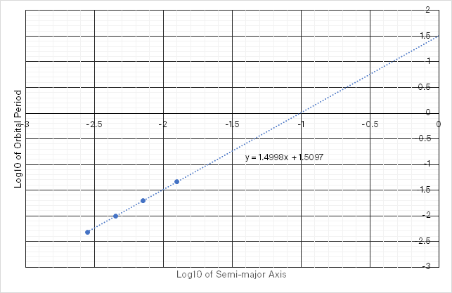

Muchen He - **44638154**

## 1. Comet Hale-Bopp

*Comet Hale-Bopp has an orbital period of about 2450 years and an orbital eccentricity of of 0.995.*

*__(a)__ What is the semi-major axis of Comet Hale-Bopp's orbit?*

We can apply Kepler’s third law: where the period of the planet’s orbit squared is directly proportional to the cube of the semi-major axis or the orbit.

In particular:

$$
P_\text{yr}^2=a_\text{au}^3
$$

Then we can isolate and find the semi-major axis:

$$
\begin{aligned}
a_\text{au}&=\sqrt[3]{P_\text{yr}^2}\\
&=\sqrt[3]{2450^2}\\
&=181.7\text{au}\\
a&=\boxed{2.72\times 10^{10}\text{km}}
\end{aligned}
$$

The semi-major axis of Hale-Bopp is **181.7 astronomical units** or **2.72&times;1010 km**, or **2.72&times;1013m**.

---

*__(b)__ Use the orbital data of Comet Hale-Bopp to estimate the mass of the Sun.*

Using derived Kepler’s third law, and assuming that the mass of the comet is much smaller than the mass of the Sun, we may proceed with the expression

$$
P^2=\frac{4\pi^2}{GM}a^3
$$

We’re using the gravitational constant $G$ which has the units m3s-2kg-1. So we convert the previously calculated values and plug it into our equation.

$$
\begin{aligned}
M&=\frac{4\pi^2}{GP^2}a^3\\
&=\frac{4\pi^2}{\underbrace{6.67259\times10^{-11}}_{\frac{\text{m}^3}{\text{s}^2\text{kg}}}\underbrace{(2450\times365.25\times24\times60\times60)^2}_{\text{s}^2}}\underbrace{(2.72\times10^{10}\times10^3)^3}_{\text{m}^3}\\
&=\boxed{1.989\times10^{30}\text{kg}}
\end{aligned}
$$

The mass of the sun is **1.989&times;1030 kg**.

---

*__(c)__ Calculate the distance of Comet Hale-Bopp from the Sun at perihelion and at aphelion.*

We start with the definition of an ellipse centered around one of the foci in polar coordinates:

$$
r=\frac{a(1-e^2)}{1+e\cos\theta}
$$

At perihelion, $\cos\theta=1$, and at aphelion, $\cos\theta=0$. Then we simplify the equation, and let $r=q$ for $q$ being the distance at perihelion. Similarly, let $r=Q$ for $Q$ being the distance at aphelion. Thus:

$$
q=a(1-e)\qquad Q=a(1+e)
$$

Plugging in the numbers:

$$
\begin{aligned}
q&=a(1-e)\\
&=(181.7)(1-0.995)\\
&=\boxed{0.909\text{au}}\\
Q&=a(1+e)\\
&=(181.7)(1+0.995)\\
&=\boxed{362.6\text{au}}
\end{aligned}
$$

The perihelion and aphelion orbiting altitude of the comet around the sun is **0.909 au** and **362.6 au** respectively.

---

*__(d)__ Determine the orbital speed of the comet when at perihelion, at aphelion, and on the semi-minor axis of its orbit.*

Using conservation of energy of an orbit’s kinetic and potential energy, we get the equation for speed in an elliptical orbit:

$$
v^2=GM\left(\frac{2}{r}-\frac{1}{a}\right)
$$

Speed at perihelion ($r=q=0.909$ au):

$$
v=\sqrt{GM_\odot\left(\frac{2}{0.909\times(1.496\times 10 ^{11})}\text{m}^{-1}-\frac{1}{2.72\times10 ^{13}}\text{m}^{-1}\right)}\\
v=\boxed{44,134\text{ m/s}}
$$

We perform the same calculation for speed at aphelion ($r=Q=362.6$ au):

$$
v=\sqrt{GM_\odot\left(\frac{2}{362.6\times(1.496\times 10 ^{11})}\text{m}^{-1}-\frac{1}{2.72\times10 ^{13}}\text{m}^{-1}\right)}\\
v=\boxed{110.6\text{ m/s}}
$$

When the orbit is at the semi-minor axis, the orbit altitude equals to semi-minor axis $b$. Normally, we would need to calculate $ae$ and $b$ such that we can apply Pythagoreas theorem to find $r$, but because the orbit is so eccentric, we can approximate $r=a$ for when the comet is on the semi-minor axis.

The equation then simplfies down to

$$
v=\sqrt{\frac{GM_\odot}{a}}\\
v=\boxed{2209\text{ m/s}}
$$

The orbiting speed for when the comit at perihelion, aphelion, and on the semi-minor axis is **44,134 m/s**, **110.6 m/s**, and **2209 m/s** respectively.

---

*__(e)__ How many times larger is the kinetic energy of Comet Hale-Bopp at perihelion than at aphelion?*

We need to find the ratio of kinetic energy:

$$
\frac{E_{k_{pe}}}{E_{k_{ap}}}=\frac{0.5m v_{pe}^2}{0.5mv_{ap}^2}=\frac{v_{pe}^2}{v_{ap}^2}
$$

Which is just the ratio of the orbiting speed squared.

$$
\frac{E_{k_{pe}}}{E_{k_{ap}}}=\frac{(4.41\times10^4 \text{m/s})^2}{(1.11\times10^2\text{m/s})^2}=\boxed{159,201}
$$

The kinetic energy for the comet is **1.59&times;105 times greater** at perihelion than at aphelion.

## 2. Jupiter and Kepler’s 3rd Law

*Verify that the general form of Kepler’s third law applies to the 4 Galilean moons of Jupiter (Io, Europa, Ganymede and Callisto).*

*__(a)__ Using the data in Appendix C of the textbook, make graph of log10P vs. log10a. You may use graph paper or a plotting program.*

Recall the general form of Kepler’s third law is given as:

$$
P_\text{yr}^2=a_\text{au}^3
$$

Then the textbook Appendix C section gives us the data:

| Satellite | Orbital Period (days) | Semi-major axis (km) |
| :-------- | --------------------: | -------------------: |
| Io        |                 1.769 |              421,600 |
| Europa    |                 3.551 |              670,900 |
| Ganymede  |                 7.155 |            1,070,400 |
| Callistro |                16.689 |            1882,,700 |

However, we need to also convert it into units that is appropriate to Kepler’s third law before we take the log10.

| Satellite | Orbital period (years) | Semi-major axis (au) | Log10P | Log10a |
| --------- | ---------------------: | -------------------: | ----------------: | ----------------: |
| Io        |                 0.0048 |               0.0028 |           -2.3149 |           -2.5500 |
| Europa    |                 0.0097 |               0.0045 |           -2.0122 |           -2.3483 |
| Ganymede  |                 0.0196 |               0.0072 |           -1.7080 |           -2.1454 |
| Callistro |                 0.0457 |               0.0126 |           -1.3402 |           -1.9001 |

Then we plot the log’d values (last two columns):

---

*__(b)__ Show that the slope of a straight line through the data is 3/2.*

The slope of a linear line of best fit for the graph from part A is 1.4998, which is close enough to 3/2.

---

*__(c)__ Calculate the mass of Jupiter from the value of the y-intercept of your graph.*

The y-intercept of the graph is at $y=0$, $x=-1$. AKA, $\log _{10}P=0$, and $\log_{10}a=-1$. Then we “un-log” the two values by raising them to the 10 to the power of. We get:

$$
P=10^0=1\text{yr}\\
a=10^{-1}=0.1\text{au}
$$

Now we can proceed with isolating $M_\text{jup}$ from the equation relating period to semi-major axis:

$$
\begin{aligned}
P^2&=\frac{4\pi^2}{GM_\text{jup}}a^3\\
M_\text{jup}&=\frac{4\pi^2}{GP^2}a^3\\
&=\frac{4\pi^2}{G\underbrace{(365.25\times24\times60\times60)^2}_{\text{s}^2}}\underbrace{(1.496\times10^{10})^3}_{\text{m}^3}\\
&=\boxed{1.989\times10^{27}\text{kg}}
\end{aligned}
$$

The mass of Jupiter is **1.989&times;1027 kg**.

## 3. Orbits and More Approximations

*__(a)__ Consider a satellite in a circular, low-Earth orbit, where the satellite’s elevation h about the Earth’s surface is $h\ll R_\oplus$. Show that the orbital period $P$ for such a satellite is approximately $R=C(1+3h/2R_\oplus)$. What is the numerical constant $C$ in minutes?* 

Let’s start with the period of a circular orbit. The speed of a given circular orbit is:
$$
v_c=\sqrt{\frac{GM_\oplus}{R_\oplus+h}}
$$
And assume that the circumference / total arc length of a full revolution is:
$$
2\pi(R_\oplus+h)
$$
Period is given by:
$$
time=distance/speed\\
P=\frac{2\pi(R_\oplus+h)}{\sqrt{\frac{GM_\oplus}{R_\oplus+h}}}
$$
Simplifying a bit, and I’m assigning the variable $\zeta$ to the constant part:
$$
\begin{aligned}
P&=\underbrace{\frac{2\pi}{\sqrt{GM_\oplus}}}_\zeta(R_\oplus+h)\sqrt{R_\oplus+h}\\
&=\zeta R_\oplus\left(1+\frac{h}{R_\oplus}\right)\sqrt{R_\oplus}\left(\sqrt{1+\frac{h}{R_\oplus}}\right)\\
&=\zeta R_\oplus^{3/2}\left(1+\frac{h}{R_\oplus}\right)^{3/2}
\end{aligned}
$$
We can see that there is a binomial series, so we can approximate the value using Taylor expansion for binomial series. Suppose $x=h/R_\oplus$, and let $\alpha=3/2$, then the expansion is:
$$
(1+x)^\alpha=\sum_{n=0}{\alpha \choose n}x^n=1+\alpha x+\frac{\alpha(\alpha-1)}{2!}x^2+\dots
$$
We can just approximate by truncating everything after the linear term ($\alpha x$). So:
$$
\begin{aligned}
(1+x)^\alpha&=1+\alpha x\\
\left(1+\frac{h}{R_\oplus}\right)^{\frac{3}{2}}&=1+\frac{3}{2}\frac{h}{R_\oplus}
\end{aligned}
$$
Now plugging everything back:
$$
\begin{aligned}
P&=\zeta R_\oplus^{\frac{3}{2}}\left(1+\frac{3h}{2R_\oplus}\right)\\
&=\underbrace{\left(\frac{2\pi R_\oplus^{\frac{3}{2}}}{\sqrt{GM_\oplus}}\right)}_C\left(1+\frac{3h}{2R_\oplus}\right)
\end{aligned}
$$
Computing for $C$, we get 5070 seconds or **84.5 minutes**.

---

*__(b)__ What is the orbital period for a low-lunar orbit, as was used by the Apollo command modules?*

According to Wikipedia [^1], the low lunar orbit is about 100km above the moon’s surface. And they have a orbital period of about **2 hours**.

[^1]: Lunar Orbit: <https://en.wikipedia.org/wiki/Lunar_orbit>