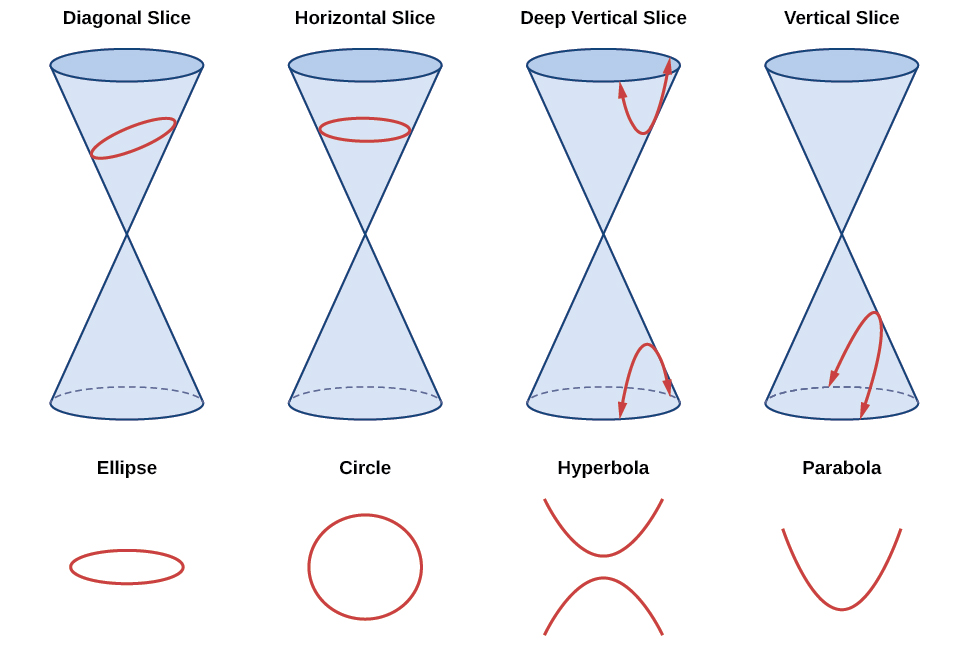
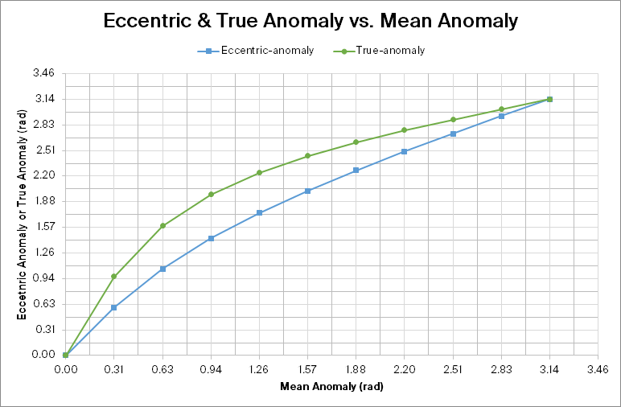

## 1. Orbital Changes 🪐

*A small particle of mass $m$ is on a circular orbit of radius $R$ around a much larger mass $M$. Suppose that the speed of mass $m$ is suddenly increased (in the same direction) by a factor $\alpha > 1$, that is, $\vec v _\text{final}=\alpha \vec v_\text{initial}$.*

*__(a)__ Find expressions for the semi-major axis, the eccentricity, the semi-minor axis and the pericenter and apocentre distances, all in terms of just $R$ and $\alpha$. You may follow the logic used in the examples done in class.*

We first start with the vis-visa equation from astrodynamics:

$$
v^2=GM\left(\frac{2}{r}-\frac{1}{a}\right)
$$

By rearranging the equation, we can obtain the semi-major axis of the new orbit after the velocity change.

$$
\frac{1}{a}=\frac{2}{R}-\frac{(\alpha v_i)^2}{GM},\quad v_i=\sqrt{\frac{GM}{R}}
$$

Simplify:

$$
\begin{aligned}
\frac{1}{a}&=\frac{2}{R}-\frac{\left(\alpha\sqrt{\frac{GM}{R}}\right)^2}{GM}\\
&=\frac{2}{R}-\frac{\alpha^2}{R}\\
a&=\boxed{\frac{R}{2-\alpha^2}}
\end{aligned}
$$

Because $\alpha>1$, then we the small particle mass $m$ is now at the *periapsis*. We can use the equation to get periapsis orbital altitude to find the new eccentricity of the orbit:

$$
q=a(1-e)=\boxed{R}\\
e=1-\frac{R}{a}=1-\frac{R}{\frac{R}{2-\alpha^2}}=\boxed{\alpha^2-1}
$$

The semi-minor axis is derived by Pythagorean theorem, since we already did that for assignment 1, I will jump into using the equation:

$$
\begin{aligned}
b^2&=a^2(1-e^2)\\
b&=\left(\frac{R}{2-\alpha^2}\right)\sqrt{1-(\alpha^2-1)^2}\\
&=\frac{R}{2-\alpha^2}(\alpha\sqrt{2-\alpha^2})\\
&=\boxed{\frac{R\alpha}{\sqrt{2-\alpha^2}}}
\end{aligned}
$$

Since we increased the speed in the prograde direction, we increased our apoapsis. The new apoapsis is:

$$
\begin{aligned}
Q&=a(1+e)\\
&=\frac{R}{2-\alpha^2}(1+(\alpha^2-1))\\
&=\boxed{\frac{R\alpha^2}{2-\alpha^2}}
\end{aligned}
$$

---

*__(b)__ There is a maximum value of $\alpha$ for which this is a sensible problem. Why is that, and what is the maximum value of $\alpha$?*

Because the geometry of the elliptical orbit is a conic section – a section cut of a cone shape. Given enough $\alpha$. the “tilt of the slice” will be a parabola and then a hyperbola (see figure below – source: [voer.edu.vn](http://voer.edu.vn/c/rotation-of-axes/166e8432/66fe1fe0)). In physical sense, if we increase $\alpha$, our particle velocity would be so great that it would reach the **escape velocity**, and it will escape the orbit.



The escape velocity, the factor we multiply our orbiting speed by $\alpha$ is given as:

$$
\begin{aligned}
v_{esc}=v_{f}&=\sqrt{\frac{2GM}{a}}\\
\alpha v_i&=\sqrt{\frac{2GM}{R}},\quad v_i=\sqrt{\frac{GM}{R}}\\
\alpha \sqrt{\frac{GM}{R}}&=\sqrt{\frac{2GM}{R}}\\
\alpha &=\boxed{\sqrt{2}}
\end{aligned}
$$

## 2. Kepler’s Equation

*Kepler solved his own equation, $E-e\sin E=\phi$ (where $\phi=nt^\star$ is the mean anomaly), by an iterative process; here you will explore that method. Them method relies on rewriting the equation as $E=\phi + e\sin E$. For an initial guess $E_0=\phi$, we can then proceed to a next guess for $E$: $E_1=\phi + e\sin E_0$ and then iterate until $E_n=\phi + e\sin E_{n-1} \simeq E_{n-1}$ to within some tolerance.*

*Consider an ellipse with eccentricity 0.5. Use mean-anomaly points corresponding to (0, &pi;/10, &pi;/5, 3&pi;/10, 2&pi;/5, &pi;/2, 3&pi;/5, 7&pi;/10, 4&pi;/5, 9&pi;/10, &pi;).*

*__(a)__ For ONE of these mean-anomaly points (which is not at 0 or &pi; radians), produce a table showing each step in your iteration of Kepler's equation until you reach a satisfactory value of $E$ to within a difference $\vert E_n-E_{n-1}\vert < 0.01$ rad. Also show the calculation to compute the true anomaly.*

I will choose **3&pi;/10** (0.9425 rad) as the mean-anomaly point. I wrote a C program to help me compute the iterations. See the attached *Appendix A* for the C program code. Here are the results:

| Iterations | Eccentric anomaly |
| ---------: | ----------------: |
|          0 |            0.9425 |
|          1 |            1.3470 |
|          2 |            1.4300 |
|          3 |            1.4375 |

The true anomaly ($\theta$) can be found using:

$$
\begin{aligned}
\tan\left(\frac{\theta}{2}\right)&=\sqrt{\frac{1+e}{1-e}}\tan\left(\frac{E}{2}\right)\\
\theta&=2\cdot\tan^{-1}\left(\sqrt{\frac{1+e}{1-e}}\tan\left(\frac{E}{2}\right)\right)
\end{aligned}
$$

---

*__(b)__ Make a second table with the full set of mean-anomaly points, the corresponding eccentric-anomaly $E$ values and the corresponding true-anomaly $\theta$ values.*

Again, I wrote a C program to compute the all the values for the table. See *Appendix A* for the C program code.

| Mean-anomaly $\phi$ | Eccentric-anomaly $E$ | True-anomaly $\theta$ |
| ------------------: | --------------------: | --------------------: |
|            0.0$\pi$ |                0.0000 |                0.0000 |
|            0.1$\pi$ |                0.5900 |                0.9690 |
|            0.2$\pi$ |                1.0635 |                1.5896 |
|            0.3$\pi$ |                1.4375 |                1.9750 |
|            0.4$\pi$ |                1.7486 |                2.2419 |
|            0.5$\pi$ |                2.0204 |                2.4462 |
|            0.6$\pi$ |                2.2692 |                2.6158 |
|            0.7$\pi$ |                2.5016 |                2.7635 |
|            0.8$\pi$ |                2.7168 |                2.8938 |
|            0.9$\pi$ |                2.9345 |                3.0218 |
|            1.0$\pi$ |                3.1416 |                3.1416 |

---

*__(c)__ Make a plot showing $E$ and $\theta$ as functions of $\phi$ and comment on whether it would be OK to neglect the orbit's eccentricity when estimating the position of the object.*

Using the data from *Part (B)*, I used Excel to create the following plot.



As the graph clearly shows, there is a significant discrepancy between the eccentric anomaly, and the true anomaly of an elliptical orbit. Therefore it is **not** OK to neglect the eccentricity, in this case $e=0.5$, when estimating the position of the object.


## 3. Temperature Changes in an Eccentric Orbit 🌗

*The planet HD 20782b orbits HD 20782, a G3V star with mass 1.05 times that of the Sun and luminosity 1.25 times that*
*of the Sun. The planet's orbit has a semi-major axis of 1.397 au, an orbital period of 597 days, and an eccentricity of 0.956. The planet's mass is about 2 times that of Jupiter and you may assume its albedo is similar to that of Jupiter at about 0.5.*

*__(a)__ (Review) Compute the periapsis and apoapsis distances of the planet from the star.*

$$
q=a(1-e)=(1.397)(1-0.956)=\boxed{0.0615\text{au}}\\
Q=a(1+e)=(1.397)(1+0.956)=\boxed{2.7325\text{au}}
$$

*__(b)__ Assume the planet is spinning rapidly. In class we derived the dependence of planetary blackbody temperature as a function of orbital distance in the Solar system: $T_p=279\text{K}(1-A)^{1/4}\frac{1}{\sqrt{r_\text{au}}}$. Adapt this formula to this new stellar system — that is, work out the new constant that should take the place of 279 K, and take into account the numerical value of the albedo.*

First, we need to adapt the luminosity. The sun’s luminosity is the total power outputted by the sun: $L_\odot=4\pi R^2_\odot \sigma T_\odot^4=3.839\times 10^{26}$W. We multiply this by 1.25 and get:

$$
L_s=4.799\times 10^{26} \text{W}
$$

To find the temperature, we need to equate the power intercepted from the star HD 20782 and the power emitted (assuming that temperature on the planet is much lower than the star). Power intercepted is a function of distance from the star ($r$) and is given by *flux* &times; surface area &times; absorption:

$$
P_{in}(r)=F_s\times A_{p_\text{intercept}}\times (1-A)
$$

Where $F_s$ is the flux [W/m<sup>2</sup>] which is the luminosity divided by surface area: $F_s(r)=L_s/4\pi r^2$. The area intercepted by the planet is the “shadow” of the planet which is a disk, given by $A_{p_\text{intercept}}=\pi R_p^2$ where $R_p$ is the radius of the planet.

The power outputted by the planet is by:

$$
P_{out}=A_p\times\sigma\times T_p^4
$$

Where $A_p$ is the planet’s surface area, and $T_p$ is the surface temperature of the planet.

We equate power in, and power out and simplify:

$$
\begin{aligned}
P_{in}&=P_{out}\\
F_s\cdot A_{p_\text{intercept}}\cdot(1-A)&=A_p\cdot\sigma\cdot T_p^4\\
\frac{L_s}{4\pi r^2}\cdot\pi R_p^2\cdot(1-A)&=4\pi R_p^2 \cdot \sigma \cdot T_p^4\\
\frac{L_s}{4r^2}(1-A)&=4\pi\sigma T_p^4
\end{aligned}
$$

Now we rearrange the equation to match the equation in question by isolating for $T_p$:

$$
\begin{aligned}
\frac{L_s}{4r^2}(1-A)&=4\pi\sigma T_p^4\\
T_p^4&=\frac{L_s}{16\pi r^2\sigma}(1-A)\\
T_p&=\left(\frac{L_s}{16\pi\sigma}\right)^{1/4}\frac{1}{\sqrt{r}}(1-A)
\end{aligned}
$$

We need to do one more thing. The equation we had at the top has the distance from the star $r$ in units of AU. So we need to account for it here. 149597900000m = 1 AU.

$$
\begin{aligned}
T_p&=\left(\frac{L_s}{16\pi\sigma}\right)^{1/4}\left(\frac{1}{\sqrt{r_m}}\times\sqrt{\frac{1\text{au}}{1.496\times10^{11}\text{m}}}\right)(1-A)\\
&=\left[\left(\frac{L_s}{16\pi\sigma}\right)^{1/4}\frac{1\sqrt{\text{au}}}{\sqrt{1.496\times10^{11}\text{m}}}\right](1-A)\frac{1}{\sqrt{r_{au}}}
\end{aligned}
$$

> **Verifying the units**: in this section, I’m only showing my work to see that the units for the above derivation and conversion makes sense.
> 
> $$
> \begin{aligned}
> \text{K}&=\left[\left(\frac{\text{W}}{\text{Wm}^{-2}\text{K}^{-4}}\right)^{1/4}\frac{\text{au}^{1/2}}{\text{m}^{1/2}}\right]\frac{1}{\text{au}^{1/2}}\\
> &=\left[\left(\text{m}^{2}\text{K}^{4}\right)^{1/4}\frac{\text{au}^{1/2}}{\text{m}^{1/2}}\right]\frac{1}{\text{au}^{1/2}}\\
> &=\text{m}^{1/2}\text{K}\frac{\text{au}^{1/2}}{\text{m}^{1/2}}\frac{1}{\text{au}^{1/2}}\\
> &=\text{K}\text{ au}^{1/2}\frac{1}{\text{au}^{1/2}}\\
> &=\text{K}\\
> \end{aligned}
> $$
> 
> 👌 Cool. We can proceed.

Plugging in all the values we calculated so far, where $\sigma$ is Stefan-Boltzmann consant. The constant that replaces the 279K is **294.5K**:

$$
T_p=\left[\left(\frac{L_s}{16\pi\sigma}\right)^{1/4}\frac{1\sqrt{\text{au}}}{\sqrt{1.496\times10^{11}\text{m}}}\right](1-A)\frac{1}{\sqrt{r_{au}}}\\
T_p=\boxed{294.5\text{K}}(1-A)\frac{1}{\sqrt{r_{au}}}
$$

---

*__(c)__ Assuming that there no signicant internal heating from the planet, determine its temperature and the wavelength of peak emission at both periapsis and apoapsis. In what part of the spectrum do these wavelengths fall?*

**At Periapsis:** the planet’s distance from the star is only 0.0615au. The temperature is **594K**. 🔥
$$
T_{p_{pe}}=294.5\text{K}(1-(0.5))\frac{1}{\sqrt{0.0615}}=\boxed{594 \text{K}}
$$

The wavelength of maximum intensity or peak wavelength $\lambda_p$ is in accordance with Wien’s law. We plug in the numbers here:
$$
\lambda_{p_{pe}}=\frac{2.9\times 10^3 \mu\text{m}}{T}=\frac{2.9\times 10^3 \mu\text{m}}{594}=\boxed{4.884\mu\text{m}}
$$

**At Apoapsis:** the planet’s distance from the star is 2.7325au. The temperature is **89.1K**. ⛄
$$
T_{p_{ap}}=294.5\text{K}(1-(0.5))\frac{1}{\sqrt{2.7325}}=\boxed{89.1 \text{K}}
$$

Using similar calculations as above, we get peak wavelength at:

$$
\lambda_{p_{ap}}=\frac{2.9\times 10^3 \mu\text{m}}{89.1}=\boxed{32.6\mu\text{m}}
$$

So when the planet is at periapsis, the planet is very hot at 594K and emits peak wavelength of 4.9&mu;m in the infrared spectrum. When the planet is at apoapsis, the planet is cold at only 89.1K and emits a peak wavelength of 32.6&mu;m in the far-infrared spectrum.


## Appendix A

### Code Used for Problem 2 Part 1

```c
#include <stdio.h>
#include <math.h>

#define THRES 0.01
#define PI    acos(-1)

void part1(void)
{
	printf("Part 1 #################\n");
	const double starting_mean_anomaly = 3.0 * PI / 10.0;
	const double eccentricity = 0.5;

	double eccentric_anomaly;
	double eccentric_anomaly_prev = starting_mean_anomaly;

	int iterations = 1;

	printf("| Iterations | Eccentric anomaly |\n");
	printf("|--:|--:|\n");
	printf("| 0 | %.4f |\n", starting_mean_anomaly);

	eccentric_anomaly = starting_mean_anomaly + eccentricity * sin(eccentric_anomaly_prev);
	printf("| 1 | %.4f |\n", eccentric_anomaly);

	while (fabs(eccentric_anomaly_prev - eccentric_anomaly) > THRES)
	{
		eccentric_anomaly_prev = eccentric_anomaly;
		eccentric_anomaly = starting_mean_anomaly + eccentricity * sin(eccentric_anomaly_prev);
		iterations++;
		printf("| %d | %.4f |\n", iterations, eccentric_anomaly);
	}

	printf("E_%d = %.4f rad\n", iterations, eccentric_anomaly);
}

int main(void)
{
	part1();
}
```

### Code Used for Problem 2 Part 2

```c
#include <stdio.h>
#include <math.h>

#define THRES 0.01
#define PI    acos(-1)

void part2(void)
{
	const double eccentricity = 0.5;
	const double mean_anomalies[] = {
        0.0, 0.1 * PI, 0.2 * PI, 0.3 * PI, 0.4 * PI,
        0.5 * PI, 0.6 * PI, 0.7 * PI, 0.8 * PI, 0.9 * PI, PI
	};
	const int mean_anomalies_length = 11;

	// Ouptut
	printf("Part 2 #################\n");
	printf("| Mean-anomaly | Eccentric-anomaly $E$ | True-anomaly $\\theta$ |\n");
	printf("|--:|--:|--:|\n");

	for (int i = 0; i < mean_anomalies_length; i++)
	{
		// Mean anomaly
		const double mult = mean_anomalies[i] / PI;

		// Get E
		double eccentric_anomaly;
		double eccentric_anomaly_prev = mean_anomalies[i];

		eccentric_anomaly = mean_anomalies[i] + eccentricity * sin(eccentric_anomaly_prev);
		while (fabs(eccentric_anomaly_prev - eccentric_anomaly) > THRES)
		{
			eccentric_anomaly_prev = eccentric_anomaly;
			eccentric_anomaly = mean_anomalies[i] + eccentricity * sin(eccentric_anomaly_prev);
		}
		
		// Get theta
		double true_anomaly = 2.0 * atan(
            sqrt((1 + eccentricity) / (1 - eccentricity)) * tan(eccentric_anomaly / 2)
         );

		// Print row
		printf("| %.1f$\\pi$ | %.4f | %.4f |\n", mult, eccentric_anomaly, true_anomaly);
	}
}

int main(void)
{
	part2();
}
```