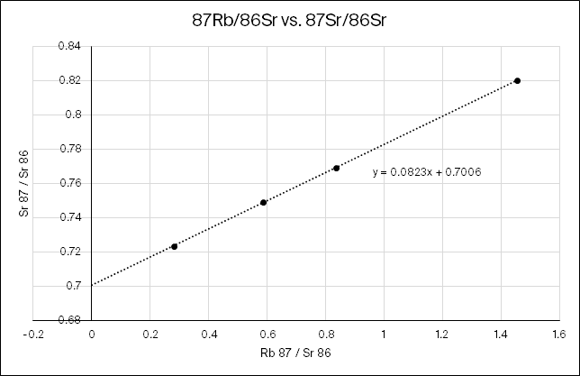
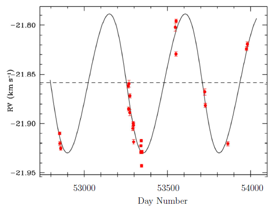
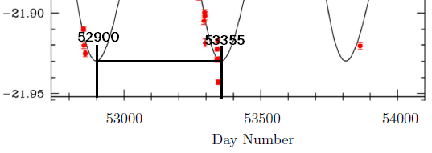
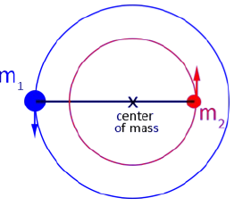
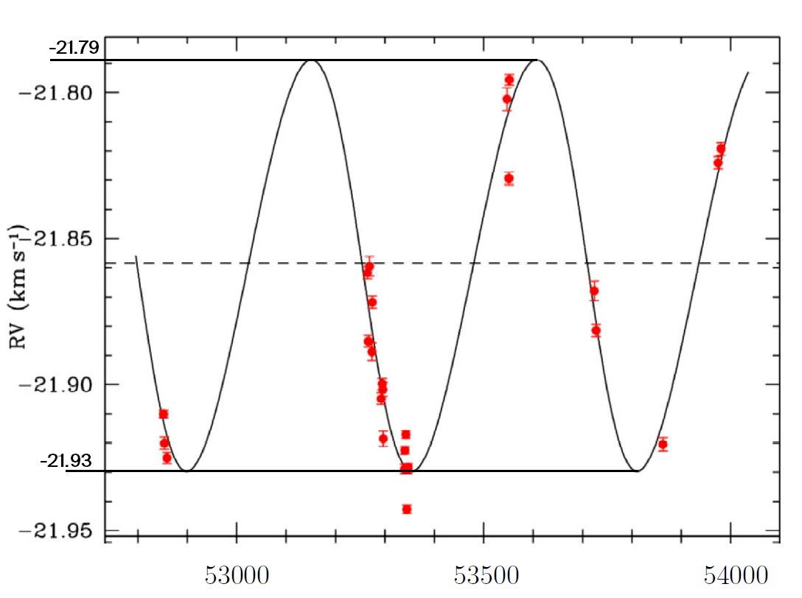

## One-Electron Atoms

A one-electron atom is an atom with Z protons in the nucleus, and will all but one of its electron lost to ionization.

*__(a)__ Starting with the expression for electrostatic force, find expression for i) the orbital radii and ii) the energies for a Bohr model of the one-electron atom with Z proton.*

The electrostatic force can be described using Coulomb’s law:

$$
F=\frac{1}{4\pi\epsilon_0}\frac{q_qq_2}{r^2}
$$

Where $\epsilon_0$ is the permittivity of free space at 8.8542&times;10-12 F/m. Then we generalize that into:

$$
F=\frac{1}{4\pi\epsilon_0}\frac{Ze^2}{r^2}
$$

Recall the radius for a hydrogen atom derived in the textbook is given as follows. Where $\mu=0.999455679m_e$ is the reduced mass because we’re simplifying the mutual attraction of the proton and the electron into a single mass orbiting around a fixed point. Also $a_0=5.291772\times10^{-11}$ m is the Bohr radius.

$$
r_n=\frac{4\pi \epsilon_0 \hbar^2}{\mu e^2}n^2 = a_0n^2
$$

For a general atom with Z protons, the equation becomes:

$$
r_{z,n}=\frac{4\pi \epsilon_0 \hbar^2}{\mu e^2 Z}n^2 = \frac{a_0}{Z}\cdot n^2
$$

Similarly, the energy derived in the textbook for the hydrogen atom is:

$$
E_n=-\frac{\mu e^4}{32\pi^2\epsilon_0^2\hbar^2n^2}=-13.6\text{eV}\frac{1}{n^2}
$$

Also generalizing for atom with Z protons:

$$
E_n=-\frac{\mu e^4 Z^2}{32\pi^2\epsilon_0^2\hbar^2n^2}=-13.6\text{eV}\frac{Z^2}{n^2}
$$

---

*__(b)__ Find the radius of the ground-state orbit, the ground-state energy and the ionization energy of singly ionized helium (Helium II). What is the wavelength of the photo corresponding to the $n=3$ to $n=2$ transition?*

Helium has two protons, so $Z=2$.

**Ground state radius when n=1**:

$$
r_1=a_0 \frac{(1)^2}{2}=2.65\times 10^{-11}\text{m}
$$

**Ground state energy when n=1**:

$$
E_1=-13.6\text{eV}\frac{2^2}{1}=-54.4\text{eV}
$$

**Energy when n=3 and n=2**:

$$
E_3=-13.6\text{eV}\frac{2^2}{3^2}=-6.04\text{eV}\\
E_2=-13.6\text{eV}\frac{2^2}{2^2}=-13.6\text{eV}\\
$$

So when the state transitions, the energy lost,and thus emitted as the form of proton is

$$
E_\text{photon}=13.6-6.04\text{eV}=7.56\text{eV}
$$

Using Planck’s equation: $E_\text{photon}=hc/\lambda$, we can obtain the wavelength $\lambda$:

$$
\lambda=\frac{E_\text{photon}}{hc}=164.0\times 10^{-9}\text{m}
$$

The photon emitted when an electron jumps from energy state n=3 to n=2 has a wavelength of **164nm**.

## Meteorite Dating

*__(a)__ The half life &tau; for 87Rb to decay to 87Sr is 49.44 Gyr. This means that in 49.44 Gyr, half of any given sample of 87Rb will have decayed to 87Sr. Given that radioactive decay can also be described by $N=N_0 e^{-\lambda t}$, find the relationship between &tau; and &lambda; and compute &lambda; for 87Rb.*

From definition of half life:

$$
\begin{aligned}
\frac{1}{2}N_0&=N_0e^{-\lambda \tau}\\
-\ln\left(\frac{1}{2}\right)&=\lambda\tau\\
\lambda&=\frac{-\ln\frac{1}{2}}{\tau}
\end{aligned}
$$

Using the relationship above, we get $\lambda$:

$$
\lambda=\frac{-\ln 1/2}{49.44\times 10^{9}} =1.402\times 10^{-11}\text{yr}^{-1}
$$

---

*__(b)__ You are a planetary scientist in another planetary system much like ours, and are attempting to figure out how long ago solids condensed out in your system. You take several samples from a chondrite meteorite that has landed on your planet and find the following ratio values:*

| Sample | 87Rb/86Sr | 87Sr/86Sr |
| ------ | ------------------------------- | ------------------------------- |
| 1      | 0.2794                          | 0.7236                          |
| 2      | 1.4551                          | 0.8204                          |
| 3      | 0.8345                          | 0.7691                          |
| 4      | 0.5867                          | 0.7490                          |

Make a graph (graph paper is fine), find the slope and intercept, and determine the age of this planetary system along with the initial ratio of 87Sr/86Sr. Comment on differences and similarities relative to our Solar system.

This is the plot using the sample data. The y=mx+b form resembles the following equation:

$$
\underbrace{\frac{\ce{^87Sr_{now}}}{\ce{^86 Sr_{now}}}}_y=
\underbrace{(e^{\lambda t}-1)}_m
\underbrace{\frac{\ce{^87Rb_{now}}}{\ce{^86Sr_{now}}}}_x+
\underbrace{\frac{\ce{^87Sr_{now}}}{\ce{^86 Sr_{now}}}}_b
$$

At $x=0$, $e^{\lambda t}=1$, and because $\lambda$ is non-zero, it is implied that $t=0$ on the y-axis. Observing from the graph, the y-intercept is $y=\frac{\ce{^87Sr_{now}}}{\ce{^86 Sr_{now}}}=0.70006$.

As time increases, the exponent term becomes greater and subsequently, the slope of the graph above would get steeper. The slope of the current samples is $m=(e^{\lambda t}-1)=0.0823$. Using the value for $\lambda$ we found from *(a)*, we get a time of:

$$
t=\frac{\ln(m+1)}{\lambda}=\frac{\ln(0.0823+1)}{1.402\times 10^{-11}\text{yr}^{-1}}
=5.64\times10^9 \text{yr}
$$

the final determined age for the planetary system is 5.64 billion years. For comparison, according to [universetoday.com](https://www.universetoday.com/15575/how-old-is-the-solar-system/)[^1], the solar system is about 4.6 billion years old.

[^1]: How Old is the Solar System? - Universe Today: <https://www.universetoday.com/15575/how-old-is-the-solar-system/>

## Radial Velocities

*The plot shows the radial velocity of a star (relative to the Solar System) as a function of time. The star has a surface temperature of about 6500K and a mass of about 1.3 Solar masses.*

*Assuming that the periodic variation is caused by an object orbiting the star, estimate the object’s <mark>orbital period</mark>, <mark>mass</mark> and <mark>orbital radius</mark>. Use as many digits in your calculation as you think are warranted by the data; explain your reasoning. Express your final mass estimates in both Jupiter masses and Solar masses. Compare your object’s orbit and mass to those of planets in our Solar System.*

The orbit period can be determined directly from the periodic features of the radial velocity from the star. This is because if the radial velocity of the star is affected by the planet, then both bodies in the binary system would share the same orbital period.

Using one of the peaks, we can see that the orbital period is approximately 53355-52900=**455 days** (5 days precision) or **1.25 years**.

The shape of the RV curve obtained for the star is perfectly sinusoidal. Which suggests that both the object orbiting the star and the star are in concentric circular orbits.

Then we can apply the equation derived from balancing the mass with the center of mass:

$$
m_1v_1=m_2v_2
$$

On the RV graph for the star, when the RV is peaked (either top or bottom) it means that the star is moving towards or away from us (the observer). So we should get the orbit velocity from those points.

Sampling from the graph, we are able to get about 2 decimal places of precision. When the star is at a point in the orbit such that it’s coming straight towards the observer, the observed RV is -21.93 km/s. When the star is at a point in the orbit such that it’s going straight away from the observer, the observed RV is -21.79 km/s. 

We can conclude that the system as a whole is moving towards us at 21.86 km/s. So the star’s orbital velocity relative to the system’s center of mass is $v_\star=0.07$km/s.

$$
0.07\text{km/s}\cdot 1.3M_\odot = m_pv_p
$$

We can’t solve because we have too many variables. So let’s assume that the mass of the star is large enough such that $M_\star+M_p\approx M_\star$. Then we can apply the Kepler’s third law in year/au form to get the semimajor axis of the orbiting planet:

$$
\begin{aligned}
m_A+m_B&=a_p^3/P^2\\
1.3&=a_p^3/(1.246)^2\\
a_p&=\sqrt[3]{1.3\cdot (1.25)^2}\\
a_p&=1.264\text{au}=r_p
\end{aligned}
$$

Since the orbit is circular, the orbiting radius is **1.27 au**. 

Knowing the orbiting radius, we can find the orbiting speed of the planet $v_p$. Speed is distance divided by time:

$$
\begin{aligned}
v_p&=\frac{2\pi r_p}{P}\\
&=\frac{2\pi(1.27\text{au}\times 149597900000 \text{m/au})}{455 \text{day}\times 86400\text{s/day}}\\
&=30.2\text{km/s}
\end{aligned}
$$

Finally, plugging back to the equation balancing the mass above, we can get the mass of the orbiting planet:

$$
0.07\text{km/s}\cdot 1.3M_\odot = m_p\cdot 30.2\text{km/s}\\
m_p=\boxed{3.0\times 10^{-3}M_\odot}
$$

Now convert to Jupiter’s mass:

$$
m_p=3.0\times10^{-3}M_\odot\times \frac{M_{\not2}}{M_\odot}=\boxed{3.2M_{\not 2}}
$$

Conclusion: the orbiting planet’s orbit period is 1.25 years, with orbiting radius of 1.27 au. The mass of the planet is 3.0 milli-solar masses, or 3.2 Jupiter masses. The orbiting period and radius is expressed to two decimal places because the precision is limited by the precision from reading from the graph. The mass lost one decimal place because of loss of precision from the 0.07km/s speed.

There are no planets in the solar system with mass comparable with this orbiting planet as it is more than 3 times heavier than Jupiter, the more massive planet in the Solar System.

