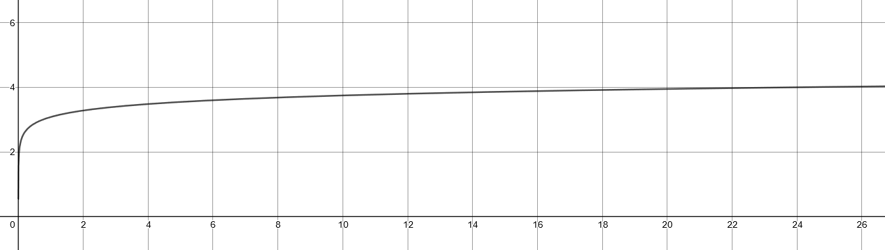

**See the attached pages at the back of the submission for hand-written work.**

## Hydrostatic Equilibrium

*A certain planet has density $\rho(r)$ that decreases linearly going from the core to the surface, so that $\rho(r)=\rho_0(1-2r/3R)$, where $r$ is the radial coordinate and $R$ is the radius of the planet.*

*__(a)__ derive an expression for the mass $M_r$ contained within radius $r$.*

The density function describes the density of a particular thin shell with radius $x$. The infinitesimal volume of the thin shell is:

$$
\mathop{dV}=4\pi x^2 \mathop{dx}
$$

The mass for these shell is then:

$$
\begin{aligned}
m(x)&=\rho(x)\mathop{dV}\\
&=\rho_0\left(1-\frac{2x}{3R}\right)\cdot 4\pi x^2 \mathop{dx}
\end{aligned}
$$

Then we can integrate from $x=0\rarr r$ to get the mass inside the radius $r$.

$$
\begin{aligned}
M_r&=\frac{4\pi\rho_0}{3R}\int_0^r(1-2x)x^2\mathop{dx}\\
&=\frac{4\pi\rho_0}{3R}\int_0^r x^2-2x^3\mathop{dx}\\
&=\frac{4\pi\rho_0}{3R}
\left[
\frac{1}{3}x^3-\frac{1}{2}x^4
\right]^r_0\\
&=\frac{4\pi\rho_0}{3R}
\left(
\frac{1}{3}r^3-\frac{1}{2}r^4
\right)\\
\end{aligned}
$$

$$
\begin{aligned}
M_r&=4\pi\rho_0\int_0^r\left(1-\frac{2x}{3R}\right)x^2\mathop{dx}\\
&=4\pi\rho_0\int_0^rx^2-\frac{2x^3}{3R}\mathop{dx}\\
&=4\pi\rho_0\left[\frac{x^3}{3}-\frac{x^4}{6R}\right]^r_0\\
&=4\pi\rho_0\left(\frac{r^3}{3}-\frac{r^4}{6R}\right)
\end{aligned}
$$

---

*__(b)__ Derive dP/dr.*

Start by considering an imaginary cylinder with mass $dm$ and height of $dr$ radially from the center of the sphere. Then start from Newton’s law of force:

$$
F=ma
$$

Where forces are the forces from top pressure and bottom pressure of the cylinder acting on the cylindrical mass. And acceleration is just double-derivative of the radial position: $\ddot r$. Formalizing the equation:

$$
(dm)(\ddot r) = - F_g + F_{P_B} - F_{P_T}
$$

Where

$$
F_g = \frac{G M_r dm}{r^2} \simeq \frac{G M_r}{r^2}
$$

And since we're considering hydrostatic equilibrium, the acceleration should be 0: $\ddot r = 0$.

Putting it all together, and cancelling $F_{P_B} - F_{P_T}$ into $A dP$, we get:

$$
\rho \ddot r = \frac{G M_r \rho}{r^2}-\frac{dP}{dr},\quad\ddot r = 0
$$

Isolate for dP/dr, and substitute $M_r$ for the expression from part (a), and substitute the expression for $\rho=\rho(r)$:

$$
\frac{dP}{dr}=\frac{G}{r^2}\times 4\pi \rho\left(\frac{r^3}{3}-\frac{r^4}{6R}\right)\times \rho_0 \left(1-\frac{2r}{3R}\right)
$$

Simplifying the above equation and we get a three-term polynomial:

$$
\frac{dP}{dr}=4\pi\rho_0 ^2G\left(\frac{r}{3}-\frac{7 r^2}{18 R} + \frac{2r^3}{18 R^2}\right)
$$

---

*__(c)__ To get pressure, we integrate*.

$$
\begin{aligned}
P(r)&=\int{\frac{dP}{dr}\mathop{dr}}\\
&=\int{4\pi\rho_0 ^2G\left(\frac{r}{3}-\frac{7 r^2}{18 R} + \frac{2r^3}{18 R^2}\right)\mathop{dr}}\\
&=4\pi\rho_0 ^2G\int{\left(\frac{r}{3}-\frac{7 r^2}{18 R} + \frac{2r^3}{18 R^2}\right)}\mathop{dr}\\
&=4\pi\rho_0 ^2G\times\left(\frac{1}{6}r^2-\frac{7}{54R}r^3+\frac{1}{36R^2}r^4+C\right)
\end{aligned}
$$

To find C, we set $r=R$, and assume that the pressure at surface $P(R)=0$:

$$
\begin{aligned}
P(R)=0&=\left(\frac{1}{6}r^2-\frac{7}{54R}r^3+\frac{1}{36R^2}r^4+C\right)\\
0&=\frac{7R^2}{108}+C\\
C&=-\frac{7R^2}{108}
\end{aligned}
$$

Putting it all together:

$$
P(R)=4\pi\rho_0^2 G \left(\frac{1}{6}r^2-\frac{7}{54R}r^3+\frac{1}{36R^2}r^4-\frac{7R^2}{108}\right)
$$

## Degeneracy Pressure

*__(a)__ Find degeneracy pressure in number density.*

Assuming that the star is full of H2 gas with uniform density. The mass of the hydrogen atom is 1.67&times;10-27 kg. So that means 1kg of Hydrogen has 5.988&times;1026 atoms. This is our number density for the electrons since a hydrogen atom only has one electron.

Then for a given mass density $\rho$ in the units kg/m3, we have $\rho\times5.988\times10^{26}$ number density in the units e-/m3.

Then we plug into the equation given from class:

$$
P=\frac{1}{20}\left(\frac{3}{\pi}\right)^{2/3}\frac{h^2}{m_e}n_e^{5/3}\\
P=\frac{1}{20}\left(\frac{3}{\pi}\right)^{2/3}\frac{h^2}{m_e}(\rho\times 5.988\times 10^{26})^{5/3}
$$

---

__(b)__ Equation of boundary between non-degeneracy and degeneracy.

Starting from

$$
P_{termal}=\frac{\rho}{m_p}k_BT
$$

Then we plug in the expressions from part (a), then isolate for T:

$$
\begin{aligned}
T&= \frac{P_{thermal} m_p}{\rho k_B}\\
&= \frac{\left(\frac{1}{20}\left(\frac{3}{\pi}\right)^{2/3}\frac{h^2}{m_e}(\rho\times 5.988\times 10^{26})^{5/3}\right) m_p}{\rho k_B}\\
&=\left(\frac{3\rho}{\pi}\right)^{2/3}\frac{h^2(5.988\times10^{26})^{5/3}m_p}{20m_ek_B}\\
\end{aligned}
$$

The entire rightmost side can be evaluated down to a constant:

$$
\frac{h^2(5.988\times10^{26})^{5/3}m_p}{20m_ek_B}=1242
$$

So therefore:

$$
T=1242\left(\frac{3\rho}{\pi}\right)^{2/3}
$$

---

*__(c)__ Plot*

Here is a log-log plot of the above function:

Where the y-axis is log10(T) and x-axis is log10(&rho;). The region of degeneracy is **above** the graph.

---

*__(d)__ Saturn*

For a mass density of 3000 kg/m3, we plug it into the equation we derived in (b):

$$
T_D=\left(\frac{3(3000)}{\pi}\right)^{2/3}1242=251\times 10^3K
$$

The actual temperature is $\sim 40,000K$, so there is no degeneracy. So it lies in part of the graph that is below the boundary curve.

## Neutron-Star Breakup Speed

*__(a)__ Find maximum orbit frequency*

We can assume that surface mass is attached to the neutron star if it’s not *orbiting*. Then we can start by calculating the required circular orbit speed at the surface:

$$
v_c=\sqrt{\frac{G M}{r}}=\sqrt{\frac{G (1.4M_\odot)}{10,000}}
$$

Plugging in the constants, we get a orbit speed of $v_c=1.36\times 10^8$ m/s which is very fast.

The equatorial circumference of the neutron star is $2\pi(10\text{km})$, and therefore the period is distance divided by speed:

$$
P=\frac{2\pi 10,000}{1.36\times 10^8}=0.4609\times 10^{-3} \text{s}
$$

---

*__(b)__ equatorial bulge*

The relationship between the polar and equatorial radius is given by:

$$
\frac{E-P}{R}=\frac{5\Omega^2R^3}{4GM}
$$

So we plug everything in where $\Omega$ is the angular frequency defined by:

$$
\Omega = 2\pi P^{-1}
$$

Then 

$$
E-P = \frac{5\Omega^2 R^4}{4G (1.4 M_\odot)}=1.374 \text{km}
$$

To solve for E and P, we can also assume that the volume of the ellipsoid and the sphere don’t change:

$$
V_{sphere}=V_{ellipsoid}\\
r^3=E^2 P, \quad r=10\text{km}, \quad P=E-1.374\text{km}
$$

We have two equations and two unknowns, so we solve for both:

$$
E = 10.48\text{km},\quad P=9.106\text{km}
$$
