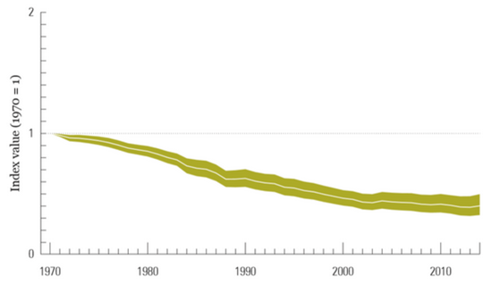

- toc
{:toc}

Sustainability as an idea has existed for a long time, but there is a growing focus on **sustainable development** since the 1950s due to rapid increase of population, wealth, and health for all countries.

## Drivers

The main drivers for sustainable development are due to rapidly economic growth in all countries. The main drivers are increasing population and increasing consumption per capita. Both of which will place an impact on society.


<iframe width="560" height="315" src="https://www.youtube-nocookie.com/embed/jbkSRLYSojo" frameborder="0" allow="accelerometer; autoplay; encrypted-media; gyroscope; picture-in-picture" allowfullscreen></iframe>




### Driver: Increasing Population

Because of better health, there exists a world population growth. It is estimated that the world population will reach 10 billion by the year 2055.

### Driver: Increasing Per Capita Consumption

Because of better wealth, people are consuming more resources. Canadians have one of the highest per-capita consumption rates. The **per capita material footprint** is the the sum of extracted material (typically non renewable) required for each person.

### Impact

The increase of both population and consumption per capita will lead to economic and ecological impacts. These impact could be positive (good) or negative (bad). The social or environmental impact can be roughly described by:

$$
\text{Impact}=\text{Population}\times\text{Affluence}\times\text{Technlogy}
$$

Some of the impacts we observe today are:

- Decrease in infant mortality.
- Drastic increase in green house gas emissions.
- Severe decrease in biodiversity due to climate change.
- Decrease in air and water quality.
- Increase in education.

## Definitions

The definition of **sustainable development**, according to United Nations[^1] is:

> *Development that meets the needs of the present without compromising the needs of future generations to meet their own needs.*

The UN created 17 **sustainable development goals (SDGs)** where each goal has well defined *targets* and *indicators*. They can be found on [UN sustainable development website](https://sustainabledevelopment.un.org/)[^2].

**Carrying capacity** is the number of people who can be supported over a long period of time. Living within the carrying capacity depends on:

- The amount of resources available in the ecosystem
- The amount of resources consumed by each individual within the population

**Biocapacity** is the *productivity* of land areas such as forests, croplands, fisheries, and land for absorbing human waste.

- Current estimated biocapacity: <mark>1.7 hectares per person</mark>.

**Ecological footprint (EF)** measures the current human demand on earth's ecosystems and natural resources. EF provides an estimate of the area of biologically productive land and sea to *sustainably* support human activities. The unit is [*area/year*]. The method of calculating EF is outlined [here](https://www.footprintnetwork.org/resources/data/)[^ef-method].

**Ecological deficit** is when the total ecological footprint is greater than the total biocapacity of the area available to that population.

- Current global average EF is <mark>2.6 hectares per person</mark>.
- For Canada, we need to reduce our EF by 4 hectares in order to be long-term sustainable.

**Natural capital** is the natural resources on Earth's biosphere that provide ecosystem goods and services imperative for survival and well-being [^nc]. Like financial capital, the idea is that we use the what we have in a way to ensure abundance of capital is maintained or increased over time.

## Climate Change

To reduce the worst-case impacts of the climate change, we need to reduce our GHG emissions significantly to limit.  There is a need to limit the average global temperature increase to 1.5 degrees Celsius before 2030.

UN Intergovernmental Panel on Climate Change (IPCC) works together to develop a strategy. They publish a report with models and predictions every few years.

### The Paris Agreement

The Paris Agreement was adopted by 195 countries in December 2015 at International Agreement on Climate Change (COP 21).  The key agreements are:

- Limit the average surface global temperature increase to below 2&#176;C
- Countries committed to make **nationally determined contributions (NDC)** to pursue goals.
- Commit to regularly report national emission, progress, and undergo international review.
- Mobilize $100B to help poorer countries by 2020-2025.
- Call for a new mechanism to reduce emissions in one country to be counted towards another country's NDCs.

### Green House Gases

**Green house gases (GHG)** should be considered in any engineering project. GHGs are any gas in the atmosphere which traps heat in earth's atmosphere.

To quantify the effects of GHGs, we use **Global Warming Potential (GWP)** index referenced to with $\ce{CO2}$.

| GHG                                   | GWP          |
| ------------------------------------- | ------------ |
| Carbon dioxide $\ce{CO2}$ (reference) | 1            |
| Methane $\ce{CH4}$                    | 21           |
| Nitrous Oxide $\ce{N2O}$              | 310          |
| Hydrofluorocarbons $\ce{HFC}$         | 124-14,800   |
| Perfluorocarbons $\ce{PFC}$           | 7,390-12,200 |
| Sulfur hexafluoride $\ce{SF6}$        | 22,800       |
| Nitrogen trifluoride $\ce{NF3}$       | 17,200       |

Sometimes we express how impactful a GHG is by quantifying them in terms of $$\ce{CO2}$$ equivalent by multiplying the mass of GHG by their GWP.

**Carbon footprint** describes the contribution of global warming of human activity. It is the land and sea required to sequester the equivalent CO2 by human activity in *Global hectares*. The carbon footprint is a slice of the total ecological footprint.

[^cf]

## Biodiversity Loss

Biodiversity loss is considered as significant as climate change. They are important because humans cannot survive without healthy and resilient ecosystems.

**Biological diversity** (**biodiversity**) refers to the variety of specifies and ecosystems [^bd] as three components:

1. Ecosystem diversity
2. Species diversity
3. Genetic diversity

**Biodiversity loss** occurs even with absence of humans but happen at a low rate and do not result in gene pool or ecosystem loss. About 60% of the animal population have been lost since 1970 due to human activities.

### Causes

Climate change is considered the main cause of biodiversity. Other significant human activities also cause significant biodiversity loss:

- Increase in human population which leads to increase in land use (for agriculture, housing, and industries).
- Unsustainable hunting, fishing, and deforestations.
- Air pollution and water borne pollution; and increase in air and sea acidity.

### Impacts

Biodiversity losses could lead to, but not limited to, some of the following [^bdloss]:

- Reduced crop yields, wood production on plantations, and fisheries.
- Weaker resistance ecosystems to invasive species.
- Weaker resistance of native plants to infections or infectious species.
- Reduced soil quality.

Ultimately, biodiversity loss leads to lower quality of ecosystems humans need to function.

### Ecosystems Services

A healthy ecosystem supports or provides benefits humans physically, mentally, and socioeconomically. The support is called **ecosystems services**. They are services of:

- Air & water purification
- Waste decomposition
- Soil & nutrient cycling
- Climate & radiation regulating
- Habitat preservation
- Noise control
- Aesthetics & culture
- Raw materials & products

[^1]: United Nation - Sustainable Development Agenda: [https://www.un.org/sustainabledevelopment/development-agenda/](https://www.un.org/sustainabledevelopment/development-agenda/)
[^2]: United Nation - Sustainable Development Goals: [https://sustainabledevelopment.un.org/sdgs](https://sustainabledevelopment.un.org/sdgs)
[^ef-method]: Global Footprint Network - Data and Methodology: [https://www.footprintnetwork.org/resources/data/](https://www.footprintnetwork.org/resources/data/)
[^nc]: International Institute for Sustainable Development - Natural Capitalism: [http://www.iisd.org/library/natural-capital-approach-concept-paper](http://www.iisd.org/library/natural-capital-approach-concept-paper)
[^cf]: Global Footprint Network - Climate Change: [https://www.footprintnetwork.org/our-work/climate-change/](https://www.footprintnetwork.org/our-work/climate-change/)
[^bd]: BioDivCanada: [https://biodivcanada.chm-cbd.net/?lang=en&n=DABC84B3-1](https://biodivcanada.chm-cbd.net/?lang=en&n=DABC84B3-1))
[^bdloss]: Nature.com - Biodiversity Loss and Its Impact on Humanity: [https://www.nature.com/articles/nature11148](https://www.nature.com/articles/nature11148).

---

**Review**

- Three major trends occurred in the global community since 1948 are:
  1. Population increased drastically
  2. Average level of health increased
  3. Average level of wealth increased
- Total material footprint in NA is **lower** in 2010 compared to 2008.
- Recall IPAT is impact, population, affluence, technology; then GHG emissions = number of people &times; kg of goods used per person &times; **GHG emissions per kg of goods**.
- Working definition of *sustainability* need to consider:
  - Development
  - Needs
  - Future impacts
- *Carrying capacity* and *biocapacity* are similar in that they both are used within the context of sustainable development and both accounts for an area of land.
  - *Carrying capacity* is “how much” people fits in an area.
  - *Biocapacity* is area of land for sustained productivity.
- Canadians need to reduce 4 global hectares in ecological footprint (EF).
- Mitigation of climate change is attempt to delay and avoid it; adaptation is developing and adapting to what happens during and after climate change.
  - Adaptations already happening: e.g. flood barriers, improved drainage, and evacuations from low sea-level areas.
- Five goals set during COP 21 (The Paris Agreement)
  - Limit temperature increase to below 2&#176;C.
  - Commit to NDC.
  - Report emissions and progress.
  - Help poorer countries with $.
  - New mechanisms to reduce emissions.
- Nationally Determined Contributions (NDC) is contribution of a country to cut down GHG emissions.
  - Canada to cut 30% below 2005 levels by 2030.
- Three components of biodiversity: **ecosystem**, **species**, **genetics**.
- 60% of animal population lost due to human activities since 1970s.