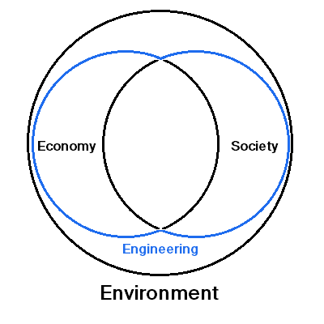
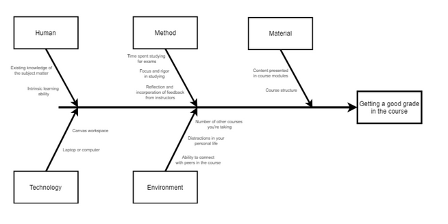

- toc
{:toc}
## Engineering Professionalism

Engineers are obligated to the code of ethics. Engineers are obligated to consider sustainability in everything we do.

### Code of Ethics

1. Hold paramount the safety, health and welfare of the public, the protection of the environment and promote health and safety within the workplace.
2. Undertake and accept responsibility for professional assignments only when qualified by training or experience.
3. Provide an opinion on a professional subject only when it is founded upon adequate knowledge and honest conviction.
4. Act as faithful agents of their clients or employers, maintain confidentiality and avoid a conflict of interest but, where such conflict arises, fully disclose the circumstances without delay to the employer or client.
5. Uphold the principle of appropriate and adequate compensation for the performance of engineering and geoscience work.
6. Keep themselves informed in order to maintain their competence, strive to advance the body of knowledge within which they practice and provide opportunities for the professional development of their associates.
7. Conduct themselves with fairness, courtesy and good faith towards clients, colleagues and others, give credit where it is due and accept as well as give, honest and fair professional comment.
8. Present clearly to employers and clients the possible consequences if professional decisions or judgements are overruled or disregarded.
9. Report to their association or other appropriate agencies any hazardous, illegal, or unethical professional decisions or practices by engineers, geoscientists, or others.
10. Extend public knowledge and appreciation of engineering and geoscience and protect the profession from misrepresentation and misunderstanding.

### Sustainability Guidelines

In addition, the EGBC developed sustainability guidelines to support sustainability.

1. **Maintain** current knowledge of sustainability.
2. **Integrate** sustainability into professional practice.
3. **Collaborate** with peers and experts from conception to completion.
4. **Develop** and prepare clear justification to implement sustainable solutions.
5. **Assess** sustainability performance and identify opportunity for improvement.

EGBC gives out sustainability awards. The UBC Aquatic Centre earned the 2018 Sustainability award.

### Where do Engineers Work in Society?

Most engineers work at the interface between **human activities** and the **environment/ecosystem**. Human activities consists of economy and society. Human activities involve extracting environment’s *natural capital*.

## Argumentation

Professional engineers need to know how to argue (present ideas effectively). 

Argumentation occurs in a social environment in which different positions are presented. It is a form of communication that “aids in the consideration of issues” and may lead to tentative resolution of an issue.

### Four Components of an Argument

1. **Claims** are statements or positions on an issue; they could be opinions or suggestions.
2. **Reasons** provide justification for the claim; commonly linked to claims using the conjunction “because”.
3. **Evidence** provide concrete data or facts to back up the reasons; evidence can be in many different forms from wide range of disciplines.
4. **Warrants** is what is inferred from the given information, connecting the reasons to the claim.

## Self-Regulated Learning

Self regulated learning is the possession of the skills needed to learn and gain knowledge. This is important in improving one’s professional practice.

- Set learning goals.
- Select strategies to attain goals.
- Reflect on progress toward achieving goals.
- Revise goals or strategies if necessary.
- Self-evaluate the methods employed to achieve learning.
- Adapt future method based on what’s learned.

## Metacognition

**Metacognition** is the awareness of one’s thought or learning process.

Use the **fishbone** diagram for structed brainstorm to cover a wide breadth of reasons grouped by main categories. Each category has a rank of impact towards the final goal on the right.

---

**Review**

- Five sustainability guidelines: **maintain, integrate, develop, collaborate, assess**.
- Argumentation enables exploration of ideas and lead to temporary agreement on resolution to open-ended question.
- Four components of arguments: **claim, reason, evidence, inferences/warrants**.