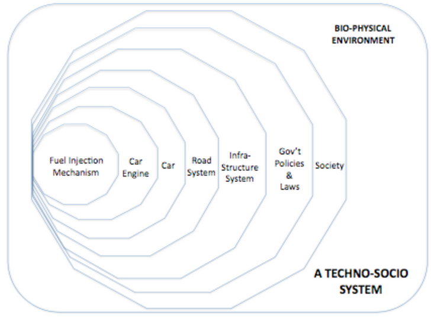
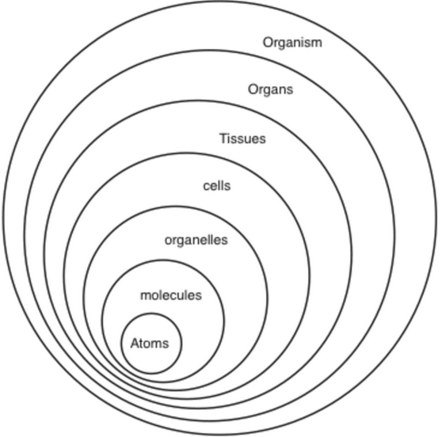

- toc
{:toc}
## Systems Theory

### Systems Thinking

**Cartesian thinking** is traditional engineering thinking which involves breaking a bigger problem down into smaller constituent components (**reductionism**). The assumption is that as long as the smaller components are resolved, the bigger problem gets resolved too.

This approach do not always work. One component may affect another component in a system that might not be obvious. i.e. a set of traffic lights at an intersection may affects traffic flow from nearby intersections.

**Systems thinking** is about understanding the context for which a network of variables and subcomponents interact with each other by examining the inter-component relationship and input/outputs. The **systems approach** starts with *complex system theory* and allow enables analysis of a subsystem while retaining the larger picture the subsystem is part of.

### Simple vs. Complex Systems

**Systems** are a group of components that are working together. A collection of components is a system when:

- There are identifiable *discrete elements*.
- The elements are interacting with each other.
- The elements together create an effect that is different from the effect of an individual element.

**Simple systems** are predictable and is a simple summation of its components.

**Complex systems** are less predictable, forms complex collective behavior, and interact more than just its components. (may have sophisticated information flow, adaptation, and evolution).

We need [complexity science](#complexity-science) to study complex system, which uses post-modern science techniques and models.

## Complexity Science

**Complexity science** is the study of complex systems.

Three common properties of complex systems:

1. **Complex collective behavior**: All complex systems are made up of decentralized individual components whose collective behavior results in hard-to-predict, adaptive patterns.
2. **Signaling and Information Processing**: All complex systems produce and use information/signals internally and externally.
3. **Adaptation**: All complex systems adapt. The behavior changes to improve the system's survival or success. i.e. evolutionary process.

Systems without a leader/controller are **self-organizing**. The macroscopic behavior from simple rules are called **emergent**. In a nut shell: [How Stupid Things Become Smart Together](https://www.youtube.com/watch?v=16W7c0mb-rE)[^1].

> A human brain is an example --- The interaction of neurons and synapses in our brain is relative simple, and we can simulate it. But on a scale of billions, we can have consciousness, personality, emotions, etc.. These are emergent and macroscopic behaviors.

## Resiliency

**Resiliency** protects a complex system and its internals from devastating disturbances. To maintain resilient, the system must always be experimenting with the boundaries of potential disruptions and what the system can or cannot handle[^2]. 

### The Adaptive Cycle

The constantly changing of complex system can be modelled by four phases[^3]:

1. **Rapid growth (r)**: Abundant resources facilitate rapid growth. (fast phase)
2. **Conservation (&Kappa;)**: Resource no longer abundant, and growth slows or stagnate. The system is less flexible, have less capacity to change, and is vulnerable to disturbance. (slow phase)
3. **Release/Disturbance (&Omega;)**: Disturbance quickly causes the system to collapse. (fast phase)
4. **Reorganization (&alpha;)**: The system reorganize into a different structure, forms new entity/behavior, achieves innovation.

## Systems Thinking in Action

An example of systems thinking applied is about **active transportation**. Active transportation are ideas of walkability such as side walks and connected streets that overall influences the population to be healthier. 

The individual components to an active transportation does not influence a person's health significantly, but when used in a vast network throughout the city, the more walkable the environment is, the more healthy the population is from the physical activities.

We can model active transportation as a diagram: Notice that certain actions such as choosing to walk as a transportation decision and physical health create a feedback loop (loop A from the diagram). 

## Causal Loop Diagrams

To represent the diagram better in a cleaner way, we can illustrate it in a causal loop diagram.

The arrows represent causal relationships. A plus **+** denotes a relationship where an increase of the cause &rArr; increase of the effect. A minus **&minus;** denotes a relationship where an increase of the cause &rArr; decrease of the effect (and vise versa).

A feedback loop occurs when a cause and effect is self-referencing. 

A positive feedback loop is two positive (+) references which is inherently unstable or **reinforcing (R)** but it cannot last forever. A negative feedback loop is made of relationships with opposite parity. The loop is stable and is considered **balancing (B)**.

## Concept Map

Concept maps are constructed in four steps:

1. Compose a focus question.
2. Create a ranked list of concepts.
3. Construct a preliminary concept map.
4. Add cross-links to show relationship.

### Key Characteristics

There are five key characteristics to concept maps.

#### 1. Concepts

A **concept** is a perceived regularity in events, objects, events, or measurements. A concept is designated by a label. 

#### 2. Linking Words

Concepts are linked together using **linking words**. The two concepts and the linking word should form a true statement. E.g. Consider the statement: physical exercise leads to better physical health. The two concepts are “physical exercise” and “better physical health” with the linking word(s) being “leads to”.

#### 3. Concept Hierarchies

Many concepts are linked together due to their hierarchical relationships. The most general and inclusive concepts are at the top with more specific concepts branch out near the bottom.

Hierarchy makes it easier to construct concept maps with reference to the focus question.

##### 4. Cross-Links

Cross-links are relationships of concepts in different domains of the concept map. Cross-links help us understand how one part of the system in the concept map could affect other distant parts.

Searching and characterizing new cross-links demonstrates creative thinking.

#### 5. Examples

To clarify the meaning of a concept, provide specific examples of events, statements, or objects. Use lines to link examples to the concepts in a concept map.

## Built & Natural Systems

Simple systems can nest inside complex systems. Such hierarchy exists in our **techno-socio** system as well as nature.

### Built Systems

The smallest systems are simple and are predictable. The larger systems are complex.

- Traditional engineers’ work involves the core of the techno-socio systems (simple).
- Categorizing a system as either simple or complex helps guiding analysis. If a problem involves simple system, use technical problem solving. If a problem involves complex system, use systems tools.
- Changes at one scale of the system can have unintended consequences at a different scale. Consequences could be direct or indirect and are difficult to predict.
  - e.g. The economy and political climate of the trade war between the US and Canada affects tariffs and material costs, which affects lowest-level engineering decisions.

### Natural Systems

We care about comparing built and natural systems because:

> “*The most important scientific challenge facing humanity is to understand the co-evolution of the natural world and the human-constructed world that, together, form the **biosphere** of our planet.*” — *James Kay*

Similarities of human-built environment (*technosphere*) and the bio-physical environment (*biosphere*).

| Biosphere                | Technosphere                    |
| ------------------------ | ------------------------------- |
| Environment              | Market                          |
| Organism                 | Company                         |
| Natural product          | Industrial product              |
| Natural selection        | Competition                     |
| Ecosystem                | Industry                        |
| Ecological niche         | Market niche                    |
| Anabolism and catabolism | Production and waste management |
| Mutation and selection   | Design process                  |
| Succession               | Economic growth                 |
| Adaptation               | Innovation                      |
| Food chain               | Product life cycle              |

## Urban Ecology

**Urban ecology** is the study of living organisms and how they interact as systems in an urban environment. Humans are fundamental elements within urban ecology.

We consider the dynamic feedback between the nested systems inside the urban ecology (e.g. walkable transportation system &rarr; physical health of the population). 

[^1]: Kurzgesagt - Emergence -- How Stupid Things Become Smart Together: <https://www.youtube.com/watch?v=16W7c0mb-rE>
[^2]: Brian Walker - The best explanation to resilience: <https://www.youtube.com/watch?v=tXLMeL5nVQk>
[^3]: <http://www.resalliance.org/panarchy>

---

**Review**

- **Reductionism** is the foundation of traditional engineering practice.
- Any living organism is generally considered **complex system**.
- An automobile fuel injection system, engine, the automobile, a road are simple systems. A city’s road system, transportation system, and the city are complex systems.
- Complex systems have three common properties:
  1. Consists of networks of individual elements governed by simple rules.
  2. Information and signals are produced and processed internally and externally.
  3. Chang behavior through learning or evolution (adaptation).
- Complex systems also:
  - Evolve over time.
  - Has large number of elements with many interactions between them.
  - Has interactions between elements which are highly unorganized.
- Complex systems have the characteristics:
  - Local interaction between individual elements.
  - Amplification of minor variations in initial conditions (small change may cause unintended consequences).
  - The emergence of pattern with no global controller.
  - Feedback occur at different scales.
- **Emergent behavior** is self-organized (often unpredictable) behavior without a controller or leader that is the result of many elements following simple rules.
- Four stages of the adaptive cycle:
  1. **Rapid growth (r)** when resources are abundant. (fast)
  2. **Conservation (K)** when resources run out, system is less flexible. (slow)
  3. **Release/Disturbance (&Omega;)** causes system to collapse. (fast)
  4. **Reorganization (&alpha;)** after the collapse to achieve change or innovation. (fast)
- Five key characteristics to a concept map:
  1. Concepts
  2. Linking words
  3. Hierarchy
  4. Cross-links
  5. Examples
- Four steps to creating a concept map:
  1. Compose a focus question.
  2. Create a ranked list of concepts.
  3. Construct a preliminary map with the listed concepts.
  4. Add cross-links to show relationships.
- Causal loop diagrams have “+” or “-” associated with each arrow to indicate positive feedback or negative feedback.
- Causal loop diagram’s most distinguishing feature is **feedback loops**.
- Case study: *Health and walkability* - four evident feedback loops:
  1. Better physical health &#8633; More walking frequency and decisions to choose walking
  2. More walking frequency &#8633; More built environments for walking (sidewalks, services, etc.)
  3. More walking frequency &#8633; Better perception of built environment (discovery, available destinations, etc.).
  4. Better physical health &#8633; Better perception of built environment (perception of distance, safety, etc.)
- Humans are fundamental elements within the urban ecology.