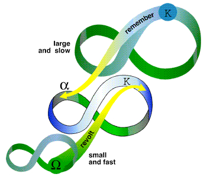

- toc
{:toc}
**Checklist** (temporary):

- [x] simple vs. complex systems
- [x] Cartesian/reductionism thinking vs. systems thinking
- [x] Apply systems thinking
- [x] Complexity science on complex systems
- [x] Resiliency theory
- [x] Adaptive cycle
- [ ] Concept maps
- [x] Causal loop diagrams
- [x] Built environment vs. natural environment
- [ ] Urban ecology

## Systems Theory

### Systems Thinking

Traditional engineering thinking involves breaking a bigger problem down into smaller constituent components. The assumption is that as long as the smaller components are resolved, the bigger problem gets resolved too. This is **reductionism** or **Cartesian thinking**.

This approach do not always work. One component may affect another component in a system that might not be obvious. i.e. a set of traffic lights at an intersection may affects traffic flow from nearby intersections.

**Systems thinking** is about understanding the context for which a network of variables and subcomponents interact with each other. (==todo==: WIP definition).

### Simple vs. Complex Systems

Systems are a group of components that are working together. A collection of components is a system when:

- There are identifiable *discrete elements*.
- The elements are interacting with each other.
- The elements together create an effect that is different from the effect of an individual element.

**Simple systems** are predictable and is a simple summation of its components.

**Complex systems** are less predictable, forms complex collective behavior, and interact more than just its components. (may have sophisticated information flow, adaptation, and evolution).

We need [complexity science](#complexity-science) to study complex system, which uses post-modern science techniques and models.

## Complexity Science

**Complexity science** is the study of complex systems.

Three common properties of complex systems:

1. **Complex collective behavior**: All complex systems are made up of decentralized individual components whose collective behavior results in hard-to-predict, adaptive patterns.
2. **Signaling and Information Processing**: All complex systems produce and use information/signals internally and externally.
3. **Adaptation**: All complex systems adapt. The behavior changes to improve the system's survival or success. i.e. evolutionary process.

Systems without a leader/controller are **self-organizing**. The macroscopic behavior from simple rules are called **emergent**. In a nut shell: [How Stupid Things Become Smart Together](https://www.youtube.com/watch?v=16W7c0mb-rE)[^1].

> A human brain is an example --- The interaction of neurons and synapses in our brain is relative simple, and we can simulate it. But on a scale of billions, we can have consciousness, personality, emotions, etc. These are emergent and macroscopic behaviors.

## Resiliency

**Resiliency** protects a complex system and its internals from devastating disturbances. To maintain resilient, the system must always be experimenting with the boundaries of potential disruptions and what the system can or cannot handle[^2]. 

### The Adaptive Cycle

The constantly changing of complex system can be modelled by four phases[^3]:

1. **Rapid growth (r)**: Abundant resources facilitate rapid growth. (fast phase)
2. **Conservation (&Kappa;)**: Resource no longer abundant, and growth slows or stagnate. The system is less flexible, have less capacity to change, and is vulnerable to disturbance. (slow phase)
3. **Release/Disturbance (&Omega;)**: Disturbance quickly causes the system to collapse. (fast phase)
4. **Reorganization (&alpha;)**: The system reorganize into a different structure, forms new entity/behavior, achieves innovation.

## Systems Thinking in Action

An example of systems thinking applied is about **active transportation**. Active transportation are ideas of walkability such as side walks and connected streets that overall influences the population to be healthier. 

The individual components to an active transportation does not influence a person's health significantly, but when used in a vast network throughout the city, the more walkable the environment is, the more healthy the population is from the physical activities.

We can model active transportation as a diagram: Notice that certain actions such as choosing to walk as a transportation decision and physical health create a feedback loop (loop A from the diagram). 

## Causal Loop Diagrams

To represent the diagram better in a cleaner way, we can illustrate it in a causal loop diagram.

The arrows represent causal relationships. A plus **+** denotes a relationship where an increase of the cause &rArr; increase of the effect. A minus **&minus;** denotes a relationship where an increase of the cause &rArr; decrease of the effect (and vise versa).

A feedback loop occurs when a cause and effect is self-referencing. 

A positive feedback loop is two positive (+) references which is inherently unstable or **reinforcing (R)** but it cannot last forever. A negative feedback loop is made of relationships with opposite parity. The loop is stable and is considered **balancing (B)**.

## Concept Map

## Bio vs. Techno

## Urban Ecology

[^1]: Kurzgesagt - Emergence -- How Stupid Things Become Smart Together: <https://www.youtube.com/watch?v=16W7c0mb-rE>
[^2]: Brian Walker - The best explanation to resilience: <https://www.youtube.com/watch?v=tXLMeL5nVQk>
[^3]: <http://www.resalliance.org/panarchy>

