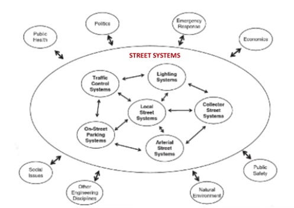
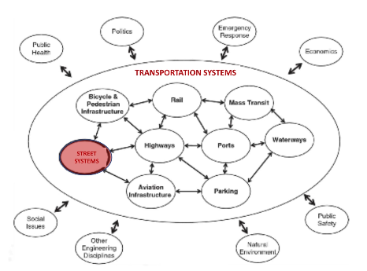
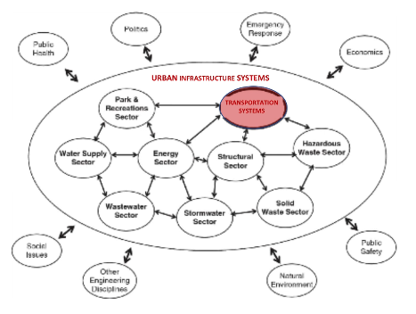

- toc
{:toc}
## Components of the Urban Ecology

Within an urban ecology there are three primary subsystems:

1. The built environment.
2. Urban social systems.
3. The bio-physical environment.

Built environment could be infrastructure systems. The streets are at the lowest level of systems nested in larger urban systems:

The urban social systems are made of urban societies brought together by a variety of different socio-economic, national, and professional cultures. Communities such as neighborhoods, organizations, clubs, businesses are social systems that influence peoples’ behaviors.

Peoples’ behaviors also impact built systems and bio-physical systems within the urban ecology. E.g. a large demand for electric cars in the neighborhood prompts the city to install electric chargers (built structure) and reduces gas-car emissions and noise (bio-physical).

### Livability

**Livability** is the quality of interactions between people and the urban environment.

Indicators of livability:

- Air quality
- Walkability
- Working conditions
- Cultural activities
- Sports activities
- Volunteerism in communities
- Housing affordability

Vancouver, BC has been recognized as one of the most livable cities in the world.

### Ecosystem Services in Cities

Recall [module 1](/documents/CIVL250/module1), ecosystem services are benefits healthy ecosystems provide in an urban environment. 

**Bats in Bristol**: Bats provide benefits such as reducing the mosquito population in urban areas. Brightly lit areas create a barrier which makes bats less likely to move from tree to tree; thus impacting the health of the bat population and hindering the benefits from bats.

**Birds in Vancouver**: Birds are important to eliminate insects and urban pests such as rats. Vancouver created [Bird Strategy](https://vancouver.ca/parks-recreation-culture/vancouver-bird-strategy.aspx) aiming to create an attractive and supportive urban environment to native birds.

## Urban Infrastructure

**Megacities** are very large cities with population &gt; 10 million people. Due to urbanization, there increasing number of megacities.  Megacities are vulnerable to disruptions because they’re often located near river deltas or coastlines.

Urban development is challenging due to dense population which makes (mega)cities vulnerable to these concerns associated with climate change and biodiversity loss:

- Disease epidemics
- Criminal activities
- Loss of affordable housing
- Social dysfunction/riots
- Natural disasters such as earthquakes
- Increased airborne particulates from wildfires
- Flooding and drought
- Intense storms
- Rise in sea level
- Loss of underground infrastructure
- Salinization of soil and aquifers
- Decrease in agriculture productivity

### Resiliency in Cities

**Resiliency** is the means for the society in an urban environment to survive, adapt, and grow under chronic or acute stress. Increasing resiliency of cities and systems such as infrastructure systems is an effective strategy to reduce cities' vulnerabilities.

**Integrated plans** address and responds to the challenges effectively.

There are seven qualities of resilient frameworks for systems to “withstand, respond to, and adapt more readily to shocks and stresses after tough times, and live better in good times”. They are:

1. Reflective (i.e. learning from past experience)
2. Robust
3. Flexible
4. Integrated (i.e. systems are working and communicating in effectively)
5. Resourceful
6. Redundant
7. Inclusive

### City Resilience Framework

The CRF aims to understand the complexity of cities and the drivers that contribute to resiliency. There are four main dimensions to a resilient city, each with three drivers.

#### Dimension 1: Health & Well Being

1. **Basic needs satisfied**: all have access to basic resource needed to survive (food, water, sanitation, energy, and shelter).
2. **Support livelihood and employment**: have diverse career, investment, and social welfare opportunities; adequate skills, training, and labor policies.
3. **Public health**: effective public healthcare.

#### Dimension 2: Economy & Society

1. **Promote cohesive and engaged communities**: collective identity and mutual support; encouraging diversity, tolerance/inclusion for other cultures.
2. **Social stability, security, and justice**: comprehensive law enforcement to ensure safety and justice.
3. **Foster economic prosperity**: availability of funding; diverse economy; attract business investments.

#### Dimension 3: Leadership & Strategy

1. **Encourage leadership and effective management**: strong leadership, cross-sector communication, and evidence-based decision-making.
2. **Broad range of stakeholders**: everyone is informed and involved in the city; communication between the government and public is timely.
3. **Foster long-term and integrated planning**: align sectoral plans and projects to city’s vision and appropriately address city’s needs.

#### Dimension 4: Infrastructure & Environment

1. **Provide or enhance protective assets**: provide or maintain protective assets, natural or built, such as sea walls or wetlands.
2. **Ensure critical services continuity**: actively manage and enhance natural and man-made resources.
3. **Reliable communication and mobility**: free flow of people, information, and goods.

### Rotterdam Case Study

Rotterdam is a city in Netherlands which aims to make its inhabitants fully resilient to climate change by 2025 with five primary themes in its strategy:

1. Flood management.
2. Accessibility for ships and passengers.
3. Adaptive buildings.
4. Urban water systems.
5. Quality of life within the city.

Rotterdam has build infrastructures based on consideration of the CRF dimensions and drivers.

#### Floating Pavilion

- Responds dynamically to climate change and sea level rise.

#### Benthemplein Water Square

- When the weather is dry, the square is a community plaza offering a place to socialize.
- During heavy rainfall, basins in the square and surrounding rooftops collects water.

#### Dakakkers Green Rooftops

- Urban agricultural rooftop on top of an old building.
- Supplies the city with vegetables and honey.
- Collection and retention of excess rain water.
- Reduces roof temperature and CO2.

#### Museum Park Garage

- Repurposed parking garage to hold 10 million L of water during excess downpour when sewer system is going to overflow.
- Rainwater is discharged after into the sewer.

#### Dakpark

- Roof park to offer green space for residents and businesses.
- Located on top of a mall/shopping center.
- Park provides community recreation such as yoga classes and workshops.

### Planet Scale Resiliency

On the planetary scale, we have many boundaries set for variables that may change our planet in a significant way. Going beyond these boundaries is dangerous.

Johan Rockstrom[^jr]  describes the nine planetary boundaries we need to live within to ensure sustainable development:
- Ozone depletion
- Atmospheric aerosol load
- Ocean acidity
- Freshwater consumption
- Chemical pollution
- Agriculture land use
- Biodiversity loss
- Nitrogen flow
- Phosphorus flow
- Climate change

To ensure we are within the boundary, we began retrofitting urban environments for sustainability. Examples such as the [Rotterdam case study](#Rotterdam-Case-Study), in Vancouver, and on UBC campus.

## Resiliency in Urban System Design

Using **ecosystem approach** to resilient design that challenges linear thinking, it helps us understand multitude of interactions that exists in an urban system. 

### Ecosystem Approach

The theoretical basis for the ecosystem approach to urban infrastructure design is *complex systems theory*. Specifically, in the context of urban infrastructure design, we are aware of:

- 🚥 Existence of systems and subsystems.
- 🌎 Multiple scales (physical, time, etc.)
- 💞 Direct or indirect relationships/impacts (interdependencies) between elements inside a system, as well as between subsystems or larger systems.
- ♻️ Life-cycle of elements (e.g. infrastructure).
- 🔀 System boundaries and the flow of material, energy, and information.
- 🔄 Systems are continually learning.
- 🌊 Resiliency of the system (e.g. 7 qualities of resilient cities)

The ecosystem approach requires time to observe, reflect, and consider the consequences of actions, always with an awareness of possible unintended consequences.

<!--The ecosystem approach to infrastructure design involves consideration of the context of the design (e.g. the bio-physical context, the political context, cultural context, economic context and so on), as well as both the short and long term impacts of the design, and the direct and indirect impacts of the design. It also necessitates awareness of the systems in which the infrastructure is embedded (including the ecological, geographic, climatic systems, and the different levels of social and economic systems). finally, the ecosystem approach necessitates the considerations of the entire life cycle of the infrastructure. These considerations influence the goals of the infrastructure design.-->

> *“James Kay and others have shown us that the ecosystem approach to urban systems has a solid scientific foundation enabling us to bridge the gaps between the built environment, social systems, and the bio-physical world, so that we can effectively strive for sustainability. While examples of the ecosystem approach to urban systems exist, we are all still learning about the details of what this approach really means. ”*

### Ecosystem Approach at UBC

John Madden is the Director of Sustainability and Engineering for UBC Vancouver campus operation. According to Madden:

- Storm water rather being a separate system, it should be integrated in city designs; 

## Green Buildings

Converting traditional buildings to “green” or “high performance” buildings achieves GHG emission reduction (climate change mitigation).

### Integrative Design Process

The **integrative design process (IDP)** is a highly collaborative and interactive *design process* based on systems thinking to design green buildings. 

The IDP consists of 7+1 stages:

1. Design preparation
2. Evaluation
3. Conceptual design
4. Schematic design
5. Design development
6. Construction documents
7. Bidding and construction
8. Occupancy, operations, and performance (post-occupancy) 

### Key Aspects of The IDP

The three key aspects of the integrative design processes are design goals, IDP stakeholders, and design <dfn title="intense final effort made to complete a solution to a given architectural problem">charette</dfn>.

#### Design Goals

Design goals for different projects relate to the following five categories:

- **Energy**: usage reduction and generation of energy for the building.
- **Water**: usage reduction and capture of water.
- **Material**: use of recycled and locally produced materials.
- **Site**: optimal use of the building site.
- **Indoor quality**: optimal indoor quality (air quality ,sound quality, social environment, aesthetics, etc.) for occupants.

#### People In The IDP

The composition, structure, and member roles of the integrated design team is adapted to each project. The team consist of **core project team members** and **additional members**. Team members represent different design disciplines.

The core team (managers, engineers, experts, specialists, architects) is responsible for identifying and summoning additional members as required by the project.

Additional members (ecologists, occupant representatives, agents, community, etc.) are brought in for a short period provide input to the design process. 

#### Design Charette

An intensive planning session where owners, designers, and stakeholders of the project collaborate to create an overarching vision for the project.

## Green Buildings Certifications

To ensure that developers delivers the true “green” and “high-performance” buildings, certifications processes are developed.

### LEED

**Leadership in Environment and Energy Design (LEED)** process is based on a credit system in several categories. For new construction and major renovations, the categories considers:

- Location and transportation
- Sustainable sites
- Water efficiency
- Energy & atmosphere
- Material & resources
- Indoor environment quality
- Innovation
- Regional priority
- (Integrative process)

<!--Impact categories that makes up the LEED scoring framework:-->

<!--1. 🌎 Reverse contribution to global climate change.-->
<!--2. 💓 Enhance individual human health and well-being.-->
<!--3. 💧 Protect and restore water resources.-->
<!--4. 🐝 Protect, enhance, and restore biodiversity & ecosystem services.-->
<!--5. ♻️ Promote sustainable & regenerative material resource cycles.-->
<!--6. 💵 Build a greener economy.-->
<!--7. ♿ Enhance social equity.-->

UBC has several LEED certified buildings: Life-Science Building, new Pharmacy Building, and CIRS.

### LBC

**Living Building Challenge (LBC)** is another building certification system. There are seven attributes explored in LBC certification process:

1. Site integrity
2. Net zero water
3. Net zero energy
4. Health: promote health for occupants such as welcoming stairways.
5. Materials: safe and locally sourced materials
6. Equity
7. Beauty: aesthetics

Gift shop at Vancouver’s Van Dusen Gardens is certified by the LBC.

[^jr]: <https://www.youtube.com/watch?v=RgqtrlixYR4>

---

**Review**

- Megacities are vulnerable because they’re often near river deltas or coastlines.
- Three primary sub-systems within the urban ecology:
  1. The built environment/infrastructure.
  2. Urban social systems/societies.
  3. The bio-physical environment/ecosystem services.
- **Livability** is the quality of interaction between people and the urban environment.
- After a specific strategy is established, a city generally then collects baseline data relevant to the strategy.
- Significant challenges for city sustainability:
  - Disease epidemics
  - Criminal activities
  - Loss of affordable housing
  - Social dysfunction/riots
  - Natural disasters such as earthquakes
  - Increased airborne particulates from wildfires
  - Flooding and drought
  - Intense storms
  - Rise in sea level
  - Loss of underground infrastructure
  - Salinization of soil and aquifers
  - Decrease in agriculture productivity
- Qualities of a resilient system:
  - Reflective
  - Robust
  - Flexible
  - Integrated
  - Resourceful
  - Redundant
  - Inclusive
- Indicators of planetary boundaries:
  - Ozone depletion
  - Atmospheric aerosol load
  - Ocean acidity
  - Freshwater consumption
  - Chemical pollution
  - Agriculture land use
  - Biodiversity loss
  - Nitrogen flow
  - Phosphorus flow
  - Climate change
- The ecosystem approach to infrastructure design involves consideration of:
  - Context of the design (e.g. the bio-physical context, the political context, cultural context, economic context).
  - Short and long term impacts of the design.
  - The direct and indirect impacts of the design.
  - Awareness of the systems in which the infrastructure is embedded (including the ecological, geographic, climatic systems, and the different levels of social and economic systems).
  - Entire life cycle of the infrastructure. These considerations influence the goals of the infrastructure design.
- “Green” certification process we learned are LEED and LBC.
- The criterions for LBC are: site integrity, net zero water, net zero energy, health, materials, equity, and beauty.