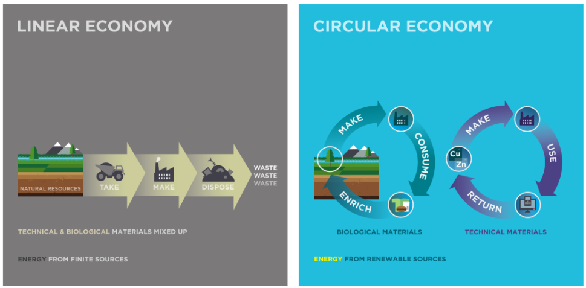

- toc
{:toc}

## Material Resources & Productivity

**Supply chain** is a sequence of activities to the delivery of a product or service to the *end user*. Supply chain consists of resource gathering, manufacturing, production, transportation, usage, and end of life.

**Cotton Clothing Supply Chain**:

1. Fiber production: uses land, water, and energy
2. Spinning, weaving, and dyeing: uses water and energy
3. Cutting, sewing, and finishing: uses water, poor human health and labor practices
4. Distribution: energy use, and produce packaging
5. Retail: energy use
6. Use: water and energy use
7. End of life: ecotoxicity from landfill, which leads to poorer health

### Material Consumption

From [module 1](module1), we know that the consumption per individual is increasing.

The industrial products depends on natural resources. Natural resources are important source of income and jobs, provide ecosystem services, and necessary for human and economic development.

Amount of material extracted in 2010 is 72Gt, doubled since 1980. This is projected to 100Gt by 2030.

Material consumption is mostly construction materials (36%), fossil fuel (28%), and biomass for food and feed (20%).

### Decoupling Material Consumption

**Decoupling** of material resource means to increase GDP without increasing material consumption. The **dematerialization** requires:

1. Government level policies
   - Promoting life-cycle orientated approaches (Apple's LIAM)
   - Fees for use of resources (decrease incentive to over use)
   - Charges for environmental damage (decrease incentive to pollute)
   - Supporting longer product lifespans such as:
     - Increased legal minimum warranty periods
     - Right to repair
2. New business models based on process efficiencies (less material is more value).
3. Consumer awareness (buy less stuff, drive less, etc.).

## Biomimicry in Engineering Design

**Biomimicry** is innovation inspired by nature. Biologist are stakeholders of the design and we look at nature to see how they solve the problems we're trying to solve.

Biomimicry design process is similar to the engineering design process ([from APSC 100](/documents)).

**Similarities**

- Both processes starts with studying the problem, defining the scope and context.
- Both has a brainstorming/idea generation phase.
- Both iterates (loops) to incrementally improve the design.
- Both has a testing phase (emulation step)

**Differences**

- An additional step for biomimicry design process (*discovery*) which involves studying the nature and abstracting its functions.
- There's a further evaluation phase for biomimicry design process.
- There seem to be lack of screening/selection (identify most promising solution) phase for biomimicry design process.

### Design Principles

Biologists postulates that life on earth follows 6 design principles:

1. **Evolve to survive**: continuously improving performance through generations by replicating strategies that work, learn from mistakes, and has random mutation.
2. **Adapting to change**: responds to dynamic contexts by incorporating diversity, self renewal (healing), resilience through variation, redundancy, and decentralization.
3. **Locally attuned and responsive**: fit in by take advantage of repeating events, use abundant resources, use information feedback, and co-operate in win-win situations.
4. **Integrate development with growth**: invest in strategies that promote long term development and growth.
5. **Resource efficient**: minimize energy use
6. **Life-friendly chemistry**

.png)

The six principles are successful with Earth’s 4 operating conditions:

1. Sunlight, water, gravity
2. Dynamic non-equilibrium (weather, currents, etc.)
3. Limits and boundaries
4. Cyclic processes (seasons, etc.)

### Biomimicry in Consumer Products

Here are some of the consumer products that follow biomimicry: 

**Colored Fabric Without Dyes**: Chemical dyes require pigments from nature (natural resource usage), toxic, and require energy to process and apply. :face_with_head_bandage: Butterflies wings are to refract light that changes the wavelength of light, giving it colors.

**Mussel and Gecko Adhesion**: Glues lose their stickiness when wet. An adhesive can be made inspired from dry gecko feet and wet mussel adhesion. The end result works in both wet and dry conditions.

**Neural Network Machine Learning**: Machine learning that uses neural network to perform computer vision or detect faces is inspired by how neurons work in our brains. Axons in the neuron fire signals with simple rules, but with lots of neurons and nodes, we can train a network to be useful.

**Sonar**: Using ultrasonic waves to detect proximity is inspired by bats.

**Highspeed train**: Bullet train nose’s profile is inspired by highspeed birds. The aerodynamics observed in nature inspired the design of flat and sharp nose to reduce noise, stress, and structural damages.

### Biomimicry in Construction Products

Here are some of the construction products that follow biomimicry:

**Self-Healing Concrete**: Concrete is known to deteriorate over time. Self-healing concrete uses microfibers to fill in cracks. A chemical reaction occurs similar to ones found in seashells and renews the concreate strength.

**MAP Cement Process**: Mineralization via Aqueous Precipitation (MAP) process for making cement is inspired by coral polyps, which cuts CO2 emissions.

## Industrial Ecology

In industrial ecology, we think factory as an organism, and set of factories and human activities as ecosystem.

### Kalundborg Symbiosis

Biggest companies in Kalundborg participate in Kalundborg symbiosis, a collaboration of companies buy and sell waste from each other in a **closed cycle** of materials. By-products from one company becomes another company’s material. The result benefits the environment, and increases economic prosperity due to low cost of reusing materials.

### Industrial Ecology in Cities

Idea of industrial ecology can be applied to cities in **Material Flow Analysis (MFA)** to assess energy and material flow in and out of the city. MFA is more complex due to cities’ variation and unpredictable activities. 

Once MFA is conducted, we can identify possible synergies for waste to be reused.

## The Circular Economy

{:width="540px"}

**Circular economy** mimics biological cycles. It suggests three focuses:

1. **Eliminating waste** from resource and material processing, thus “closing the loop”.
2. **Minimizing input** of new materials via **reuse**, **reduce**, and **recycle**.
3. **Adopt renewable energy** to support human activities.

### Principles of Circular Economy

1. **Design to minimize** externalities (waste and pollution such as toxic substances, GHGs, etc.).
2. **Keep** existing assets at highest value and in use.
   - Design for re-use, recycle, and remanufacturing to keep materials circling in the economy.
3. **Regenerate** natural systems.
   - Enhances natural capital by encouraging flow of nutrients (e.g. soil).

### Denmark Real Estate Case Study

The Danish construction sector applied the three principles of circular economy in construction and real estates. Three opportunities are identified:

1. Industrialized production and 3D printing of building modules.
2. Sharing and multi-purposing buildings.
3. Reuse and high-value recycling of components and materials. (This opportunity is difficult due to not enough capabilities and skills, and lack of information across the value chain)

### Vancouver Zero Waste

Vancouver projects to become zero-waste city by <mark>2040</mark>. Currently, a website will educate where different kinds of waste should go so that materials are properly disposed and recycled in the waste-stream. Vancouver rate has recycle rate of 94%; 6% loss are due to contamination.

### Construction Waste

The construction industry uses the most materials worldwide so we need to consider recycling and reusing construction waste to cut down material consumption and GHG emissions. Concrete and cement are one of the largest contributors to GHG emissions. One way to reduce emission is to replace portions of cement with other waste products such as slag.

### Reusable and Recyclable Materials

**Recycled aggregates**: aggregates and debris from demolitions can be reused for building foundations, concrete, and asphalt; cutting down a project’s footprint.

**Asphalt rubber**: can be used in asphalt as aggregate.

**Recycled metals**: used for reinforcements; should be reused because mining is difficult and resource is finite.

**Rebar**: should be reused because manufacturing of rebar emits lots of GHGs.

## The Life-Cycle-Assessment Methodology

**Life Cycle Assessment (LCA)** is a material flow analysis based on product’s life-cycle to determine the environmental impact of a product over the lifetime (“product” could also be process, building, or system). LCA allows us to understand the material inflow and outflow related to the product and how it impacts the ecosystem.

The life-cycle stage for a product could be generalized to: raw materials &rarr; manufacturing &rarr; transportation &rarr; distribution &rarr; product-use &rarr; end of life.

Formal LCA follows four steps:

1. Goal & scope (purpose, boundaries affected, and functional unit)
2. Definition inventory (inflows and outflows)
3. Impact assessment (classify eco-impacts)
4. Interpretation

### Goal & Scope

The first phase of LCA is to define the goal and scope. Some of the questions asked during this phase may be:

- “What is the purpose of this analysis?”
- “What are the functional units to be assessed?”
- “Who is going to use the result of the analysis?”
- “What decisions will we make based on the results of the analysis?”

### Inventory Analysis

Impact analysis involves identifying and measuring the input and output (materials, energy, water, and pollutant) to each life-cycle stage. Often times when a comparison is made, we perform the analysis over the entire life cycle of the product while ensuring data collection methodologies are standardized.

### Impact Assessment

Each of the flow in the inventory analysis stage is categorized into one of the impact classifications (using Eco-Indicator 99 methodology).

### Interpretation

Organize the findings from previous steps for decision making. Often interpretation is simultaneously performed during each of the previous stages.

---

**Review**

- 7 stages of cotton clothing supply chain:
  1. Fibre production
  2. Spinning, weaving, and dyeing
  3. Cutting, sewing, and finishing
  4. Distribution
  5. Retail
  6. Use
  7. End of life
- The annual amount of materials extracted worldwide (72Gt) has increased since 1980.
- **Dematerialization** is the *decoupling* of economic growth from natural resource consumption. Requirements:
  1. Government policies to support dematerialization.
  2. Business model includes improved efficiency or production.
  3. Greater consumer awareness and less materialism.
- For most developed countries, economic growth is decoupling from **per-capita consumption**, but total natural usage is increasing due to population growth.
- Six life’s design principles:
  1. Evolve to survive
  2. Adapt to changing conditions
  3. Locally attuned and responsive
  4. Integrate development with growth
  5. Resource efficient
  6. Use life-friendly chemistry
- Fundamental foci of the circular economy:
  - Regenerate natural systems
  - Eliminate waste & pollution
  - Reduce, reuse, recycle, and use renewables
- Worldwide, the construction sector is the highest industrial user of materials.
- 

