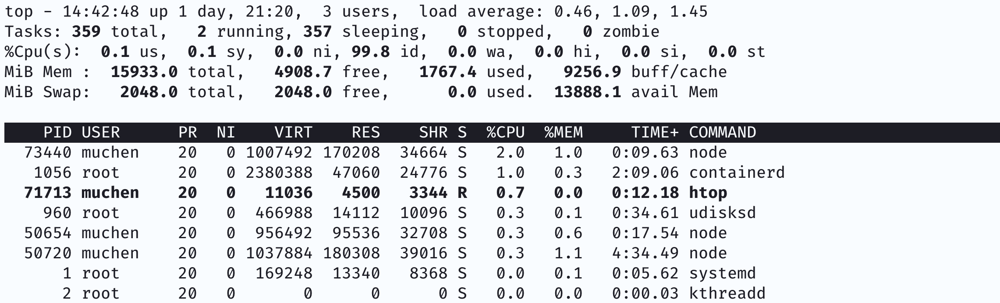
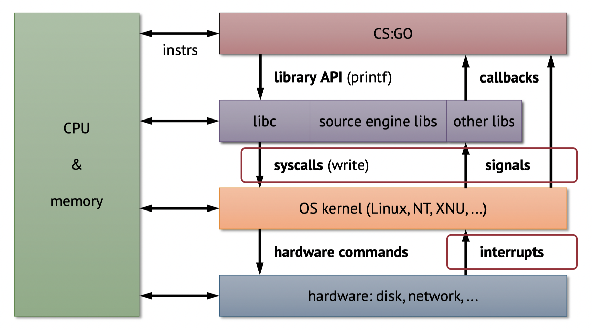
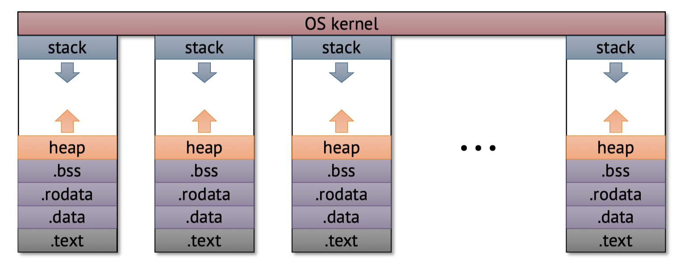

# Processes and Threads

Let's take a look at a typical output of the command `top` which outputs a list of processes on a computer.



- PID is the process ID -- as long as this is unique we don't care about it
- User is who owns the process
- *PR* and *NI* is the priority of the process -- the lower the priority number, the higher priority it is
- The next three column is the memory footprint:
  - VIRT: is the total memory food print
  - RES (resident): the actual mapped memory footprint
  - SHR (shared): shared memory foot print (e.g. sharaed libraries, where the same copy of the library is being shared)
- S is the run-status: `I` is idle, `R` is running
- The next two columns shows percentage of CPU and memory
- TIME column shows the total CPU time used on this process
- The last column shows the command to the process

🤔 **Question**: How can we have so many processes running at the same time?


### Process Abstraction

*Abstraction* here implies that the process is "pretending"/virtualizing that it has the whole system to itself. The result is that each process *appears* to be running as if it's the only process on the computer.

Let's consider an example where we are playing CSGO:



Notice that both our program (CSGO) and library (e.g. libc) interact with the CPU and memory.

But actually, the processes don't have direct access to hardware -- because every process will try to compete with eacher. **We need some mediator between the program/library and hardware**. This is the **OS/Kernel** -- which elevates calls to be ran on the hardware.

The OS/Kernel can pass *hardware command* to the computer hardware that may also interact with CPU and memory.


### Hardware Interaction with Software

We're playing CSGO and we're moving the mouse and the keyboard. How does the hardware pass our interaction to the OS/kernel, and ultimately to our CSGO game (program and libraries)?

**Naive** solution: we could map an address in memory to the state of a hardware/mouse. The problem is that we have to constantly run some code (polling) to get state regardless if we changed the mouse state or not.

What we want is **interrupt**: whenever some external event (such as a click) happens, we want to *interrupt* the current process and run some interrupt service routine (ISR). 


The kernel is capable of accepting interrupts, and the kernel can propagate a *signal* back to the application layer. The libraries can issue some callback function to our process to do some stuff (e.g. firing a gun).

Some signals we might be familiar with include:

- SIGTERM: terminate the program
- SIGKILL: kill the program (less graceful)
- SIGSEGV: segment fault


### OS Kernel

The kernel is the core of the OS. It's the interface between the bare metal hardware and the processes we run on top of it. As we just learned, it manages interrupts/signals and calls/syscalls.

More importantly, the kernel provides basic abstractions over hardware. For example, the kernel and the hardware together manages virtual memory (setting up page tables, address layout). 

In every processes' address space, there is always a region mapped for kernel.

Lastly, the kernel always runs at an **elevated privilege level** -- which means it can pretty much do anything it wants in the computer.

---

This model of process abstraction allows us to run lots of processes in parallel:



These processes won't interfere with each other because they have their own virtual memory space.


### Threads

A thread is like a process because they have their own logical control flow. But it **shares the same virtual address space** as other threads that belong to the same parent process.

> For example, if we have a simple program that plays a video, we can have one thread to display the video, and have a separate thread to handle user-interactions. These two threads share the same memory mapping so when we click the pause button, the video will pause. But they're running on different threads so lag/stall in the video won't make our user-interface unresponsive.


### Context Switch

Going back to the question: how does a computer run so many processes and threads? 

**Time-Sharing**: The computer is fast enough to multiplex/cycle through many different processes very quickly. To us, this will appear as if multiple processes running concurrently on the same hardware.


### Process Tree

`insert process tree slide`

For instance, running the command `pstree` on Linux shows us a tree view of a process tree.

```
systemd─┬─ModemManager───2*[{ModemManager}]
        ├─NetworkManager───2*[{NetworkManager}]
        ├─accounts-daemon───2*[{accounts-daemon}]
        ├─acpid
        ├─at-spi-bus-laun─┬─dbus-daemon
        │                 └─3*[{at-spi-bus-laun}]
        ├─at-spi2-registr───2*[{at-spi2-registr}]
```

- Every process has a parent
- Processes can create other processes (children)
- The paret process must wait for children processes to finish, once they finish/die the parent process is notified.

> For example, suppose we have an app to process a photo. The parent process may spawn a child process/thread to process the image as to not stall the user-interface. Once the photo has finished processing, the child process dies and the parent process (app) can notify the user that the processing has finished.