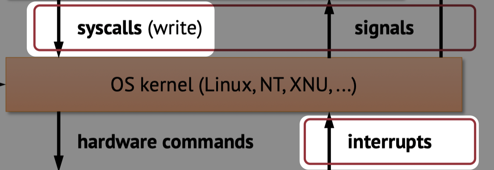

> Note: this is a draft document; will probably be updated thursday

Lecture and slide by Mieszko Lis.

- toc
{:toc}

# Processes Continued

Recall **process abstraction**:

- A process is a single instance of a program, and is unique and identified by it's process ID (PID)
- Each process thinks it has the whole computer resources to itself -- supported by virtual memory system, who makes this illusion of address space.
- The OS kernel schedules processes on limited hardware via **context switch**
- *threads* are like processes but share same address space

## Time-Sharing

Suppose we have two cores, but six processes (A-F), how do we run all the processes seemingly concurrently.

`TODO: insert slide`

Every time step (e.g. during a timer interrupt), we delegate the compute resource to a different process.

## Process Details

Recall: Every process has a **parent**, except PID 1 which is started by kernel during boot. Processes can also create **children** and need to wait for them to finish.

**Q: How does processes handle kernel requests? (hint: signals)**

**Q: How does processes pass requests to kernel? (hint: syscall)**

**Q: How does hardware notify kernel, e.g. how does the computer know when a key is pressed? (hint: interrupt)**

**Q: How does processes creates created / destroyed / managed**

To answer the above questions, we need to see what happens from the bottom of the stack.

### Program Control Flow

A CPU will execute instructions one after the other sequentially until it dies 💀. If we want it to do something interesting we must have conditional/unconditional jumps/branches. We can also call and return from functions.

We have done all of this already.

**Q: What happens when something unexpected happens?** Something that is unexpected to the program could include:

- Illegal instructions
- Incoming network packet
- Segmentation fault (illegal memory access)
- Someone presses a key
- Page fault
- etc.

We cannot use the standard control flow we know and love to handle these exceptions. We need to use :rainbow: **hardware exceptions** :rainbow:.

# Hardware Exceptions

`insert flow arrow slide`

Upon a hardware exception, we pause the original process control flow and execute some exception handler -- typical part of the kernel code. Once handled, we resume the original process flow.

> **Note**: "Exception" word in this case is not the same as C++/Java/Python exception.
>
> **Also note**: "Exception" in this case sometimes also known as *interrupts* and *traps*.

There are two types of exceptions:

- **Synchronous**: Result of instruction execution: such as illegal instruction and page faults.
- **Asynchronous**: these are based on events external to the instruction flow such as key press, hardware timers, network packet. Typically these are triggered by a signal via wire.

## Privilege Levels

Recall in previous lecture, we learned that processes have privilege levels -- some processes are more "entitled" than other processes. CPU has multiple privilege levels (e.g. 0 == kernel, ..., 3 == user applications).

Some instructions need kernel privilege level. Trying to execute these instructions with lower privilege results in a hardware fault (e.g. illegal instruction).

Some memory pages specify kernel privilege level in the page table entries.  Trying to access these pages result in a hardware fault (e.g. segmentation fault).

Exception handlers needs more permission than user-processes since:

- they often need to access the hardware directly
- they might need to switch / update page table (e.g. during page fault exception handler)

> **Example: Syscall**
>
> `todo: insert syscall control flow`
>
> - The **syscall** transfer the control from the program to the kernel to do something -- in this case writes to the terminal/screen. 
> - The **sysret** transfers the control back to the program -- where it proceeds to do its thing.
> - This is an example of **synchronous exception**. Since there is no external events that triggered this.

> **Example: Page fault**
>
> `todo: page fault graph`
>
> - Suppose we're running some app and it hits a page fault. As a programmer/user we don't even know if page fault happened (except it's slightly slower). 
> - Upon page fault, we go into a page fault handler that swaps in the page from disk.
> - This is also an example of **synchronous exception**. This is still not an external event because the page fault happened due to an memory instruction. If this instruciton wans't there, the exception woudln't have happened.

> **Example: Context Switch**
>
> `todo: context swtich graph`
>
> - Processes control flow is interrupted by some timer interrupt, where we switch to some exception handler
> - Upon completion of exception handler, we might return to a different process
> - This is an example of **async exception** since the exception occured due to the timer

> **Example: Illegal Memory Access**
>
> `todo: illegal memory access`
>
> - Process tries to access some illegal memory
> - Protection fault triggers and we go to some exception handler
> - Process will be killed, and we might return from exception handler to a different process
> - This is another example of **sync exception** 

## Exception Abstractions

So far we understand that:

- Hardware intrrupt running program
- and excpeiton handlers (ISR) transfer control to/from OS
- what happens during ISR depends on exception type

---

In x86-64, for example, a system call uses `syscall` and `sysret` instructions. A couple of things ahppen when we call `syscall`

1. The current instruction pointer `rip` gets saved &rarr; `rcx` (next instruction)
2. `rflags` saved to r11
3. `LSTAR` (system register that contains address of system call handlers) to `rip`
4. Raise privelige level 
5. Resume execution (which should go into the `syscall` handler)

When we call `sysret`

1. Lower privilege level
2. Restore flags: `rflags <- r11 & 0x3c7fd7 | 2`  it looks like magic code because there's some reserved flags we don't want touched.
3. Restore next instruction pointer: `rip <- rcx`

## Exception Observations

- syscall has a single entry point; the syscall exception handler has to decide what to do (read, write, etc.) based on value of `rax`
- page fault and keypresses cannot have a single entry point -- because the handler NEEDS to know what happened. The hardware needs to know a head of time which handler to call. We need to look up the type of exception in a table (Exception vector table)

## Exception Vector Table

There is a table somewhere in memory that is known to the processor called **exception vector table** that outlines "for *this* exception, there is *this* address for a handler."

Example: page fault exception type has a number 14, protection fault has 13. 

`insert slide for exception vectors`

## Exception Entry and Return

Upon exception entry, we switch to another stack (at some known address). We save the original stack pointer, rflags, and rip by pushing it to our current stack. We raise privilge level and then jump the handler code via exception table. 

This is like a *syscall* but we jump to a different stack.

Upon return, everything is just undone (like a function call).

## Sidenote: How Does a Debugger Breakpoint Work?

How does a breakpoint trap the execution to stop at where it needs to stop? (Hint: the word "trap").

The fast way to do this is a **hardware breakpoints** -- the hardware can support a few breakpoints that help stopping execution at a few designated instruction addresses. (e.g.  registers `DR0`, `DR1`, ...). When the PC (`rip` register) matches one of these breakpoint addresses, it can trigger an exception -- who hands control back to the debugger.

Hardware breakpoints only works for a *few* breakpoints (typically 4). If we want more breakpoints, we need to use...

**Software breakpoints** replaces the instruction at the breakpoint with a **trap** instruction. The trap instruction is guaranteed to trigger an exception, where we can then hand control back to the debugger.

## Exception during Exception, Inception?

Exception handler **masks** exceptions -- so that other exception cannot occur. 

Interrupts hardware so that we can ensure future exceptions are not lost. Once the original exception is handled,d we can re-enable the exception. Some part of handlers re-entrant (e.g. for clean up)

Some exceptions cannot be masked (NMIs). One example is illegal instructions -- the processor literally cannot do anything else -- so it can't be masked.

## Hardware Exceptions vs Java (and Friends) Exceptions

In hardware exceptions:

- CPU interrupts the program, the program doesn't know it's been interrupted
- Run at escalated privilege level
- Serviced by OS kernel (handlers are part of the kernel)

In Java (and friends) exceptions:

- It's literally just a *jump*, and not much else (dissapointingly)
- The control transfer here is *non-local* (?),
- But the key difference is that the program is **not** interrupted and we're still inside the program.
- No special hardware or OS involvement. 
