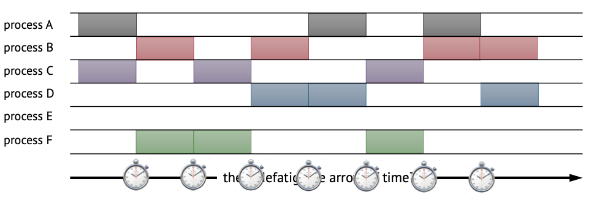
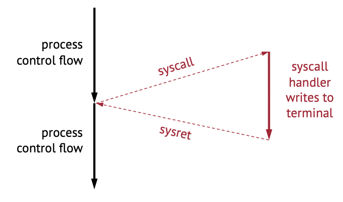
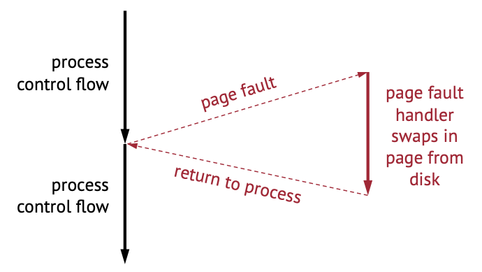
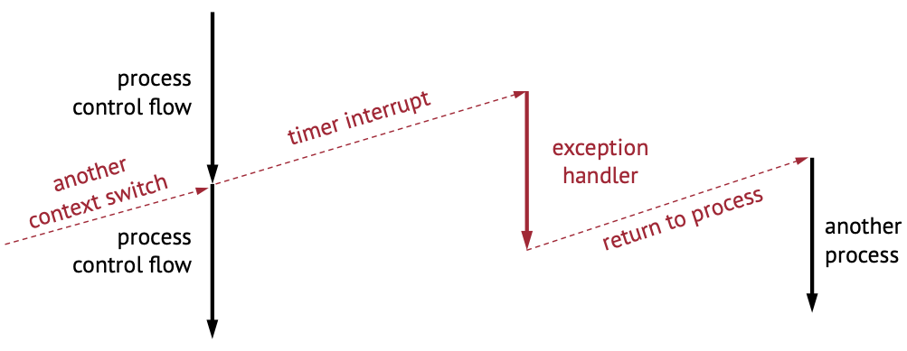
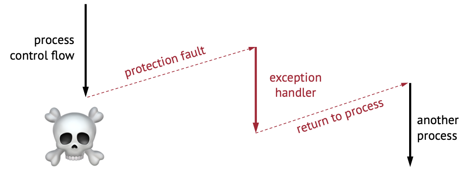
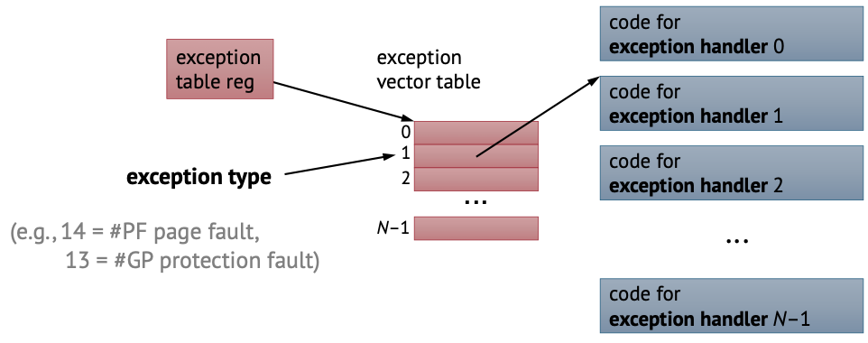

Lecture and slide by Mieszko Lis.


- toc
{:toc}


# Processes Continued

Recall **process abstraction**:

- A process is a single instance of a program, and is unique and identified by it's process ID (PID)
- Each process thinks it has the whole computer resources to itself -- supported by virtual memory system, who makes this illusion of address space.
- The OS kernel schedules processes on limited hardware via **context switch**
- *threads* are like processes but share same address space

## Time-Sharing

Suppose we have two cores, but six processes (A-F), how do we run all the processes seemingly concurrently.



Every time step (e.g. during a timer interrupt), we delegate the compute resource to a different process.


## Process Details

Recall: Every process has a **parent**, except PID 1 which is started by kernel during boot. Processes can also create **children** and need to wait for them to finish.

**Q: How does processes handle kernel requests? (hint: signals)**

**Q: How does processes pass requests to kernel? (hint: syscall)**

**Q: How does hardware notify kernel, e.g. how does the computer know when a key is pressed? (hint: interrupt)**

**Q: How does processes creates created / destroyed / managed**


To answer the above questions, we need to see what happens from the bottom of the stack.


### Program Control Flow

A CPU will execute instructions one after the other sequentially until it dies 💀. If we want it to do something interesting we must have conditional/unconditional jumps/branches. We can also call and return from functions.

We have done all of this already.

**Q: What happens when something unexpected happens?** Something that is unexpected to the program could include:

- Illegal instructions
- Incoming network packet
- Segmentation fault (illegal memory access)
- Someone presses a key
- Page fault
- etc.

We cannot use the standard control flow we know and love to handle these exceptions. We need to use :rainbow: **hardware exceptions** :rainbow:.


# Hardware Exceptions


Upon a hardware exception, we pause the original process control flow and execute some exception handler -- typical part of the kernel code. Once handled, we resume the original process flow.

> **Note**: "Exception" word in this case is not the same as C++/Java/Python exception.
>
> **Also note**: "Exception" in this case sometimes also known as *interrupts* and *traps*.

There are two types of exceptions:

- **Synchronous**: Result of instruction execution: such as illegal instruction and page faults.
- **Asynchronous**: these are based on events external to the instruction flow such as key press, hardware timers, network packet. Typically these are triggered by a signal via wire.


## Privilege Levels

Recall in previous lecture, we learned that processes have privilege levels -- some processes are more "entitled" than other processes. CPU has multiple privilege levels (e.g. 0 == kernel, ..., 3 == user applications).

Some instructions need kernel privilege level. Trying to execute these instructions with lower privilege results in a hardware fault (e.g. illegal instruction).

Some memory pages specify kernel privilege level in the page table entries.  Trying to access these pages result in a hardware fault (e.g. segmentation fault).

Exception handlers needs more permission than user-processes since:

- they often need to access the hardware directly
- they might need to switch / update page table (e.g. during page fault exception handler)

**Note** privilege level is different from *priority*: that privilege level dictates whether if a process is entitled to carry out certain operations (e.g. interacting with hardware), but priority influences time-sharing scheduling: i.e. how much time/resources a process gets.


> **Example: Syscall**
>
> 
>
> - The **syscall** transfer the control from the program to the kernel to do something -- in this case writes to the terminal/screen. 
> - The **sysret** transfers the control back to the program -- where it proceeds to do its thing.
> - This is an example of **synchronous exception**. Since there is no external events that triggered this.

> **Example: Page fault**
>
> 
>
> - Suppose we're running some app and it hits a page fault. As a programmer/user we don't even know if page fault happened (except it's slightly slower). 
> - Upon page fault, we go into a page fault handler that swaps in the page from disk.
> - This is also an example of **synchronous exception**. This is still not an external event because the page fault happened due to an memory instruction. If this instruciton wans't there, the exception woudln't have happened.

> **Example: Context Switch**
>
> 
>
> - Processes control flow is interrupted by some timer interrupt, where we switch to some exception handler
> - Upon completion of exception handler, we might return to a different process
> - This is an example of **async exception** since the exception occured due to the timer

> **Example: Illegal Memory Access**
>
> 
>
> - Process tries to access some illegal memory
> - Protection fault triggers and we go to some exception handler
> - Process will be killed, and we might return from exception handler to a different process
> - This is another example of **sync exception** 


## Exception Abstractions

So far we understand that:

- Hardware intrrupt running program
- and excpeiton handlers (ISR) transfer control to/from OS
- what happens during ISR depends on exception type

---

In x86-64, for example, a system call uses `syscall` and `sysret` instructions. A couple of things ahppen when we call `syscall`

1. The current instruction pointer `rip` gets saved &rarr; `rcx` (next instruction)
2. `rflags` saved to r11
3. `LSTAR` (system register that contains address of system call handlers) to `rip`
4. Raise privelige level 
5. Resume execution (which should go into the `syscall` handler)

When we call `sysret`

1. Lower privilege level
2. Restore flags: `rflags <- r11 & 0x3c7fd7 | 2`  it looks like magic code because there's some reserved flags we don't want touched.
3. Restore next instruction pointer: `rip <- rcx`


## Exception Observations

- syscall has a single entry point; the syscall exception handler has to decide what to do (read, write, etc.) based on value of `rax`
- page fault and keypresses cannot have a single entry point -- because the handler NEEDS to know what happened. The hardware needs to know a head of time which handler to call. We need to look up the type of exception in a table (Exception vector table)

## Exception Vector Table

There is a table somewhere in memory that is known to the processor called **exception vector table** that outlines "for *this* exception, there is *this* address for a handler."

Example: page fault exception type has a number 14, protection fault has 13. 




## Exception Entry and Return

Upon exception entry, we switch to another stack (at some known address). We save the original stack pointer, rflags, and rip by pushing it to our current stack. We raise privilge level and then jump the handler code via exception table. 

This is like a *syscall* but we jump to a different stack.

Upon return, everything is just undone (like a function call).


## Sidenote: How Does a Debugger Breakpoint Work?

How does a breakpoint trap the execution to stop at where it needs to stop? (Hint: the word "trap").

The fast way to do this is a **hardware breakpoints** -- the hardware can support a few breakpoints that help stopping execution at a few designated instruction addresses. (e.g.  registers `DR0`, `DR1`, ...). When the PC (`rip` register) matches one of these breakpoint addresses, it can trigger an exception -- who hands control back to the debugger.

Hardware breakpoints only works for a *few* breakpoints (typically 4). If we want more breakpoints, we need to use...

**Software breakpoints** replaces the instruction at the breakpoint with a **trap** instruction. The trap instruction is guaranteed to trigger an exception, where we can then hand control back to the debugger.


## Exception during Exception, Inception?


Exception handler **masks** exceptions -- so that other exception cannot occur. 

Interrupts hardware so that we can ensure future exceptions are not lost. Once the original exception is handled,d we can re-enable the exception. Some part of handlers re-entrant (e.g. for clean up)

Some exceptions cannot be masked (NMIs). One example is illegal instructions -- the processor literally cannot do anything else -- so it can't be masked.


## Hardware Exceptions vs Java (and Friends) Exceptions

In hardware exceptions:

- CPU interrupts the program, the program doesn't know it's been interrupted
- Run at escalated privilege level
- Serviced by OS kernel (handlers are part of the kernel)

In Java (and friends) exceptions:

- It's literally just a *jump*, and not much else (dissapointingly)
- The control transfer here is *non-local* (?),
- But the key difference is that the program is **not** interrupted and we're still inside the program.
- No special hardware or OS involvement. 


---

# Process Management

We know that processes can be organized in a tree -- because parents can launch children processes. 

From the kernel perspective, there are two piece of implementation to carry such management:

1. **`fork`**: a system call that takes current process and makes a copy (replicates a memory image).

   (In Linux, a more general call, **clone** does the same thing but also generalizes to threads)

2. **`execve`**: a system call that replaces current program with another. 

If we want to spawn another process, we need to first **fork**, then we replace one of the copies with another program we want to run with **execve** (*fork-and-exec*).

## Fork

Fork is a system call that returns a new process ID for the child process upon success:

```c
pid_t fork(void);
```

**Note**: `fork` returns -1 if the fork fails and cannot create a child process.

The cloned child process is **exact duplicate** of the parent, but it has its own virtual memory space.

> **Example**: consider following C code:
>
> ```c
> int main() {
>   pid_t p = fork();
>   printf("p: %d, my PID: %d, parent PID: %d\n", p, getpid(), getppid())
> }
> ```
>
> Where `getpid()` gets current process's PID and `getppid()` gets parent PID. In practice, one should always check for errors when we're forking (but for brevity is ignored in this example code).
>
> ---
>
> **Q:** how many lines does it print?
>
> Since when we called `fork` everything gets copied, including program flow, so `printf` is called twice -- once in the parent, once in the child. Suppose here's the output:
>
> ```
> p: 2, my PID: 1, parent PID: 0
> p: 0, my PID: 2, parent PID: 1
> ```
>
> We can tell that the first line comes from the parent, since `p` -- the return value from calling `fork` is a child PID and that the child's parent PID is `1` on the second line.
>
> **Note:** the order this occurs is not defined. We cannot assume that parent/child comes first. We **must** look at the PIDs to determine child/parent relationship.

We can use child processes for **concurrent processing**, e.g. use a seperate child process for each instance of web server connection.

## Controlling Children

When we spawn child process, both parent and child continue to run. This raises several issues:

- What happens when a child finishes/dies?
- How will the parent know?

If a child dies, we have to clean up. Consider the following code, if the code is in a child process, it will print "child":

```c
int main() {
  pid_t p = fork();
  if (p == 0) {
    printf("child\n");
  } else {
    while(1);
  }
}
```

Once we run this,  the child immediately finishes but upon inspecting list of processes we see that the child process still exists with status **`Z+`**:

```
$ ps X grep spawn2
507925 pts/3 R+ 0:03 ./spawn2
507926 pts/3 Z+ 0:00 [spawn2] <defunct>
```

The child process is now a **zombie**: no code is running but the process still exists. We need to cleanup, and must be **reaped** by the parent (via `waitpid`). If the parent dies before the child process dies, then it will be reaped by the `init` process (or next level parent process).

### Waitpid

**`waitpid`** is a system call we can utilize to reap child processes. Here is its API:

```c
pid_t waitpid(pid_t pid, int *wstatus, int options)
```

Where

- `pid` is the child PID
- `wstatus` is child exit details; we can use this output parameter to extract information about child exit detail and status to the parent.
- `options` has some options about the call. E.g. we might just want to check on the status of children processes without killing (see manual)

## Spawn Another Program

We use the system call **`execve`** to replace a copied process with a different one; here is its API:

```c
int execve(const char *pathname, char *const argv[], char *const envp[]);
```

Where

- `pathname` is the path to the program we want to run/spawn,
- `argv` is a list of command-line arguments,
- `envp` is the environment (environment variables, etc.),
- and returns -1 if `execve` fails, and doesn't return if the call suceeds -- since the newly spawned process replaced the current process in memory.

The program arguments and the environment are arrays of strings to be provided to each process. While arguments can vary specifically from process to process, environment is expected to be **persistent** (same to all programs).

We can use child processes for **concurrent processing**, e.g. use a seperate child process for each instance of web server connection.

> **Example**: spawning a child process that echos hello world.
>
> ```c
> int main() {
>   char *args[] = {
>     "/bin/echo",
>     "hello",
>     "world",
>     "\0" /* could be NULL here */
>   };
>   
>   pid_t p1 = fork();
>   
>   /* In practice, do error check */
>   if (p1 == 0) {
>     execve(args[0], args, environ); ⓵
>   } else {
>     pid_t _ = waitpid(p1, NULL, 0); ②
>     printf("parent: child died\n");
>     while(1);
>   }
> }
> ```
>
> This outputs:
>
> ```
> hello world
> parent: child died
> ```
>
> ---
>
> We started with the parent; then we called `fork` and got an exact copy of the parent process. Upon running `execve` (1) we replaced the child memory space with new data -- including new binary for the program we spawned.
>
> In the parent process, we can query the status of the child process (2), and when we the process dies, `waitpid` returns and the parents print the message.


## Signals

So far our parent process is hanging on `waitpid` when it's interested in child process's signals. But what if we want the parent process to continue doing other work and **be notified** when child exists?

We need to use **signals** -- which is a way for kernel/processes to notify processes. Signals are mediated by the kernel because it's unsafe to have exception handlers in user-code (since exception handlers require elevated privileges).

Kernel or process takes action depending on the signal. The signals `KILL` and `STOP` are always handled by the kernel, and other signals can be caught by having *signal handlers* in programs.

A list of UNIX signals can be found here: [POSIX signals](https://en.wikipedia.org/wiki/Signal_(IPC)#POSIX_signals).


### Sending Signals

For a `kill` signal, we just need to call the `kill` command and specify the PID. The kill signal will then be handled by the kernel -- kind of like an exception handler.


### Catching Signals

