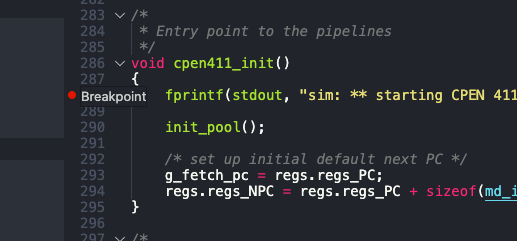

- toc
{:toc}

## 👋 Introduction

Visual Studio Code (VS Code) is apparently very popular as a code editors. While it labels itself as only an *editor*, it has many features that enables it to be used like a proper integrated development environment (IDE). I will use CPEN 411 Lab 2 assignment as the sample project to guide the reader through this document. By the end of this document, we should know how to:

- Install C/C++ extensions for VS Code,
- Configure VSC to run the debugger, and
- Use the GDB debugger in VS Code GUI.

## ☑️ Requirements

First we must make sure that we have the tools to build/compile the source files (i.e. running `make` in the terminal should yield no errors). 

Then install *C/C++* extension from VS Code Extensions Marketplace. Click the green *Install* button to install (Figure 1).

<figure class="figure">

<figcaption class="figure-caption">Figure 1. Installing C/C++ from VS Code Extension Marketplace</figcaption>
</figure>


## ⚙️ Configure Launch

In VS Code interface, go to the *Run* tab in the sidebar (icon shaped like a bug overlaying a play-triangle). Then click on the big blue *Run and Debug* button. If the proper build tools are available, we should see something like in Figure 2. Type or select `C++ (GDB/LLDB)`. You might then be prompted to select either *gcc-7* or *gcc*, this doens’t matter so I chose *gcc-7*.

<figure class="figure">

<figcaption class="figure-caption">Figure 2. Creating a Launch Configuration File</figcaption>
</figure>

Upon completion, VS Code will immediately try to compile and run whichever file we have open in the active editor window. This will result in compilation error — which is expected. Click *Abort*. Now we see the active editor window showing the **launch.json** file as seen in Figure 3.

<figure class="figure">

<figcaption class="figure-caption">Figure 3.</figcaption>
</figure>

This file configures what happens when we “launch” from VS Code. 

1. First let’s change the `name` entry to something more relevant, such as `Build and debug sim-scalar-5`.

2. Change the `program` entry to point to the path of the executable, in our case, this would be: `“${workspaceFolder}/src/sim-scalar-5”`. Note that *\${workspaceFolder}* is a VS Code special variable that expands to the root path of the workspace — in my case this is the root directory of the Lab 2 assignment.

3. For `args`, this will be the arguments passed into the simulator. For example, if we want to run the *go* benchmark, we would need to specify:

   ```json
   "args": ["${workspaceFolder}/benchmarks/go/go.ss", "9", "9"]
   ```

   Note that the paths must be relative to the workspace root, and each argument are entered as separate strings in a list.

4. For the key `preLaunchTask`, change the entry to some other name like `Make sim-scalar-5`. Note that this is the name of the *task* that will execute before the launch happens. In the next subsection, we will go over how to make a *build task* that is responsible for running `make` so that we have an executable program to launch from.

5. Ensure that the path to launch `gdb` is correct in `miDebuggerPath`.

Once done, our *launch.json* file should look something like this (Figure 4):

<figure class="figure">

<figcaption class="figure-caption">Figure 4.</figcaption>
</figure>

### Configure a Build Task

In this subsection, we will configure a task to run `make`. 

1. Open the VS Code Command Palette, then select *Tasks: Configure Task*, then *Create tasks.json from template*, then *Others*. A new json file should open up.

2. Change `label` to the same string as what we set in `preLaunchTask` in *launch.json* — which is `Make sim-scalar-5`.

3. Change `cmd` to the command we want to run in the shell, which is to run `make`:

   ```json
   "command": "make -C ${workspaceFolder}/src"
   ```

   Note that here we use the flag `-C` to tell *make* to change directory to the *src* subdirectory.

Once we are done, it should look like Figure 5:

<figure class="figure">

<figcaption class="figure-caption">Figure 5.</figcaption>
</figure>

### Makefile Compiler Flags

Since we’re debugging, let’s open up *src/Makefile* and make sure that no optimzation is set to be performed during the compilation. In the *Makefile*, sure that optimzation flags (`OFLAGS`) have `-O0` for no optimization and `-g` to generate debug information:

```makefile
OFLAGS = -O0 -g -Wall
```


## 🐛 Running and Debugging

Once the steps described above is done, headback to our code (*sim-scalar-5.c*), go to the *Run* tab on the sidebar, and notice that we have a launch configuration ready to go (Figure 6):

<figure class="figure">

<figcaption class="figure-caption">Figure 6.</figcaption>
</figure>

### Adding Breakpoint

To add a breakpoint, simply click the left margin near the line number to add a red dot 🔴 symbolizing where the program should break out at as seen in Figure 7. This is equivalent of using `break` or `b` in GDB.

<figure class="figure">

<figcaption class="figure-caption">Figure 7.</figcaption>
</figure>

### Start

Click the green triangle at the top of the *Run and Debug* panel or use the keyboard shortcut <kbd>F5</kbd> to start debugging. From here on now, users of Visual Studio IDE would find debugging very familiar.

### Stepping

As seen in Figure 8, we have paused at the line where we set the breakpoint. The toolbar at the top of the VS Code window provides controls to: continue, step over, step in, step out, restart, and stop the debugger. The lefthand *Run and Debug* panel shows local variables, watched variables, and the callstack.

<figure class="figure">

<figcaption class="figure-caption">Figure 8.</figcaption>
</figure>

### Debug Console

The *Debug Console*, shown as a tab in the bottom panel in Figure 9, can be used to enter commands for the debugger. For instance, we can call a function (Figure 9):

<figure class="figure">

<figcaption class="figure-caption">Figure 9.</figcaption>
</figure>

Then go back to the *Terminal* tab to see the resulting output of the function call (Figure 10):

<figure class="figure">

<figcaption class="figure-caption">Figure 10.</figcaption>
</figure>

## 👏 Conclusion

This concludes a short “tutorial” on how to configure VS Code to build a project from Makefile, running, and debugging the code. Using the VS Code debugger can potentially significantly speedup the workflow for someone like me — who’s grown up using visual/GUI applications and is more comfortable with it.

If there’s any questions or errors, please don’t hesitate to get in touch with me!