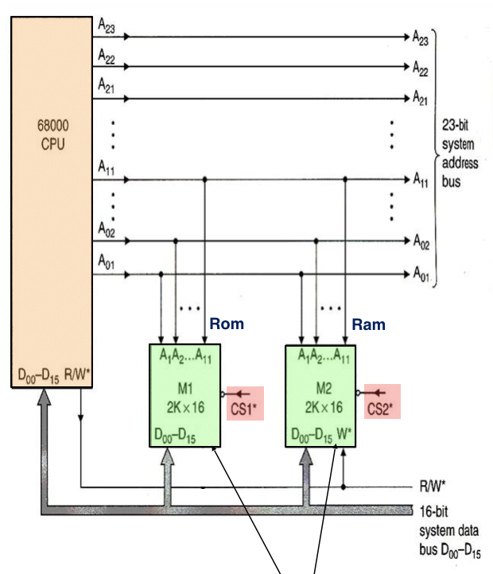

**Sequential access memory** have different access methods. They are sequential technology one bit a time, so we don’t need a wide data-bus. The device are physically very tiny but as a trade off, they’re typically very slow. Examples include SPI RAM, I2C.

---

Typical interface of a random access memory chip consists of:

- Input: Full address bus (N-bits, usually commonly 4, 8, or 16 bits; if we want bigger widths, it’s more economical to put two devices in parallel)
- Input/Output: Full data bus (M-bits)

The total storage is given by $M\times 2^N$ bits.

Additional signal may be used to control the device:

- Chip select (CS) or chip enable (CE) used to enable memory expansion for making a bigger memory system than the device.
- R/W is used to control whether if we’re reading or writing to
- Output enable (OE) is used to control the output buffer to prevent contention between two memory chips (we never want to drive both memory devices at the same time as it could cause electrical badness), it is a faster method than just changing CS.

## Building Larger Memory

We can put meory systems with a certain “data bus width” together and make a larger memory system.

We can put 2 devices in parallel, each with 4 of the 8 data bits. Each chip is connected ot 15 address lines.

We can use the highest 1 bit as a primitve decoder to feed into chip-select (CE). Now if we want 18 bit memory, then we can use the highest 2 bits and feed it into 2-4 decoder and do the same thing.

