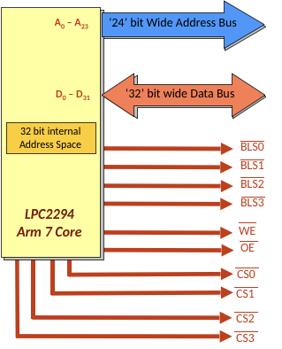

## Motorola 68000

This is a CISC proessor, and we have the UDS and LDS signal for transferring upper or lower byte o fthe 16-bit words. Address strobe (AS) signal is used to show that the address is valid.


The 68000 is asyncronous, meaning that it attempts to control the memory device, and sit there until we receive DTACK (data transfer acknowledge) or BERR (bus error).


Internally, there are many registers. The data registers are like accumulators used for arithmetic operations. An example instruction:

```assembly
add.w d1, d0
```

This adds the word in registers D1 and D0 and stores it in D0.

The address regsiters are like index registers, this is what we use to implement pointers. They could be 16 or 32 bits. A7 is the stack pointer (this is used for push/pull operations) and points to some area in the stack. This requires initialization.

CCR is the register used for carrying data.

### LDS and UDS Signals

Eventhough the 68000 has 16 bit bus for memory, it might not transfer all 16 bits at once. Every 8 byte has its own address from programmer’s point of view. If I want to write/read a byte from location with even numbered address, then we need to use the upper 8 bits of the data bus, with UDS asserted. Same thing with odd numbered addresses except with lower 8 bits of the data bus and LDS assert 0.

If we’re reading/writing a 16 bit word, then upper and lower 8 bits of the data bus are memory, and both UDS and LDS is asserted 0.

For a long word (32 bits), two back-to-back transfers will be done.

#### Alignment

This processor will not work if the words or long words are not aligned. If we tried to transfer a word to odd address, then one byte will be in one word address. But the other half will be in a different word address.


This is why the 68000 processor doesn’t have the A<sub>0</sub> pin. 

### Example Data Transfer

```
move.b	d0,$0
```

This moves a byte from regsiter D0 to address 0. Since 0 is even, it will be transfered using upper 8 bit of the bus, UDS asserted 0. Word address output 0.

```
move.b	d0,$1
```

LDS asserted 0. Address output 0.

```
move.b	d0,$2
```

Same as first one, except word address output is 1.

```
move.b D0,$FF
```

This is an odd address, so they’re transfered using lower 8 bits (D0-D7), and LDS asserted 0.

```
move.w d0,$0
```

Both LDS and UDS asserted 0. Data are transfered over both half of the data bus. Output word address 0.

```
move.w	d0,$2
```

Same as previous operation, except output word address is 1.

```
move.w 	d0,$3
```

:warning: this is an illegal operation becase we cannot transfer a word over an odd address.

```
move.l	d0,$0
```

Both UDS and LDS asserts 0, full data bus used for transfer and output word address 0. Then it increments the word address and does another transfer, and then output word addrses 1.

```
move.l	d0,$1
```

:warning: fail.

### Memory System Architecture


### Memory Organization

Since there are 24-bit address. We can go up to `FF FFFF` or 16 megabytes. 


All CPUs reserve memory space for special boot vectors and exception vector. This is up to the designer and in this case, it goes from `00 0000` to `00 03FF`.

## Case Study: LPC2294 ARM 32-bit RISC CPU



This is a modern RISC processor, but the data interface is mostly the same. This processor however does not have A0 or A1 line, because byte 0, 1, 2, 3 share the same long-word address and so on.

---

**Dynamic bus sizing** involves the processor not assuming the width of the memory being accessed. It involves an active communication between memory and processor. If the width mismatches, then the processor then breaks the data down and does multiple transfers.