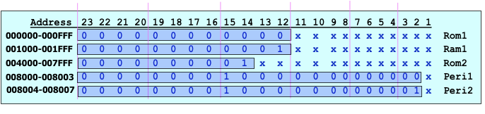

Memory full address decoder example:

- 10K word block of ROM as:
  - ROM1: 2k
  - ROM2: 8k
- 2K RAM
- 2 words for 16bit peripheral
- 2 words for 16bit peripheral #2

We cannot put ROm2 after ROM1 right after each other and it will make it hard to design address decoder because it doesn’t align with a boundary in the memory space. 

Follow the steps and make an address table for the memory spaces:



So our address mapping is as follows:

```
Rom1 = [00 0000 to 00 0FFF]
Ram1 = [00 1000 to 00 1FFF]
Rom2 = [00 4000 to 00 7FFF]
Per1 = [00 8000 to 00 8003]
Per2 = [00 8004 to 00 8007]
```

---

### Practice

Recall full address decoding means all unused address space goes into address decoder to organize memory blocks and peripherals. The address lines goes active high/low to enable whichever memory block should be enabled, when the address line is a particular combination.

> **Exercise 1**
>
> How many address lines the following byte wide memory devices have?
>
> - 256 bytes: 8 address lines 
> - 4k: 12 address lines
> - 32k: 15 address lines
> - 1M: 20 address lines
> - 16M: 24 address lines

> **Exercise 2**
>
> For a CPU with 16 addresss lines, how many addres lines would connect to a full address decoder for the follwoing memory devices:
>
> - 1k byte: 16 - 10 address lines = 6 bits unused for address decoder
> - 8k byte: 3 bits for address decoder
> - 32k: 1 bit for address decoder
> - 64k: no need for address decoder

> **Exercise 3**
>
> How many blcoks of emmory with the following size fits into 68000 memory map. The 68k system had 23 width, or 16M byte space.
>
> - 256k bytes: 1k x 8 devices

> **Exercise 4:**
>
> Determine how many memory chips of the following type are required to realize the following sizes of memory on 68k. system adn how are they organized on the data bus:
>
> - 2k bytes using 1k x 8 bytes: we need 2 devices. Two are split for each half of the total address spaces.
> - 16k bytes total memory using 4k x 4 bit devices: We need 2 chips for 4k bytes, so we need 8 chips. Two are put in parallel pair to output 8 bit width. Then split to cover the address spaces.
> - 64k bytes total memory using 16k x 1 bit devices. We need 8 chips for 16k bytes. So we need total fo 32 chips. 8 of them are in parallel to ouput a byte, and 4 of them stacked to split the address space.

> **Exercise 5**
>
> What is the range of addresses occupied by the following blocks of memory, assuming base (or start) address shown below:
>
> - Base `0F 0000` block size 16k: 16k gives 14 address bits, or 11 1111 1111 1111 so the answer is `0F 3FFF `
> - Base `2F 0000` block size 64k: `2F FFFF`.
> - Base `C0 0000` block size 4M: 22 bits, 22 bits of 1’s gives `3F FFFF`, add it to base address and we get `FF FFFF`. 

> **Exercise 6**
>
> Design a full addrsss decoder for 68k based systsem with total 4k bytes of RAM beginning at a base address of 0h002000 using 2kx 8 ram chips.
>
> First, we need 2 chips. They are connected by connecting one to each half of the data bus. 68k. has 16 bit data bus, 4k bytes will  have 11 address lines. So the lower 11 address lines are connected direct to memmory. Then we write the base address to the upper, remaining, 13 lines.
>
> The result is: `0000 0000 0010 | xxxx xxxx xxx`

> **Exercise 7**
>
> Design a  full address decoder for 68k system with 128k bytes of RAM constructed from 64k byte devices, to reside at a base of 48 0000
>
> We need 2 chips to give us a full 128k. So we need ONE bank of two chips of memory.
>
> 64k chips have 16 bit address lines (A0-A15). They connect to A1 to A16 on the 68k. Then A17-A23 are for the decoder. Since 64k is FFFF, then for 128k is 1FFFF. Then the last address will be base address + 1FFFF = 49FFFF.
>
> The base address starts at 480000. So we write out 48 in the upper 7 bits (address line used for decoding): `0100 100 | x xxxx xxxx xxxx xxx`. So we select this bank of memory if address[23:17] is 7’b0100100. Note that using if/else in Quartus to do this will genearte a comparator circuit whihc is slower tahn a boolean expression.

> Exercise 8
>
> Design a  full address deccoder for the following 68k system:
>
> 1. a block of 256k bytes of ROM, using 128k byte devices located at 0 and up.
>
> > I need 2 chips in parallel to give us 128k words (or 256k bytes). Address decoder have all the unusued address lines 0. 17 lines of the 128k goes from A0-A16 which connects to A1-A17 on the CPU. Address table looks like: `0000 00 | xx xxxx xxxx xxxx xxx`. 
>
> 2. 4M of RAM using 512k x 4 chips starting any.
>
> > A bank which uses 4 devices to give us 16 bit lines, and we need 4 banks. Each back uses 512k words or 1M byte and uses 20 address lines. We need 4 address decoders, one for each bank. 
>
> 3. A block of 4M RAM using 1M x 1 chips starting any.
>
> > We need 8 x 4 = 32 chips. 16 of them in parallel to get us a bank. And we make two banks. It has to be on a natural boundary. Each bank has 1M words, each 1M chip has 20 lines A0-A19, connects to A1-A20 on CPU. Leaving us 3 address lines A21-A23 to decode. We chooes the range `C0 0000` to `DF FFFF`. It also cannot be at 00000 because 68k must have ROM in location 0.

Take home question: other CPUs like ARM and NIOS has 32 bit data bus. Solve exercise 8 again. 

> Exercise 9
>
> Design a full address decoder for the following 68k based system.
>
> - 2M bytes of RAM using 256k x 8 located at A00000.
> - 256 kbytes of ROM of 128k x 8 at F80000
>
> We need 8 256k x 8 organized into four 16 bit banks. Each pair has one connected to lower, and one to higher (LDS and UDS) of the data bus. 4 chip select lines will be required, one for each bank. Each chip has 18 address lines for 256k leaving 5 for the decoder (A19-A23). 
>
> Starting at A00000 we have: `1010 0 | xxx xxxx xxxx xxxx xxx` and the decoding goes `1010 1`, `1011 0`, `1011 1` for each of the four banks. The ending address is `BF FFFF`.