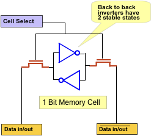
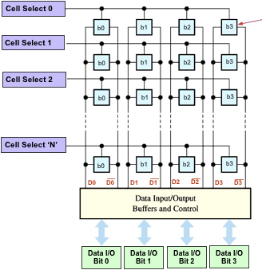
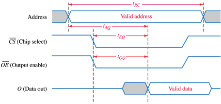
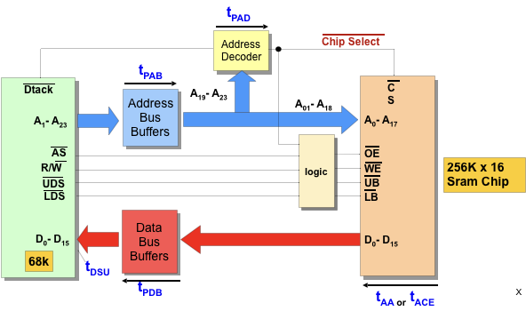
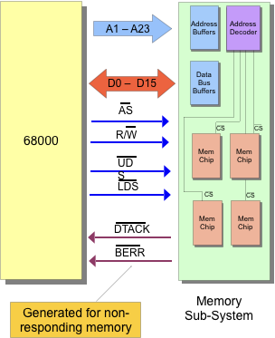
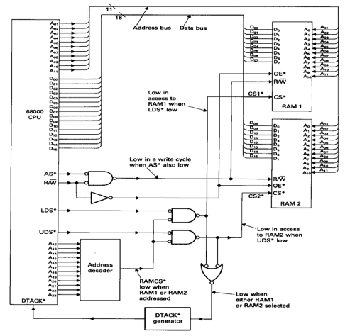
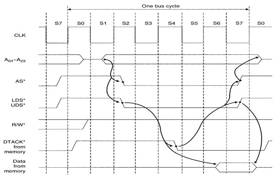
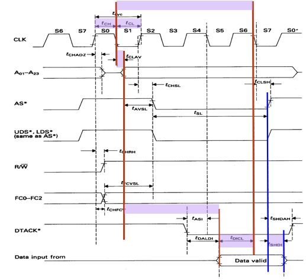
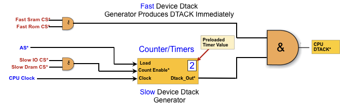
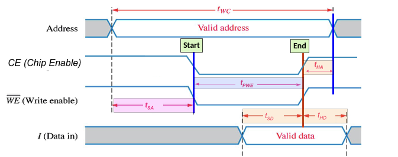

- toc
{:toc}

## Asynchronous Memory

A typical SRAM cell consists of back-to-back inverter. Note that due to the nature of the cell and logic gate (meta-stablility and regenerative properties), upon powerup the stored bit is random.

The inverter could either be CMOS (2 MOS + 2 MOS + 2 control MOS = 6T), or using resistive load implementation.

These SRAM cells are arranged in a lattice where individual stored data can be accessed using wordlines and outputted in bit lines.

### Reading from SRAM Cell

The *cell select* line is activated as response from the CPU address, and turns on the two control MOS and the inverter outputs are fed into a *sense amplifier*. 

We need a **sense amplifier** because upon read, the change in bitlines is very small due to the fact that all memory cells of a bitline are connected in parallel. The sense amplifier is biased to Vdd/2 and upon a small change, it will be pulled to either 0 or Vdd.

### Writing to SRAM Cell

The *cell select* is asserted HIGH, then the CPU drives data into the data in/out lines (bitlines). The higher power control MOS overpowers the inverter and forces the data into an appropriate stable state.

### SRAM Timing

No two chips exhabit identical timing due to difference in temperature, material, capacitance, voltage. For example, a higher voltage can make a circuit work faster because capacitances can be charged and discharged more quickly. Another example is when a digtial pin switches from a 1 to a 0 (discharging capcitance), so there exists a current that flows into the ground. The ground has intrinsically inductance properties, so the Vdd inside the digital chip could drop, making the circuit run slower.

- tAA is the worst case read access time — this is the most important parameter when considering SRAM devices when designing a system.
- tAC is the worst case time delay between chip enable to output to be valid
- tDOE is the worst case time delay between output enable to the output data being valid
- tRC is the minimum time for a single read operation.

Key design decisions for read operation:

1. CE and OE arrive early so it's not delaying turning on output buffer inside the memory chip.
2. Get CPU address to chip ASAP; do not wait for AS. This is so the internal decoder in the memory chip can get started immediately.
3. Make sure CPU wait at least tAA or else it's going to get erroneous data.

#### Memory Address Dead Time

There exists a period of time between transitions of different address signals. This is to ensure that we turn one memory device OFF between a another memory device ON to avoid *contension*. This is done using Address Strobe (`AS_L`) active low signal. `AS_L` turns HIGH before the address changes, and turns on a bit after the address changes.

#### Other Delays

Other delays can come from buffers. In this case, we’re not even considering the propagation delay in the wires.

The total delay, ttotal, after Dtack is received is at tPAB + tAA + tPDB + tDSU or tPAB + tPAD + tACE + tDSU.

## Synchronous Memory

Synchronous memory can have the data clocked, so a clock is needed. SSRAMs have internal counters to automatically increment the last address, allowing burst reading or writing of data (quickly burst different data without changing address).

It is more important to consider timing for synchronous memory system because CPU usally clocks a lot faster than memory access time (1 GHz corresponds to 1ns, and is much faster compared to 10 ns, which is typical for fast SRAM). So either we need to slow CPU down, or have a robust protocol to communicate with the SRAM.

## 68K Asynchronous Bus Interface

Recall our process-memory interface:

1. The processor output the address on the pins A1-A23
2. It then asserts active low address strobe `AS_L`
3. `R/W_L` indiccates direction of data transfer
4. `UDS` or `LDS` active low signals indicate which byte to transfer.
5. Data is then transfered.
6. After memory operation, the memory system responds with a *data transfer acknolwedgement* signal (`DTACK`) which means that the memory has done its job and we can move on.

😇 The advantage is that async-memory is flexible and allows for both fast and slow memory to communicate.

😱 The disadvantage is that this `DTACK` “handshaking” has lots of overheads that puts an upper limit on transfer rates on highspeed systems.

---

Here is an example of an implenetation fo 68K async SRAM:

Notice the `DTACK` active low signal generator.

## Timing Analysis

We need to look at both read and write operation and how they look like (they have different timings).

### Read Operation

The read operation takes 4 clock cycles. They are further split into 8 states (S0 to S7), this is the fastest we can go. The arrows on the diagram below implies the casal relationships between signals.

- At the start of the read operation, all of the signal to the memory is deactivated. Notice that `UDS*` and `LDS*` is disabled (HIGH) prior to any read operation.
- Since we are doing a read operation, `R/W*` is asserted first before we do anything else (S0). 
- During S1, the address line is going to become valid. Notice that it becomes valid some delay after the clock edge of S1, this is due to propagation delay. The sooner we can give the address to the memory device, the sooner we can get the data from the address. The address decoder can now get to work.
- In S2, the `AS*` is now asserted along with `UDS*` and `LDS*`; now the chip has all the signal it needs to start producing its data to the output buffers. 
- S3 is a wait state
- The state machine makes a decision in S4. If the `DTACK*` from memory is asserted low before end of S4, then we go to S5. Otherwise, the statemachine go to wait states.
- In S7, assuming that `DTACK*` is asserted low, then the data latch internal in the CPU is latched. Control signals to memory `AS*`, `UDS*`, `LDS*` are disabled, which makes `CS*` and `OE*` also disabled. At that point, `DTACK*` is negated too. This is like taking a exam away from the student when time is up during a midterm.

> **Note**: Quartus simulations of the soft core does not simulate tristate of the address bus. So the address is actually asserted a lot earlier. This is good for us becuase the address decoder can start working earlier, reducing delay.

#### Timing Analysis Annotations

**8 MHz Clock**

- One important timing parameter is tCLAV: this is from clock to address available delay. Due to inherit propagation delays through the device, it constrains the worst case delay to 70 ns.
- From start of S1 to Start of S7 (when the data is latched), there is 3 clock cycles. For a 8 MHz chip, that is 375 ns. But because of the tCLAV, we are down to a window of 305 ns for the memory to respond.
- But wait, there is more. There exists a delay tDICL which is the data setup time in CPU, which could be 15 ns, so now we are done to 290 ns. That’s the window we have for the memory (worst case access time).
- But wait, there is more. There exists propagation delay between the memory device to the CPU. So we need even more of a timing margin. So a delay of 280 ns in the memory chip should theoretically work, but a longer PCB could cause the device to fail.

**12.5 MHz Clock**

- tCLAV now drops down to 55 ns (probably because better technology), clock period goes down to 80 ns.
- 3 clock periods is 240 ns. The minimum setup time is down to 10 ns.
- The total access time has window of 175 ns. Thus violating the timing constrains and the chip may not work.
- To fix issue, we either have to upgrad the memory system as well, or introduce wait statements (but in this scenario is counterintuitive).

#### Inserting Wait Statements

The 68k is capable of extending bus cycle indefinitely. We often want to insert wait statements because `DTACK*` doesn’t arrive in-time.

`DTACK*` is improtantt for DRAM becuase DRAM is leaky and requires refereshing. During the refresh, no read/write is possible and thus DTACK must be delayed.

#### DTACK Generator

For fast SRAM and ROM, we don’t need to delay `DTACK*`. When `AS*` goes HIGH, it makes the counter *load* the preloaded timer value; and when `AS*` goes LOW and the the counter starts. 

### Write Operation

The input data must to presented to the memory chip and a the same time WE and CE are activated. OE can be ignored because we don’t care. The memory address must remain valid throughout the write cycle.

In write operation, there are two setup and hold constraints: address setup and hold time, and data setup and hold time. 

- tWC is the minimum time guarenteed (worst case) for a write operation
- tSA is the setup time at the that needs to be valid before the start of the write
- tHA is the minimum address hold time
- tSD and tHD is the setup and hold time for the data to be written to the chip
- Importantly, the minimum SRAM write pulse width is the tPWE, which need to be on for a minimum amount of time for the circuit to apply its data.

The CE will be removed when one of the R/W or UDS/LDS is deactivated, whichever comes first.

> Note: the softcore has similar timing diagrams. However, the address hold time is being violated as the address simultaneously changes when UDS/LDS/AS are deactivated. Propagation or capacitance delays may cause UDS/LDS/AS (as result CE) to be delayed and arrive later than address line changes — which could be problematic.