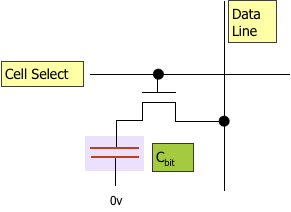
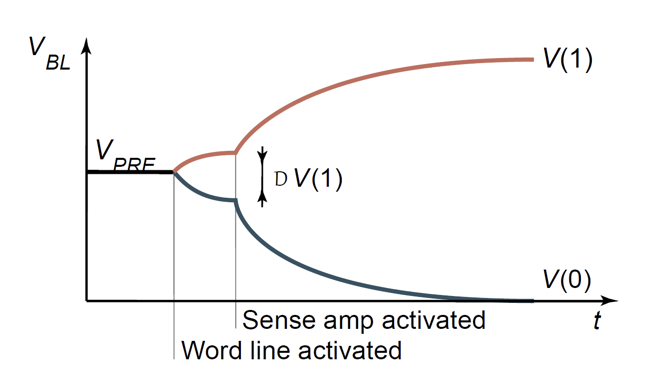
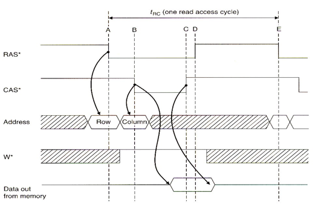
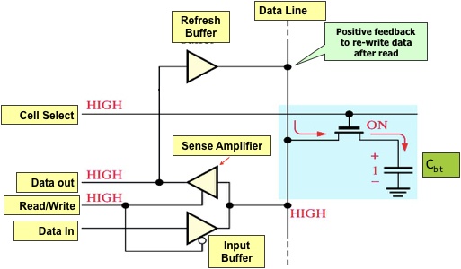

- toc
{:toc}

DRAM is voliltile storage memory. Generally they are randomly accessible. 

💪 It’s major advantage over SRAM:

- Cost per bit is cheaper
- Storage capacity is much higher per chip; as it only uses 1 transitor per bit compared to 6 for SRAM

👍 The drawbacks of DRAW is:

- Complicated interfacing; so a dedicated controller with its own state machine is required.
- DRAM is leaky and need to be refreshed.
- DRAM are also slower than SRAMs, which is why most caches are made with SRAMs.

In 8 or 16 bit microcontrollers, we don’t usually want to interface with DRAM. One reason is that there is not enough address space for the massive storage provided by DRAM.

## Basics of DRAM

The DRAM cell works by using a single transistor to charge/discharge a capacitor. The capacitor then stores the  memory bit as the charge state.

## Writing

### Storing 1️⃣

1. Data/bit-line gets driven HIGH to VDD.
2. Cell-select (word-line) goes HIGH and turns on the transistor.
3. Current flows and charges the capacitor, and create a voltage potential across the plates of the capacitor.
4. The cell-select line is then turned off, and the transistor cuts the capacitor off from the rest of the circuit.

### Storing 0️⃣

1. Data/bit-line goes to LOW.
2. Cell select signal goes HIGH and turns the transisitor on. 
3. Capacitor gets discharged, and there would be no potential across the plates.
4. Cell select goes LOW, and transistor is cut off.

## Reading

Reading is more complicated because by reading, we destory the data so we have to somehow put that data bcak.

1. Once we anticipate a read, the dataline/bitline is precharged to VDD/2.
2. Cell-select line goes HIGH and turns on the transistor, the capacitor will either discharge into the bitline if it held a 1, or charge from the bitline. ⚠️ note charge/discharge will destroy the data.
3. The bitline will increase or decrease by &Delta;V
4. We can use a *sense amplifier* to measure the change in voltage &Delta;V, and pulls the output to either HIGH or LOW.

### Timing Diagram

1. Present the row address, and latch it using RAS*

2. Present the column address and latch it using CAS*

   > An external multiplexer must be responsible to switch the two addresses to the DRAM

3. Data remains valid until negation of CAS* or RAS*

4. Data becomes available some delay later.

### Charge Leakage when Reading

All DRAM has a feedback loop to “repair” the data after read operation. Upon read, the feedback circuit either fully charge or discharge the circuit.

### Precharge Time

The fact that we need to precharge to precisely VDD/2 slows down the reading cycle time. The result is that the DRAM cycle time is twice as long as the access time. 

## Corruption of Data

DRAM cells can be corrupted by cosmic particles, which causes random bit failures. First geneation of DRAM had problems with &alpha;-particles that penetrates and changes the state of the cells.

More critical systems that require the reliability feature ECC memory that exists to allow detection and correction of bit errors. It uses extra bits to calculate where the faulty cell is and restore it.

## DRAM Refreshing

DRAM is leaky over time, and refreshing is necessary because if don’t access a part of memory frequently, the data gets corrupted. Refreshing is operated periodically.

The **refresh counter** and **refresh contorl & timing** circuit is used to manage this task.

### Refresh by Reading

We can read the data to refresh it too. This is common in graphic memories. Since for every frame, we need to draw to the screen and read data from the frame buffer periodically anyway, and thus a explicit refresh is not required.

$$
\nabla L_\lambda(\mathbf w)=\frac{1}{N}\sum_{n=1}^N\left[-y_n(1-\hat y_n)-\hat y_n (1-y_n)\right]\mathbf x_n+\lambda\sum_{i=1}^{d+1} w_i
$$

