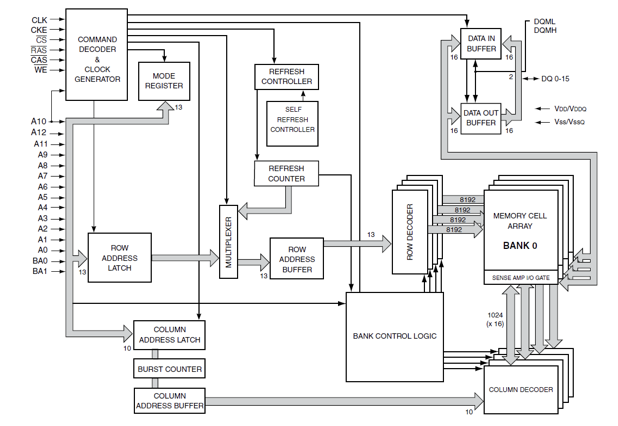
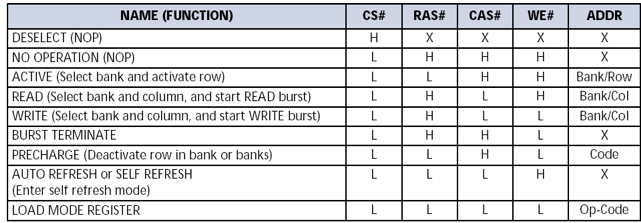
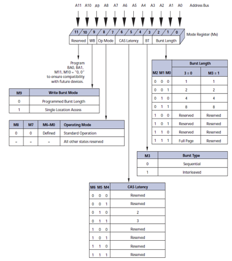
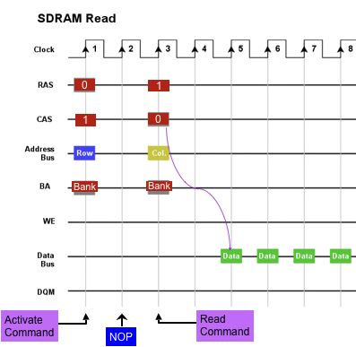
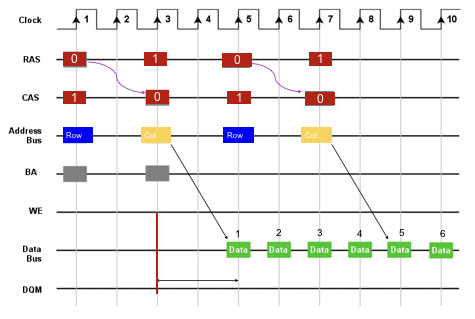

Unlike asynchronous DRAM, the synchronous DRAM, as the name suggests requires a clock. The synchronous DRAM offers *burst* mode and the internal buffers fills a bunch of data — then for each clock the data is shifted out like a shift register.

The burst mode is available in 1,2,4, 8 or full row in order to make access faster.

## SDRAM on DE1-SoC

- The clock feeds into the command decoder and the clock generator used by all components.
- There is a row address and column address latch just like async. devices. But there is also row buffer of 1024 used to clock the data out (`DATA OUT BUFFER`).
- The refresh counter is built in — which keep tracks which row needs to be refereshed next.

## Synchronous Commands

Because the device now is synchronous. Then any operations and commands needs to be signaled first, then clocked.

- No operation (NOP) command tells the device to do nothing.
- The active command selects which bank and activate row.
- The read command selects bank and column, then start the read, with optional burst (note that the active command needs to be sent first)
- The write command is siliar to read command, but writes.

### Power-Up Programming

From the table above, we can use the `LOAD MODE REGISTER` command to push in Op-Code over the *address bus*.

- The DE1-SoC has 50 MHz clock, so we need to set 2 clock period for the shortest clock latency.
- The 68k doesn’t feature cache so for now we don’t deal with bursts. The burst length is then set to 1.
- Set the above configuration to the 13-bit address lines.
- Set CS, WE, RAS, and CAS to low and wait for the clock to program it.

**Initialization Procedures**

1. 

## Read Timing

Advanced features in SDRAM supports command pipelining — we can issue a new command before the previous command has completed. In the following diagram, note that the delay from start of command to getting the first bit of data is 5 clock cycles. So if we want to get more data after the four pieces of burst data as seen below, it would be slow if we start issuing new command after all the data has come out.

Hence, we can use the time where the chip is clocking out the data to pipeline new commands. Note that on the positive edge of clock cycle #5, we started issuing new read command — and the burst output is continuous.

## Double Data Rate (DDR)

Instead of just synchronizing on positive edge of the clock, but we transfer data on both positive and negative edge. Theoretically, we can get data from memory twice as fast. In reality, the performance is marginally better.

