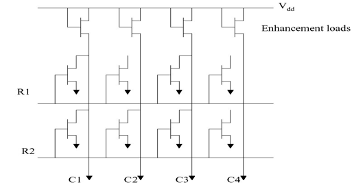
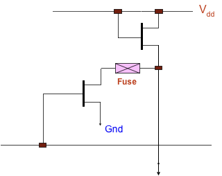
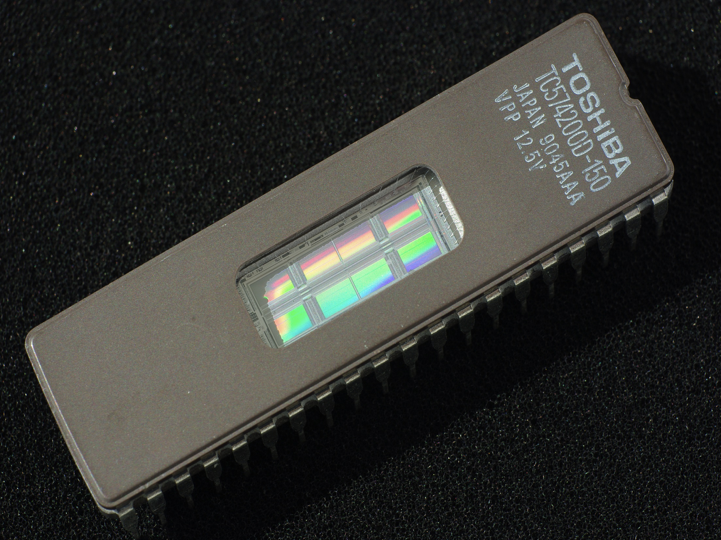
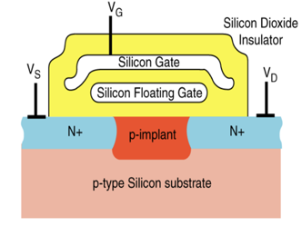

Classification of non-volatile memory:

- toc
{:toc}

## Mask Program ROM

Mask program ROM was very popular at one point. The memory is “programmed” into the memory chip by using a *metallization* layer that connects the MOSFETs together. The way it is wired defines what is stored. The memory is literally “hard-wired”.

👎 One obvious downside is that we cannot change the memory content. So if the data is wrong, then we need to discard the physical chips and restart. 👍 However, it is almost impossible to accidentally erase the memory. The upfront cost is also reduced since we don’t need a further process to program the chip. It is also common to replace logic circuit with memory using a truth-table/LUT.

They are made with high-resistance transistor that are suppose to output 1 by default. By physically wiring the transistor to the dataline, then we are outputing a logic 0. This connection is made with the *metallization* layer. For a logic-0 transistor, notice that when we enable the word-line (R1 or R2), then the bitline is pulled down to 0.

#### Characteristics (todo: combine into above paragraph)

- High data density per transistor (about 1 MOS per bit)
- Read operaton similar to static RAM.
- Production has 3-6 weeks delay due to the complexity to design and implement the metallization layer.
- Large upfront cost to produce the first samples.
- Extremely low per unit cost after that.

## One-Time Programmable ROMs

Customers are looking ways to program the chip themselves, even if it’s just once. This is similar to the previous *mask program ROM* except instead of using a metallization layer, we are using a fuse:

The programmer could program this by blowing up 💥 the fuse to make a logic 1 — same as mask program ROMs. The memory chips themselves are put into a specialized device which will zap 💥 the fuses by raising the VDD to a high voltage like 12 V into a 5 V device. They are expensive 💸.

## Reprogrammable Memory

### UV-EPROM

**Ultra-violet erasable PROM**s are memory chips that can be erased by exposing the chip to UV light. It’s obvious to distinguish these because they feature a quartz glass window that allows the exposure to occur. Erasing could take up to 30 minutes. The downside is that the chips needs to interface via the sockets so that it could be removed for erasing. The sockets are actually quite expensive — as costly as the chips themselves.

How it works is similar to Mask ROM except instead of using normal transistors, we are using *floating gate MOSFET*. The floating gate has the ability to hold chages on the floating gate. If there is little charge, then it allows weak current to flow through the transistor; outputing a 1. Otherwise, a large current flows — effectively shorting the bitline and outputs a 0.

By exposing the floating gate to UV. The stored electrons in the floating gate jumps back across the insulator.

### EEPROM

The problem with aforementioned UVPROM is that it needed to be removable, and specialized UV equiment is required since only a specific wavelength of UV can erase the memory chip. **Electrically erasable PROM** is the solution to this problem so that we can do erase operation internally.

The erase mechanism is similar to that of UV-PROM’s except instead of using a UV, it erases by a large electrical field. The big benefit is that we can erase individual locations without nuking the entire chip 🤯. Thus the chip is popular for storing parameters and configurations in the industry. Also since the chip can now erase itself, preventative measures are put into place so that it’s not very easy to erase by some random dude 🧑‍💻.

During a write cycle, internal circuitry automatically erase the cells byte-by-byte. Even though the write operation is fast, the memory chip may take several thousand times longer to carry-out the erase operation. Ergo usually the chips often feature a “status” pin to let the CPU know that it has finished.

One downside is that every time charge is jumping between the insulation layer, the layer actually breaksdown. This wasn’t a problem with UV-PROM because it was so slow to erase, no one bothered to care about this 🤷‍♀️. But now that we can do it so easily; there is now a limited lifetime, or erase cycles, these floating-gate devices — usually between 10,000 to 100,000 cycles. 

Another disadvantge is that we now need **2** transistors per bit cell because one is used to control the erase transistor. The result in history is that the data-density actually decreased when the industries transitioned from UV-PROM to EEPROM 📉.

