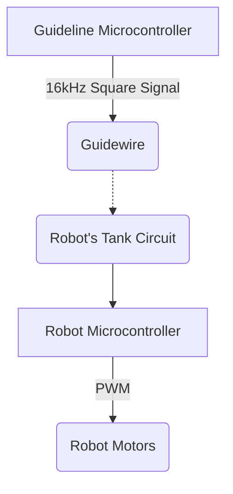

# ELEC 291 Magnetic Field Track Robot Final Report

**Team B6**

| Name                      | Contact     |
| ------------------------- | ----------- |
| Nicholas (Scott) Beaulieu |             |
| Geoff Goodwin-Wilson      |             |
| Muchen He                 | i@muchen.ca |
| Larry Liu                 |             |
| Lufei Liu                 |             |
| Wenoa Pauline Teves       |             |

[TOC]

## i. List of Abbreviations

## ii. List of Figures

## 1. Introduction

### Objectives

The objective of this project is to design, build, program, and test an autonomous robot which is controlled using the magnetic field generated by a guide wire.

*Figure 1.1: Project flow chart*

### Specifications

**Guideline wire frequency**: 16kHz

**Guideline wire communication baud-rate**: 15.625 (64.00ms per bit)

**Battery life**: ~20 minutes (drawing 500mA on a 9V alkaline battery)

#### Parts List

A detailed parts list is included in the appendix.

#### Software Features

##### Robot

- Reads commands sent through via the wire's magnetic field as binary (self made UART)
- Supports interpretation from binary up to 4 bits
- Supports the following commands (transmitted via binary as mentioned above):
  - Stop
  - Turn left at the next detected intersection
  - Turn right at the next detected intersection
  - Track forward
  - Track backward
  - U-turn (rotates 180 degrees)
- Proximity detection using sonar sensor
  - Stops the robot when objects directly in front of the robot is detected
- LED Matrix Visualizer that displays bitmapped pixel art that associates to the command
- Blinker LEDs to simulate turn signal

##### Guideline Controller

- Generates 16kHz square wave in the guideline wire for the robot to follow
- Sends commands to the robot using binary by switching the 16kHz signal on or off (self made UART)
- Sends the binary for the following commands:
  - Stop
  - Turn left at the next detected intersection
  - Turn right at the next detected intersection
  - Track forward
  - Track backward
  - U-turn (rotates 180 degrees)

## 2. Investigation

## 3. Design

## 4. Lifelong Learning

## 5. Conclusion

## 6. Glossary

## 7. References

## 8. Bibliography

## Appendix

### A. Detailed Parts List

### B. Guideline Controller Circuit

### C. Robot Circuit

### D. Robot Logic

### E. Test Data

### F. Software Source Code

