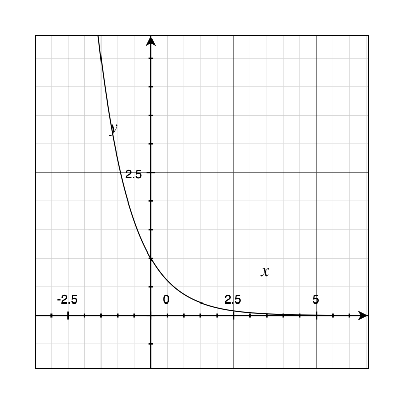
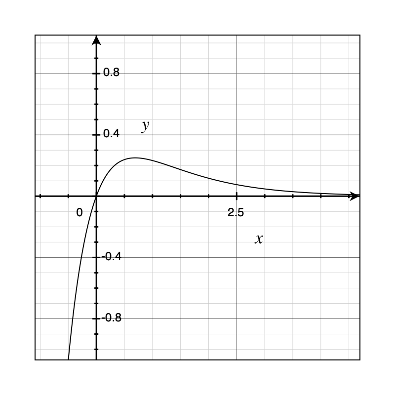

**Poles** corresponds to the polynomial in the denominator of a transfer function in s-domain. **Zeroes** corresponds to the polynomial in the numerator. Consider the following examples:

**Example 1:** Single pole on the left
$$
\frac{1}{s+1}\Rarr e^{-t}
$$

This open loop transfer function has a pole on the left-hand side of the s-space. When plotted in time-domain, we see that this system is *naturally stable*.

 

**Example 2:** Single pole on the right
$$
\frac{1}{s-1}\Rarr e^t
$$
The open loop transfer function has a pole on the right-hand side of the s-space. This is considered bad because it results in an unstable sytem. In time-domain, it is apparent that the signal will exponentially grow until saturation.

**Example 3**: Two poles on the left
$$
\frac{1}{(s+2)(s+1)}\Rarr e^{-t}-e^{-2t}
$$

**Example 4:** Two poles and zero on the left
$$
\frac{s+3}{(s+2)(s+1)}\Rarr2e^{-t}-e^{-2t}
$$

**Example 5**: Complex poles
$$
\frac{1}{(s+j\omega)(s-j\omega)}=\frac{1}{\omega}\frac{\omega^2}{(s^2+\omega^2)}\Rarr \frac 1 \omega \sin(\omega t)
$$
A pair of complex poles share the same real-components. In time-domain we have a sinusoidal signal. In this example, the pair of complex conjugate poles lie exactly on the imaginary axis. The result is a marginally stable system since the oscillation never goes away.

The same applies to if we add a zero-at-zero to to the transfer function:
$$
\frac{s}{(s+j\omega)(s-j\omega)}\Rarr \frac 1 \omega \cos(\omega t)
$$

**Example 6**: Complex poles on the left
$$
\frac{1}{(s+a+j\omega)(s+a-j\omega)}=\frac{1}{\omega}\frac{\omega}{(s+a)^2+\omega^2}\Rarr\frac{1}{\omega}\sin(\omega t)e^{-at}
$$
If we shift the complex poles to the left hand side, then we essentially introduced a decaying exponential component to the system. This is due to the *shifting theorem*, that by shifting in the s-domain, we multiply the time-domain function by $e^{-at}$.

**Example 7**: Controlling an unstable system

Consider the following open loop transfer function:
$$
\frac{Y}{U}=\frac{2}{s-1}\Rarr 2e^t
$$
There exists a pole on the right hand side, so this system is unstable. To make it more stable, we need to add control/feedback. The simplest feedback we can add is this error feedback with a gain of 1.

The closed loop transfer function is $G/(1+GH)$, where $G$ is the feedforward gain ($Y/U$) and $H$ is the feedback gain (1). The closed loop transfer function evaluates to:
$$
\frac{\frac{2}{s-1}}{1-\frac{2}{s-1}}=\frac{2}{s+1}\Rarr e^{-2t}
$$
Now this shows that the closed loop system *is* a stable system.

