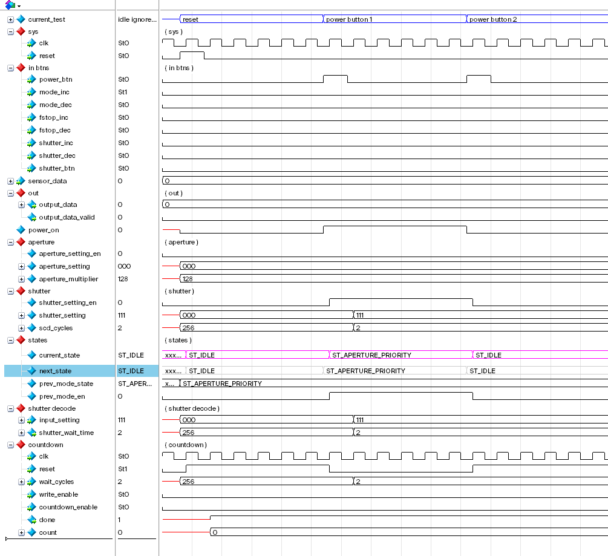

Muchen He - **44638154**

This report specifies the finite state machine (FSM) I built for ELEC 402 project 1. 

## Description

The FSM I built is a very simple model of a single-pixel digital camera. The digital camera has three modes of operation: Aperture Priority (A), Shutter Priority (S), and Manual (M). In A mode, the user can change the aperture size, denoted in photography terms as the f-stop number. A wider aperture, which lets in more light, has lower f-stop number. In A mode, The shutter speed setting will be automatically adjusted. In S mode, the user can control the shutter speed, or how long to expose the sensor for. In S mode, the f-stop will be adjusted automatically. In manual (M) mode, the user can control/override both settings at the same time. The user presses the shutter button to capture an image. Then, the sensor data is “amplified” and outputted from the FSM into memory.

### Assumptions

For the scope of this project, we will make some assumptions.

First, we are not actually implementing a memory device. Since the goal for this project is just to construct a 10+ state FSM, the output would be the “amplified” sensor data.

Second, we assume this camera is not realistic, as in, the simulation of operation is simplified and is not a true reflection of how a digital camera works. In a real digital cameras, the sensor data is not “amplified” by shutter or aperture, they simply just gather more light. They are sensor sensitivity settings (ISO) but we are not considering them here.

Lastly, the shutter speed is in multiples of clock cycles. In real life, shutter speed is typically 1/200 or slower. But that would be too much clock cycles and simulating “waiting for shutter” for thousands of clock cycles is unproductive. So in this project, the fastest shutter speed is 2 cycles, and the slowest shutter speed is 512 cycles.

## State Transition Diagram

The machine starts in the “reset state” which is the state named “idle”. Here the FSM will not do anything until the user presses the power button (named `power_btn`). Then the FSM will default into aperture priority mode state (A). From here, we can cycle through the different operating modes.

When the FSM is “powered on” (in one of “A”, “M”, or “S” states), pulsing `power_btn` will make FSM return to the idle state. We use a flip flop to keep track of previous state so we can return to it.

Depending on which mode, we can press the corresponding buttons to increment or decrement camera settings (see *Descriptions* section on how it works). 

Pressing the shutter button (`shutter_btn`) will tell the FSM to “take a picture”. Necessary data is calculated and stored. Then we go into the “wait” state where we wait for the “photo” to expose. How long we wait depends on the shutter speed. 

Lastly, when we’re done, we output the data from the FSM, and return to the previous **operating mode** state.

### State Transition Diagram with Output Signals

Here is the previous diagram except with the output signals of the FSM to the datapath as well as to the external of the device. I provided two separate diagrams to avoid clutter.

### State Descriptions

- **IDLE**: The reset state. This is equivalent to the camera being put into suspension mode for power saving. The FSM should not accept any input except for the power button.
- **A (Aperture Priority)**: This is the main mode state for operating in aperture priority. In this state, the user only changes aperture/f-stop settings. At the same time, the FSM automatically sets the shutter speed (in *Calc S* state).
- **S (Shutter Priority)**: This is the main mode state for operating in shutter priority. In this state, the user only changes the shutter speed settings. Similarly, the FSM automatically compensates by adjusting f-stop automatically (in *Calc A* state).
- **M (Manual)**: This is the main mode state for operating in manual mode. The user can adjust both f-stop and shutter speed settings. Furthermore, the FSM does not do anything automatic.
- **F+ (Increase F-Stop)**: This state increments the f-stop settings.
- **F- (Decrease F-Stop)**: This state decrements the f-stop settings.
- **S+ (Increase Shutter Speed)**: This state increases the shutter speed and we need to wait more cycles.
- **S- (Decrease Shutter Speed)**: This state decreases the shutter speed.
- **Calc S**: Compute the automatic compensation for the shutter speed when we are in aperture priority mode.
- **Calc A**: Compute the automatic compensation for the f-stop when we are in shutter priority mode.
- **WAIT**: A state that waits for exposure. The slower the shutter speed, the longer we stay in this state. When the shutter countdown is finished, we transition to *Done* state.
- **DONE**: This state computes the final signal value, and turns on the output valid signal.

## Modules

This section outlines the modules that make up this FSM.

### DFF

For the sake of simplification and abstraction, I created separate D-Flip-Flop modules that I could use. The intention is to not have too many `always_ff` in a single file, which could be confusing.

The implementation is straightforward. D equals Q on rising clock edge. The input to the module is D, Q, clock, and reset. We can also use the *parameter* to specify the bus width (1 bit wide by default).

The DFF modules are for storing aperture and shutter settings.

### Aperture and Shutter Decoder

The settings for aperture and shutter is enumerated as a number between 0-7 (3 bits). But we need to decode this into usable values for calculation and number of cycles to wait for the shutter. 

The aperture decoder takes in the aperture settings and output the “aperture multiplier”.

The shutter decoder takes in the shutter settings and output number of cycles we need for exposure.

### Shutter Countdown Module

SCD (Shutter Countdown) module is a simple implementation of a countdown module. The input is clock, reset, number of cycles, write enable, and countdown enable. To set the number of cycles, we need to ensure write enable is on. To run the countdown, turn “countdown enable” (`scd_cd_en`) to HIGH. It outputs a high “done” signal when the countdown finished.

## Block Diagram of FSM

**See the extra attached file for code and implementation**.

The top level FSM encloses all the previously mentioned modules. The *FSM Core* is the module that encapsulates the main “combinational-sequential-combinational” state-transition and state memory logic. The *FSM Core* is an “implicit” synthesized from the `always` blocks.

Here are all the modules used:

Here’s how they’re connected within the top-level FSM wrapper module:

## Test Bench

**See the extra attached file for test bench code and tests implementation**.

We make a separate test bench module that match that wraps the input and output of the finite state machine. In the test bench, we simulate all kinds of user input testing. All combinations of input is tested to ensure that our FSM don’t end up in an undefined state.

### Block Diagram of Test Bench

## Simulation Results

### Basic

#### Reset & Power Button

Notice that the first time power button is pressed we go from `ST_IDLE` state to `ST_APERTURE_PRIORITY` state. The second time the power button is pressed, we go back to `ST_IDLE` state.

#### Ignore Input

While in `ST_IDLE` state, any input except for power button should affect the FSM.

#### Mode Increment & Decrement

Cycling through the different shooting modes should be working.

#### Aperture Increment & Decrement

Pressing or holding down the f-stop increment or decrement button should change the f-stop setting. But once we have reached the maximum or minimum value, it should not cycle around (unlike modes).

While in aperture priority mode, we also need to ignore all inputs from shutter speed settings. Nothing should happen if the signal `shutter_inc` or `shutter_dec` is activated. Notice in the below waveform that shutter setting did not change (which is good).

#### Shutter Speed Increment & Decrement

Same as aperture / f-stop.

#### Manual Mode

Both f-stop and shutter speed can be override in this mode.

### Manual Mode “Photo” Tests

These photo tests simulates taking a “photo” where the `shutter_btn` is pressed.

#### Test 1: 2 Cycle Shutter Speed

In this test, the shutter speed is set to the fastest (2-cycles); aperture is set to smallest (x1 multiplier); the input sensor value is 42. Therefore the output is just 2-cycles &times; 42 = 82.

#### Test 2: 2 Cycle Shutter Speed Wide Aperture Test

Same as test 1, except aperture is wider (lower f-stop setting). Notice that given the sensor input of 100, we get output of 25600, which is expected.

#### Test 3: Slowest Shutter Speed

In this test, we set the shutter speed to the lowest setting (512 cycles). With aperture set to widest (x128 multiplier) and sensor input of 1, we get the expected output of 32768. And we indeed waited 512 cycles for the shutter to open and expose.

#### Test 4: Fastest Shutter Burst Mode

Modern digital cameras have burst-mode: where user holds down the shutter button and the camera will continue to take pictures as often as possible until the shutter button is released. This test tests that this FSM also have burst-mode. The output result and state transition is nominal.

### Aperture Priority & Shutter Priority “Photo” Tests

I won’t go into too much detail for the remaining tests. They’re just the same tests as described above except in aperture priority mode (A) and shutter priority mode (S). The results of the simulation and tests are nominal.

