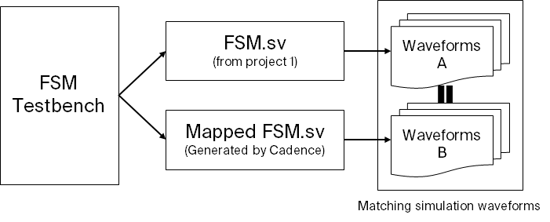
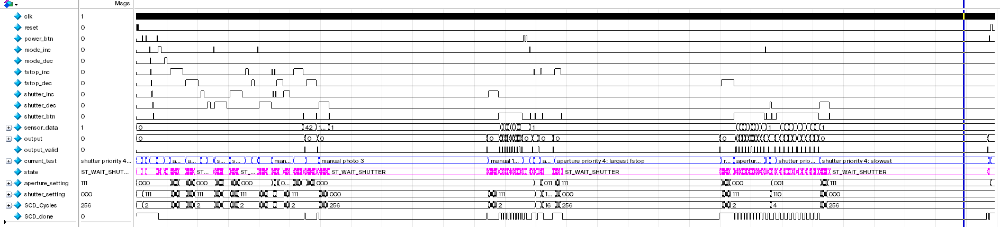
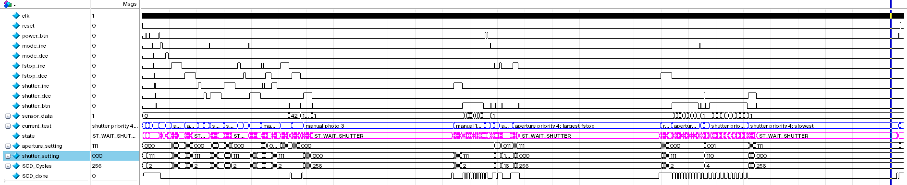

In this project, I continued work from [project 1](/documents/ELEC402/proj1). In particular, I took the FSM built in the first project and used CAD tools to synthesize the design into stanard cells.

## Mapped Verilog

I used Cadence Encounter RTL Compiler to generate a mapped SystemVerilog code. Since the file contains 1,132 lines of code. It will be attached as a separate file. It can also be accessed on my [GitHub here](https://raw.githubusercontent.com/FSXAC/ELEC402/master/proj2/synth/out/fsm_map.sv).

## Design Changes

A small set of changes regarding the *bit width* of I/O of the decoder modules required changing. Since there were bits on the bus that were never used, ModelSim would confuse it with high-impedance (*z* signals).

I also had to change the bit-width for states from 5-bits to 4-bits since we were using 12 states to also mitigate the highest bit left on high-impedance.

Otherwise, the overall design and the operation of the FSM remained identical to project 1.

Here is an example *diff* of the changes made:

```diff
- enum logic[4:0] {
+ enum logic[3:0] {
      ST_IDLE,                /* [1]  The idle / reset state */

      ST_APERTURE_PRIORITY,   /* [2]  The default home state for aperture priority mode */
      ST_SHUTTER_PRIORITY,    /* [3]  The default home state for shutter priority mode */
      ST_MANUAL,              /* [4]  The default home state for manual exposure mode */

      ST_INC_FSTOP,           /* [5]  State for increasing f-stop number */
      ST_DEC_FSTOP,           /* [6]  State for decreasing f-stop number */
      ST_INC_SHUTTER,         /* [7]  State for increasing shutter speed */
      ST_DEC_SHUTTER,         /* [8]  State for decreasing shutter speed */

      ST_CALC_SHUTTER,        /* [9]  Intermediate state to caluclate shutter speed needed */
      ST_CALC_APERTURE,       /* [10] Intermediate state to caluclate aperture needed */

      ST_WAIT_SHUTTER,        /* [11] State for waiting for the shutter to open and close */
      ST_DONE                 /* [12] state for outputting shutter */
  } current_state, next_state, prev_mode_state;
```

## RTL Compiler Reports

The RTL compiler outputs various reports regarding area, power, timing, and gates. For this project, we are concerned with the area.

### Area Report

This is inside of `fsm_area.rpt`:

```
============================================================
  Generated by:           Encounter(R) RTL Compiler RC14.13 - v14.10-s027_1
  Generated on:           Oct 05 2019  01:46:46 pm
  Module:                 fsm
  Technology library:     slow_vdd1v0 1.0
  Operating conditions:   PVT_0P9V_125C (balanced_tree)
  Wireload mode:          enclosed
  Area mode:              timing library
============================================================

       Instance        Cells  Cell Area  Net Area  Total Area  Wireload     
----------------------------------------------------------------------------
fsm                      634       1399         0        1399    <none> (D) 
  mul_261_30             216        496         0         496    <none> (D) 
  mul_261_52             199        476         0         476    <none> (D) 
  COUNTDOWN_MODULE        62        127         0         127    <none> (D) 
  SHUTTER_SETTING_FF       6         26         0          26    <none> (D) 
  APERTURE_SETTING_FF      6         26         0          26    <none> (D) 
  SHUTTER_DECODER         13         14         0          14    <none> (D) 
  FSTOP_DECODER           13         14         0          14    <none> (D) 

 (D) = wireload is default in technology library
```

The total cell count is **634**.


## ModelSim Tests

A derived testbench (from project 1) is used for the generated Verilog. To run the testbench in ModelSim. I ensured that the optimization for internal signals is set to off for debugging purposes such that the `assert` statements could function correcty as it is used to check states.

I also compared the simlation/testbench output waveforms to the reference waveforms from project 1. The output is matching to ensure everything is working correctly.



## Visual Waveform of Mapped Verilog

The details regarding the tests shown in the waveform is already described in [project1](/documents/proj1). So here I will just show the overall output waveform.



It is a bit harder to see, but I assure that I verified this against the reference waveform. Here is the output waveform from the unmapped (hand-coded) verilog FSM for reference:



