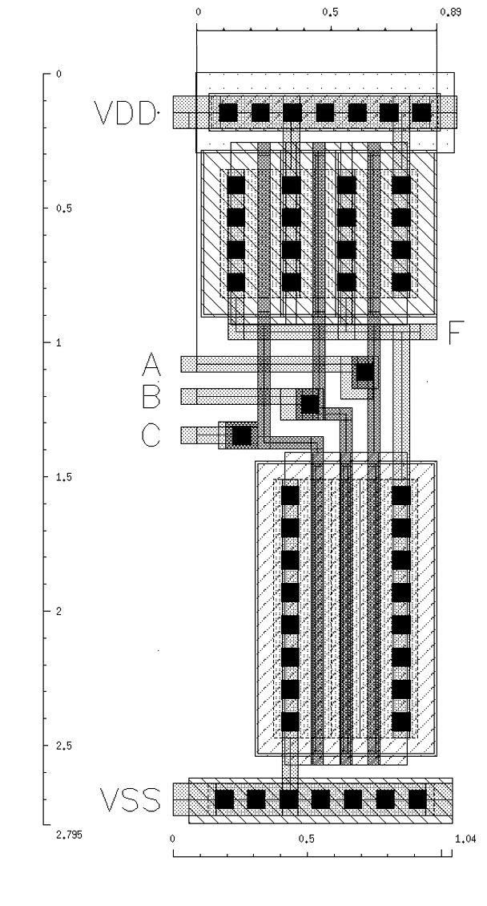

---

title: "Project 4 - Assignment"
date: 2019-11-11
categories: ELEC 402
ubc_handin: true
use_math: true
---

- toc
{:toc}

## 1. NAND3 Simulation and Layout

| Design Summary | Layout Area             | Delay  | Area &times; Delay           |
| -------------- | ----------------------- | ------ | ---------------------------- |
|                | 2.9068&mu;m2 | 70.5ps | 204.9294 &mu;m2ps |

### NAND3 Layout

The following figure is the layout of the NAND3.

For a typical NAND3, the theoretical sizing is 2W for PMOS and 3W for NMOS. However through simulation this ratio is not sufficient to ensure *tpHL* and *tpLH* match. Ergo, for my design, I’ve chosen 4W for PMOS and 8W for NMOS. Where W is 120nm.

The distance from input (A, B, and C) to output (F) is about 0.9&mu;m apart.

### Waveform

The following waveform graph showcase the input vs. the output for a worst-case test-bench setup. See the [next section](#schematics) for the test-bench setup. Essentially, the worst-case is if two of the inputs to the NAND3 are tied to fixed value. The input pattern transitions like this: `001` &harr; `000` and output should toggle between `0` and `1`.

The simulation is performed accounting for the extracted view after layout, as well as all the parasitic capacitances.

The *tpHL* is 69.5ps and *tpLH* is 71.5ps.

### Schematics

The diagram below shows the schematic for the test bench used to test the worst-case scenario of the NAND3. The waveform in the [previous section](#waveform) is generated using this schematic and configured to use the *extracted view* from the layout.

Important notes:

- Input signal only drives one of the NAND3 inputs with a ramp up and down (skew) of 10ps (as specified by the problem).
- Other inputs of the NAND3 are tied to VDD (1.0V) for the worst case.
- Output of the NAND3 is driving a 10pF capacitor.

The diagram below is the schematic of the NAND3.

## 2. Static CMOS Logic

### Logic Function

We can look at the pull-down portion to decipher the logic: `~F=(A+B)CD`, so `F=(~A~B)+~C+~D`. 

### CMOS Sizing

We want to match the MOS’s such that overall it matches that of resistance in an inverter where NMOS W/L=4&lambda;, and PMOS W/L=8&lambda;.

The worst case for the pull-up logic is that only a single branch, specifically the A-B PMOS branch since there is more resistance due to the two PMOS in series. Therefore, we have to make them 4W each, or 16&lambda;. For C and D, they’re 2W or 8&lambda; each.

For pull down, only one of A or B NMOS is on would be the worst case. So the three NMOS in series need to match 1W for an inverter. So they’re all 3W or 12&lambda; each.

### Worst Case Transitions

#### Hight-Low

For *tpHL*, we need to consider a scenario where as many nodes are charged up to VDD as possible before transition. By this logic, D mustn’t be on and C must be always on. So the input pattern ABCD = `1010`, `0110`, or `1110` all works.

During transition, we need to consider a scenario where as little NMOS are turned on to drive discharge all nodes to ground. The only NMOS we can turn on to do this is D. So the pattern ABCD is `xxx1` (where `x` is whatever input is before).

For instance, this is a worst-case HL transitions ABCD = `1010` &rarr; `1011`.

#### Low-High

Before transition, we want as many node to be 0, so C and D NMOS are both on. (C and D PMOs are off). Since the only node in the pull-up complex that is capable of being 0 is the node between B and A, we turn A off (PMOS for A is on). Therefore, the input pattern before transition is ABCD = `0111`.

During the transition, we turn on as little PMOS as possible to drive up. So we just turn off B (turn on B PMOS). The input pattern is ABCD = `0011`.

For worst-case LW transition ABCD = `0111` &rarr; `0011`.

### Simulation Schematic

The schematic of the logic gates and the test-benches are shown in the diagrams below:

*Function logic module:*

*Test bench for transitioning ABCD = `1010` to `1011`*:

*Test bench for transitioning ABCD = `0111` to `0011`*:

### Simulation Waveform

The worst case *tpHL* is 218ps by reading from the waveform of the simulation of the first test-bench schematic.

The worst case *tpLH* is 111ps by reading from the waveform of the simulation of the second test-bench schematic.

## 3. Transmission Gate Logic

The following circuit has transmission gate sizing as $W_N=W_P=4\lambda$, and $L=2\lambda$. The inverters have PMOS W/L of $8\lambda:2\lambda$, NMOS W/L of $4\lambda: 2\lambda$.

The expression of the output function is derived as follows:

- The combined output of the transmission gates (TGs) forms an “OR” operation.
- The top TG has `sel` as a control signal to select `~A`.
- The bottom TG has `selB` as a control signal to select `~B`.

Therefore the combined logic is:

$$
OUT=\neg C\\
C=(\neg A\wedge sel)\vee(\neg B \wedge selB)\\
OUT = (A\vee\neg sel)\wedge(B\vee \neg selB)
$$

### A to C

The path from A to C passes through a single inverter and a single TG. There exists some capacitances C1 and C2 at each node along the path. 

The equivalent circuit looks like this:

As derived in class, we can approximate the TG resistance as $R_{TG}=R_{eqn}(L/W)$. And we can further approximate $R_{inv}=R_{TG}=(12.5k\Omega)(2/4)=6.25k\Omega$.

For C1, we need to account for capacitance from the input inverter and the TG. The input inverter has capacitance of $C_{inv}=C_{eff}(4\lambda+8\lambda)$. The TG is turned **on** because `sel` is on, so its capacitance is $C_{TG}=C_{eff}\cdot2(4\lambda)+C_g(4\lambda)$. Combined, we get:

$$
\begin{aligned}
C_1 &= (4\lambda+8\lambda)C_{eff}+2(4\lambda)C_{eff}+(4\lambda)C_g\\
&=20\lambda C_{eff}+4\lambda C_g\\
&=20(0.1)(1.0)+4(0.1)(2.0)\\
&=2.4~\mathrm{fF}
\end{aligned}
$$

For C2, we get the TG capacitance in the same manner. But we also consider the load inverter, which is $f$ times larger. The capacitance from the load inverter is given as $C_{li}=f C_g(4\lambda  + 8\lambda)$. Combined:

$$
\begin{aligned}
C_2&=f(4\lambda+8\lambda)C_g+2(4\lambda)C_{eff}+(4\lambda)C_g\\
&=C_g(12f\lambda +4\lambda)+8\lambda C_{eff}\\
&=(2.0)(12f(0.1)+4(0.1))+8(0.1)(1.0)\\
&=2.4f+1.6~\mathrm{fF}
\end{aligned}
$$

### A to C Delay

Using Elmore delay to find the total delay: 

$$
t_D=R_{inv}C_1+(R_{inv}+R_{tg})C_2=RC_1+2RC_2,\quad R=6.25\mathrm{k\Omega}
$$

### A to OUT

Now we want to find the delay through the entire circuit (from A to OUT).

The equivalent circuit is now as follows:

C1 and C2 is the same as before. Except now we also have to consider another set of resistance from the inverters, and C3 at the output node.

$$
C_3=f\cdot C_{eff}(4\lambda + 8\lambda) + C_{load},\quad C_{load}=50\mathrm {fF}\\
C_3=f(1.0)(12(0.1))+50=1.2f+50~\text{fF}
$$

$$
R_{inv1}=\frac{R_{inv}}{f}
$$

Total delay using Elmore delay, using $R_{inv}=R_{tg}=R=6.25\mathrm{k\Omega}$:

$$
\begin{aligned}
t_D&=RC_1+2RC_2+ \left(2R+\frac{R}{f}\right) C_3\\
&=R\left[(2.4)+2(2.4f+1.6)+\left(2+\frac{1}{f}\right)(1.2f+50)\right]\\
&=(6.25\mathrm{k})\left(7.2f+106.8+\frac{50}{f}\right)\\
\end{aligned}
$$

To minimize the delay, we choose to minimize the terms $7.2f+50/f$. By plotting, there exists a local minimum at $f=2.635$:

*Note: ignore the y-axis value. The graph is only made to find the the value of $f$ by looking at a local minimum*.