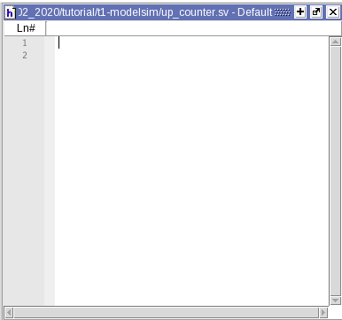

This document covers how to setup the Linux environment to use ModelSim, compiling and synthesizing SystemVerilog files, and configuring ModelSim to simulate a testbench. This document is a revision of Dr. Shekhar’s tutorials[^1].

- toc
{:toc}

## Tools Overview

Verilog (`.v` filetype) and SystemVerilog (`.sv` filetype) are hardware description landugage files we use to construct hardware and state-machines. SystemVerilog is like Verilog but newer. 

In this tutorial, I will work with *SystemVerilog*, but I will also refer to it as *Verilog* for the sake of convenience .

**ModelSim** is an IDE for writing, compiling, and simulating Verilog projects. To run Modelsim, use the following commands:

## Environment Setup

In this section, we will setup the Linux environment ready for the tools, take care of licensing issues, and start using the tools.

### Working Directory

We will create a working directory where our ModelSim project files and other generated files will live. One option is to make a `ModelSim_StudentNumber` directory in your home directory — where `StudentNumber` is your UBC student number or ECE account ID. Once you made the directory, descend into that directory:

```shell
mkdir ModelSim_StudentNumber
cd ModelSim_StudentNumber
```


### ModelSim

In our working directory, source the ModelSim *.csh* file to automatically set up the environment and licensing. After sourcing the file, we can launch ModelSim using the command `vsim`.

```shell
source /CMC/scripts/mentor.modelsim.10.3.csh
vsim -64 &
```

> **Note**
>
> - Use `-64` flag when running `vsim` to use 64-bit version of the ModelSim software.
> - Adding `&` starts the ModelSim process in the background so you can continue to use the terminal/command line.


Once ModelSim launches, we should see this screen (**Figure 1**):

<figure class="figure">

<figcaption class="figure-caption">Figure 1. ModelSim Initial Window</figcaption>
</figure>


> **Optional Shortcut**
>
> If you find typing out the command to be tedious every time you want to start ModelSim, you can assign an *alias* to run the same commands. Simply open your `.cshrc` file from your home directory and add the line:
>
> ```shell
> # Inside '.cshrc'
> alias modelsim 'source /CMC/scripts/mentor.modelsim.10.3.csh && vsim -64 &'
> ```
>
> Then reset your shell environment by  sourcing the `.cshrc` file, then you can use the alias to launch ModelSim.
>
> ```shell
> source ~/.cshrc
> modelsim
> ```
>


## SystemVerilog Files

In this section, we will learn how to create a new project, use ModelSim’s built in code editor, and compile Verilog files.

### Create a New Project

To create a new project, go to ModelSim’s menu bar and select **File** &rarr; **New** &rarr; **Project…** and a *Create Project* window will appear. Enter the *Project Name*, *Project Location*, and *Default Library Name*: 

- **Project Name**: Set project name to *ELEC402_PRJ&lt;project number&gt;_&lt;student number&gt;*.
- **Project Location**: Browse and select the working directory created in [Working Directory Section](#working-directory).
- **Default Library Name**: Leave it as *work*.

The *Create Project* window should look like this in **Figure 2**.

<figure class="figure">

<figcaption class="figure-caption">Figure 2. Create Project Window</figcaption>
</figure>


Click *OK* to finish creating the project. A new window will appear to prompt to add project files to the project as depicted in **Figure 3a**. We can either create a new file by clicking on *Create New File* or add existing file by clicking on *Add Existing File*.

Let us create a new file. A new *Create Project File* window will appear. Fill in the *File Name* — which should reflect the function and name of the module to be created. In this tutorial, I’ve chosen the name “up_counter” Then, select the type of the file to *SystemVerilog*. Finally, the window should look like **Figure 3b**. Click OK and return to ModelSim main window.

<figure class="figure">

<figcaption class="figure-caption">Figure 3. (a) Add items to the project Window, (b) Create Project File window</figcaption>
</figure>


### Write Verilog Modules

Back in the main ModelSim window within the *Projects* tab, notice that we have a new file added to the project as shown in **Figure 4a**. Right click on the file then select *Edit* from the context menu to start editing the file. A new code editor panel, as shown in **Figure 4b** will appear.

<figure class="figure">


<figcaption class="figure-caption">Figure 4. (a) New project file seen under Project tab, (b) ModelSim Code Editor Panel</figcaption>
</figure>

Next, we write SystemVerilog code in the editor. In this tutorial, we implement a simple 8-bit counter that counts from 0 to 255 with an `en` (enable) signal and synchronous reset. The sample code is in **Code 1.**

```verilog
/* Name:       
 * Student ID: XXXXXXXX
 * Purpose:    A simple up-counter
 */

module up_counter (
    input logic clk,
    input logic rst,
    input logic en,
  
    output logic[7:0] count
);
    
always_ff @(posedge clk) begin
    if (rst) begin
        count <= 0;
    end

    else if (en) begin
        count <= count + 1;
    end
end
    
endmodule
```

<figcaption class="figure-caption">Code 1. Sample code for a simple 8-bit counter with synchronous reset</figcaption>

> **Note**
>
> Follow good coding practice such as including inserting detailed comments in the code. This is important for yourself in the future, and others reading your code — this includes the TA’s who will be grading your code.

### Compilation

To compile files in the project, you can either:

1. Right-click the file in the *Project* tab and select **Compile Selected** from the context menu. Or,
2. Right-click anywhere in the *Project* tab and select **Compile All** from the context menu to compile all files in the project.   Or,
3. Click the **Compile** menu from the menu bar and do either of the two above.

During compilation, pay attention to the *Transcript* window as well as the file status.

If the file has any errors, the file status will change to a red X (❌) with corresponding error messages in the transcript: <span style="color:#a00"># Compile of &lt;file_name&gt;.sv failed with ## errors</span>. Click on the error message opens another window containing detailed descriptions of the errors. You should go back to the editor and correct the errors. Try compiling again after the correction.

If the file has no errors, the file status will cahnge to a green checkmark (<span style="color:#080">✓</span>) with a corresponding message in the transcript: <span style="color:#080"># Compile of &lt;file_name&gt;.sv was successful</span>. 

> **Note**
>
> ModelSim **does not** check if the provided SystemVerilog code is synthesizable. Try to ensure that you are using synthesizable SystemVerilog to avoid trouble later on.

### Testbench Module Files

Let’s make a testbench. Right-click anywhere in *Project* tab and select **Add to Project** &rarr; **New File…** from the context menu. Follow the procedure outlined in the [Create a New Project section](#create-a-new-project). 

Set the testbench file name to be *&lt;module_name&gt;_TB.sv* and repeat the process as we did for `up_counter.sv`.

In this tutorial, we will use the following sample testbench SystemVerilog code as shown in **Code 2**.

```verilog
// Specify simulation timescape
// Format: unit step / resolution
`timescale 1ns/1ps

module up_counter_tb;

// Testbench wires
logic [7:0] count;
logic clk, en, rst;

// Instantiate the module to test
up_counter DUT(.*);

// Initialize signals
initial begin
    {clk, en, rst} = 3'b001;
end

// Release reset signal and activate enable signal
// (after 15-unit delay)
initial begin
    #15;
    rst = 0;
    en = 1;
end

// Clock
always begin
    #10 clk = ~clk;
end

endmodule
```
<figcaption class="figure-caption">Code 2. Sample code for the testbench for the counter module</figcaption>


In certain situiations, it is nice to have the testbench write output files. In **Code 3**, we create a file pointer and write the signal values to the file upon every positive clock edge. To use, place the code in **Code 3** inside the `up_counter_tb` module. This is **not** synthesizable SystemVerilog code, so only use this in ModelSim testbenches.

```verilog
integer file_out;

// open file and write header
initial begin
    file_out = $fopen("up_counter_tb.csv", "wb");
    $fstrobe(file_out, "time,clk,rst,en,count");
end

// write a line on every cycle
always @(posedge clk) begin
    $fstrobe(file_out, "%3d,%b,%b,%b,%d", $time, clk, rst, en, count);
end
```
<figcaption class="figure-caption">Code 3. Testbench file output</figcaption>


## Unsynthesized Simulation

After ensuring both module and testbench SystemVerilog files are compiled without errors, we can run simuations and visualize signals as waveforms. In this section, we will go through how to setup and run a ModelSim simulationfor unsynthesized designs.

### Simulation Configuration

Open *Start Simulation* window by going to the menubar and selecting **Simulate** &rarr; **Start Simulation**. Under *Design* tab, expand *work* library by clicking on `+` button, then select the testbench module — in this case, it’s `up_counter_tb`. See **Figure 5**.

<figure class="figure">

<figcaption class="figure-caption">Figure 5. Start simulation window with a list of libraries.</figcaption>
</figure>

At the time of writing, ModelSim SE-64 10.7c has deprecated simulation without optimization (unchecking *Enable optimization* will produce an error). But we would still like to play around and explore all signals in the module. So let’s fix that. 

Click *Optimization Options* button in the *Start Simulation* window. This will open a new *Optimization Options* window. Under *Visibility* tab, select *Apply full visibility to all modules (full debug mode)* as shown in **Figure 6**. Click OK to finish.

<figure class="figure">

<figcaption class="figure-caption">Figure 6. Optimziation Options window</figcaption>
</figure>

Finally, click OK to enter the simulation environment.

### Add Signals to Waveforms

After starting simulation mode, ModelSim reconfigures its layout so that it looks like **Figure 7**.

<figure class="figure">

<figcaption class="figure-caption">Figure 7. ModelSim simulation window layout</figcaption>
</figure>

- On the left, we have a list of instance hierarchies of declared modules, as well as *Initial* and *Always* blocks. 
- In the middle, we have a list of objects/signals exposed for whichever instance that is selected on the left. Here we can see `count`, `clk`, etc. — which are all part of the top-level module `up_counter_tb`.
- On the right, we have the waveform window. Here is where simulation results will be shown.

Select all signals of `up_counter_tb` except for `file_out` (because that’s not part of the synthesizable hardware), right-click and select **Add Wave** (<kbd>Ctrl + W</kbd>) as shown in **Figure 8**.

<figure class="figure">

<figcaption class="figure-caption">Figure 8. Adding select signals in the top-level module to wave</figcaption>
</figure>

The *Wave* window should look like **Figure 9** where the signals to be visualized are listed on the left.

<figure class="figure">

<figcaption class="figure-caption">Figure 9. Waveform window after signals are added</figcaption>
</figure>

We can further customize the format of the waveform such as radix, colours, etc by right-clicking on the wave and access the options in the context menu.

Once we’re happy with the wave setup, make sure to save the format by going to **File**&rarr;**Save Format**. Make sure *Waveform formats* checkbox is ticked, and click OK. This creates a *wave.do* file we can import at a later session so we don’t have to re-add the waves again.

### Running Simulation

Near the top of the menubar, we have access to the simulation control as seen outlined in red in **Figure 10**. 

<figure class="figure">

<figcaption class="figure-caption">Figure 10. Simulation control buttons on the toolbar (from left to right: Restart Simulation, Time to simulate for, Run simulation, Run continuous (don't stop simulation until interrupted), Run all, Break, and Stop.</figcaption>
</figure>

In the time textbox, enter the desired amount of time to simulate, in this case I use 100 ns. Then click on the *Run* button. The simulation will run for 100 ns (simulated-time) and pause. Click the *Zoom Full* button or press <kbd>F</kbd> to fit the waveform to view. As we see in **Figure 11**, we see the signal values through time.

<figure class="figure">

<figcaption class="figure-caption">Figure 11. Simulated waveform output</figcaption>
</figure>

Notice that `rst` and `en` are pulled HIGH and LOW respectively at first. During this time, the counter is reset and it is evident through by the output bus `count` being set to 0.

Then after 15 unit delay, `rst` and `en` flipped — and the counter starts counting. We see the output bus `count` incrementing on every clock cycle.

Furthermore, if we coded our testbench such that we output signals to file, as demonstrated in [Testbench Module Files section](#testbench-module-files), we can review the output file — which is located in ModelSim project’s working directory. **Figure 12** shows the content of the file.

<figure class="figure">

<figcaption class="figure-caption">Figure 12. Exported .csv file from the testbench</figcaption>
</figure>


## Conclusion

👏 Congratulations on completing the ModelSim & SystemVerilog tutorial. If you have any questions or concerns, please contact us using the information found on Canvas course page.

If you’re ready to move on, checkout [RTL Synthesis Tutorial](t2).


[^1]: Sudip Shekhar, University of British Columbia, “CAD Tutorials”: <http://sudip.ece.ubc.ca/cad-tutorials/>

