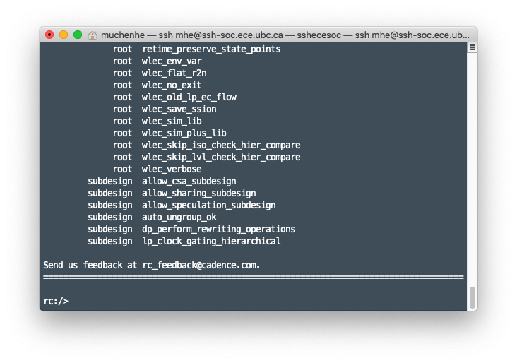
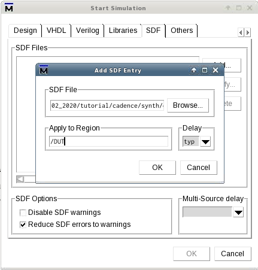

This document covers how to setup the Linux environment to use Cadence Encounter RTL Compiler, configuring TCL file, synthesizing our SystemVerilog design, and simulating the synthesized design in ModelSim. This document is a revision of Dr. Shekhar’s tutorials[^1]. However,  we are using PDK 15 nm models, so certain parts are different.

- toc
{:toc}
## Environment Setup

In this section, we will setup the Linux environment ready for the tools, take care of licensing issues, and start using the tools.

### Working Directory

We will create a working directory where our Cadence-based project files and other generated files will live. One option is to make a `Cadence_StudentNumber` directory in your home directory — where `StudentNumber` is your UBC student number or ECE account ID. Once you made the directory, descend into that directory:

```shell
mkdir Cadence_StudentNumber
cd Cadence_StudentNumber
```

Next, while inside the Cadence working directory, source the install script to set up the environment. This creates subdirectories for various tools, defining paths, environment variables, sets up licensing.

```shell
source /CMC/kits/AMSKIT616_GPDK/underg_install.csh
```

### Setup Local

Before we continue, there is another `setup_local.csh` script we need to source located in our working directory.

```shell
source setup_local.csh
```


## File Preparation

In this section, we will learn how configure various files required for a synthesis. 

First, from your Cadence working directory, descend into the subdirectory called *synth*. This will be our working directory for synthesis related tasks. Notice that inside the *synth* directory, there are two more subdirectories called *in* and *out*. They are where input source files and generated output files should be placed, respectively.

### SystemVerilog Files

Copy the SystemVerilog files we had for [previous tutorial](t1) (with the exception of testbench files — since those are not synthesizable) into the *in* subdirectory.

### Library Files

There exists kit designers provided `.lib` files which include required information regarding standard cells. No actions are required for these files — but keep in mind where they are as we need them to construct our [TCL instructions file](#TCL-instructions-file).

- **Path**: 

  > *<span style="overflow-wrap: break-word">/ubc/ece/data/cmc2/kits/ncsu_pdk/FreePDK15/NanGate_15nm_OCL_v0.1_2014_06_Apache.A/front_end/timing_power_noise/CCS</span>*

- **Required File**: *NanGate_15nm_OCL_worst_low_conditional_ccs.lib*

### SDC File

The SDC file is a text file with `.sdc` as extension. It includes the description of the clocks and other timing constraints used in the design.

Inside the *in* subdirectory, create a new file called `timing.sdc`, add the following lines show in **Code 1** into the file:

```
current_design <design_name>
create_clock [get_ports {<clock_port_name>}] -name <clock_name> -period <clock_period_ns> -waveform {<rise> <fall>}
```

<figcaption class="figure-caption">Code 1. SDC timing constraints file template</figcaption>


Where we need to replace these parameters:

- **`<design_name>`** is the module name of the top level module.
- **`<clock_port_name>`** is the port name for the clock port of the top level module. (e.g. “`clk`”).
- **`<clock_name>`** is the clock instance name — we can set this to `clk`.
- **`<clock_period_ns>`** is the clock period in nanoseconds.
- **`<rise>`** is the clock rising edge offset, we set this to `0`.
- **`<fall>`** is the clock falling edge offset, we set this to `50` so we have a 50% duty cycle wave/square wave.


When completed, our SDC file should look something like **Code 2**. 

```
current_design up_counter
create_clock [get_ports {clk}] -name clk -period 100 -waveform {0 50}
```

<figcaption class="figure-caption">Code 2. SDC timing constraints file template</figcaption>

### TCL Instructions File

The Tool Command Language (TCL) instructions file contains a sequence of instructions we need to execute in the RTL compiler environment. Having it as a file is convenient because we don’t need to type each and every command manually.

While it is highly recommended you go through the following steps to understand what we are doing in the TCL file, one can skip to [Completed TCL File](#completed-tcl-file) if they just want to copy-and-paste.

#### Writing the TCL File

Create a new file in the *in* subdirectory called `compile.tcl`, and follow the steps:

1. In the empty TCL file, insert the following line to include utility script:

   ```tcl
   include load_etc.tcl
   ```

2. Set our top-level design variable, which we use later for file output. Append the following:

   ```tcl
   set DESIGN up_counter
   ```

3. Set synthesis and mapping effort, as well as synthesis working directory. Append the following:

   ```tcl
   set SYN_EFF medium
   set MAP_EFF medium
   set SYN_PATH "."
   ```

4. Set PDK path and library file for the PDK library (see [Library Files section](#library-files)). Append the following code:

   ```tcl
   set PDKDIR /ubc/ece/data/cmc2/kits/ncsu_pdk/FreePDK15/
   set_attribute lib_search_path /ubc/ece/data/cmc2/kits/ncsu_pdk/FreePDK15/NanGate_15nm_OCL_v0.1_2014_06_Apache.A/front_end/timing_power_noise/CCS
   set_attribute library {NanGate_15nm_OCL_worst_low_conditional_ccs.lib}
   ```

5. Read in our SystemVerilog files (remove the `-sv` flag if we want to read regular Verilog files). Append the following:

   ```tcl
   read_hdl -sv ./in/up_counter.sv
   ```

   **Note**: If there are multiple SystemVerilog files, just call the `read_hdl` commands for each file in reverse-hierarcharical order.

   For example, if the top level module `Tom` instantiates submodule `Sam` and `Sierra`, then execute the command in the order of: `Sam`, then `Sierra`, then `Tom`:

   ```tcl
   # Example for the above Note:
   read_hdl -sv ./in/sam.sv
   read_hdl -sv ./in/sierra.sv
   read_hdl -sv ./in/tom.sv
   ```

6. Specify the top level module by using `elaborate` command. Append the following:

   ```tcl
   elaborate $DESIGN
   ```

    Notice that where we are using the `$` syntax to use the design name variable name we have defined earlier.

7. Check the design to ensure we don’t have any problems. Append the following:

   ```tcl
   check_design -unresolved
   ```

8. Read in the timing constraints file. Append the following:

   ```tcl
   read_sdc ./in/timing.sdc
   ```

9. Synthesize *generic* cell. Append the following:

   ```tcl
   synthesize -to_generic -eff $SYN_EFF
   timestat GENERIC
   ```

10. Synthesize to gates. Append the following:

    ```tcl
    synthesize -to_mapped -eff $MAP_EFF -no_incr
    timestat MAPPED
    ```

11. Run incremental synthesis and insert Tie-High and Tie-Low cells. Append the following:

    ```tcl
    synthesize -to_mapped -eff $MAP_EFF -incr
    insert_tiehilo_cells
    timestat INCREMENTAL
    ```

12. Generate report files to the *out* subdirectory. Append the following:

    ```tcl
    report area > ./out/${DESIGN}_area.rpt
    report gates > ./out/${DESIGN}_gates.rpt
    report timing > ./out/${DESIGN}_timing.rpt
    report power > ./out/${DESIGN}_power.rpt
    ```

13. Generate and export mapped Verilog files to be used in Cadence Encounter and ModelSim. Append the following:

    ```tcl
    write_hdl -mapped > ./out/${DESIGN}_map.v
    ```

14. Generate and export the timing constraints file to be used in Encounter. Append the following:

    ```tcl
    write_sdc > ./out/${DESIGN}_map.sdc
    ```

15. Generate and export the timing constraints file to be used in ModelSim. Append the following:

    ```tcl
    write_sdf > ./out/${DESIGN}_map.sdf
    ```

16. Status update and exit. Append the following:

    ```tcl
    timestat FINAL
    puts "Exiting . . ."
    quit
    ```

#### Completed TCL File

After that, your TCL instructions file should look something like **Code 3** (at least for our `up_counter` example). Note that in this example TCL file, we’ve added `puts` statements which print messages to the screen to improve user experience.

```tcl
# Include TCL utility scripts
include load_etc.tcl

# Timestamp
date

# Print status
puts "\n\n> Setting up Synthesis Environment . . ."

# Top level design name variable
set DESIGN up_counter

# Set synthesis effort, mapping effort, and working directory
set SYN_EFF medium
set MAP_EFF medium
set SYN_PATH "."

# Set PDK Library
set PDKDIR /ubc/ece/data/cmc2/kits/ncsu_pdk/FreePDK15/
set_attribute lib_search_path /ubc/ece/data/cmc2/kits/ncsu_pdk/FreePDK15/NanGate_15nm_OCL_v0.1_2014_06_Apache.A/front_end/timing_power_noise/CCS
set_attribute library {NanGate_15nm_OCL_worst_low_conditional_ccs.lib}

# Read in user Verilog files (add -sv flag for SystemVerilog files)
read_hdl -sv ./in/up_counter.sv

# Elaboration validates the syntax (elaborate top-level model)
elaborate $DESIGN

# Status update
puts "> Reading HDL complete."
puts "> Runtime and memory stats:"
timestat Elaboration

# Show any problems
puts "\n\n> Checking design . . ."
check_design -unresolved

# Read timing constraint and clock definitions
puts "\n\n> Reading timing constraints . . ."
read_sdc ./in/timing.sdc

# Synthesize generic cell
puts "\n\n> Synthesizing to generic cell . . ."
synthesize -to_generic -eff $SYN_EFF
puts "> Done. Runtime and memory stats:"
timestat GENERIC

# Synthesize to gates
puts "\n\n> Synthesizing to gates . . ."
synthesize -to_mapped -eff $MAP_EFF -no_incr
puts "> Done. Runtime and memory stats:"
timestat MAPPED

# Incremental synthesis
puts "\n\n> Running incremental synthesis . . ."
synthesize -to_mapped -eff $MAP_EFF -incr
puts "\n\n> Inserting Tie Hi and Tie Low cells . . ."
insert_tiehilo_cells
puts "> Done. Runtime and memory stats:"
timestat INCREMENTAL

# Generate report to files
puts "\n\n> Generating reports . . ."
report area > ./out/${DESIGN}_area.rpt
report gates > ./out/${DESIGN}_gates.rpt
report timing > ./out/${DESIGN}_timing.rpt
report power > ./out/${DESIGN}_power.rpt

# Generate output verilog file to be used in Encounter and ModelSim
puts "\n\n> Generating mapped Verilog files . . ."
write_hdl -mapped > ./out/${DESIGN}_map.v

# Generate constraints file to be used in Encounter
puts "\n\n> Generating constraints file . . ."
write_sdc > ./out/${DESIGN}_map.sdc

# Generate delay file to be used in ModelSim
puts "\n\n> Generating delay file . . ."
write_sdf > ./out/${DESIGN}_map.sdf

# Status update
puts "Synthesize complete. Final runtime and memory:"
timestat FINAL

# Done
puts "Exiting . . ."
quit
```

<figcaption class="figure-caption">Code 3. Example TCL file</figcaption>


## Synthesis

In this section we will run the synthesis tool. At this point, all of our input files (inside the *in* subdirectory) should be ready for synthesis. 

Make sure we are in the synthesis working directory (*…/Cadence_StudentNumber/synth*). Then source the `setup_local.csh` to reset our environment and go into the RTL Compiler environment using the command `rc`:

```shell
source ../setup_local.csh && rc
```

The licensing checkout process begins — this will take a few seconds. Once licenses are checked out and validated, we enter the *RC* environment as shown in **Figure 1**. In the RC environment, source the TCL file we created in the [previous section](#tcl-instructions-file):

```shell
source ./in/compiler.tcl
```

<figure class="figure">

<figcaption class="figure-caption">Figure 1. RC environment started in the command line</figcaption>
</figure>

The RTL Compiler will execute the instructions provided in the TCL file and will generate the *artifacts* — the reports and output files — in the *out* subdirectory. 

The generated design files are as follows:

- **`.v`**: Verilog file with the new gate level description of the synthesized system.
- **`.sdc`**: Constraints file which includes the timing constraints of the system.
- **`.sdf`**: Constraints file which includes the timing information about the used standard cells.

The generated reports are as follows:

- Area report
- Used cells statistics report
- Timing report
- Power consumption report

The generated files will be used in the coming steps in the digital flow. The generated reports are important to assist one in making sure that the system meets the required specifications.

## Simulate Synthesized Design

In this section we will take the generated artifacts from [previous section regarding synthesis](#synthesis) and put them to the test — in ModelSim simulations. Review [previous ModelSim tutorial](t1) on basic ModelSim usage.

### Compile Files

Start by copying the output `.v` file from the synthesis output directory into our ModelSim project directory. You may need to modify the module name or remove the un-synthesized SystemVerilog file to avoid name conflicts.

Next, add the required PDK Verilog file to the project. This file incldues the behavioural description of the standard cells.  Go to the *Project* tab and then go to **Project** &rarr; **Add to Project** &rarr; **Existing File…** and navigate and select the following file: 

> *<span style="overflow-wrap:break-word">/ubc/ece/data/cmc2/kits/ncsu_pdk/FreePDK15/NanGate_15nm_OCL_v0.1_2014_06_Apache.A/front_end/verilog/NanGate_15nm_OCL_functional.v</span>*

Then, compile all files and ensure all files compiles successfully.

### Testbench

Modify the testbench files (if required) to instantiate the newly generated mapped module. Because we need to see if the synthesis is successful, we should leave the rest of the testbench untouched — and expect identical waveform outputs.

### Simulation Options

Follow the same steps outlined in the [previous ModelSim tutorial](t1) to begin simulation. However, on *Start Simulation* window, go to *SDF* tab, and click *Add*. An *Add SDF Entry* window will appear like shown in **Figure 2**. Click on *Browse* and then navigate and select the `.sdf` file from your synthesis output directory.

<figure class="figure">

<figcaption class="figure-caption">Figure 2. Add SDF in Simulation Options.</figcaption>
</figure>

Enter the name of the top-level module in the test-bench in the *Apply to Region* text field and click OK.

Back in the *Start Simulation* Window, enable the *Reduce SDF errors to warnings* checkbox. 

### Run Simulation

Follow the same steps outlined in the [previous ModelSim tutorial](t1) to setup your waveforms and run simulation. Ensure the waveform output is as expected compared to the orignal, unsynthesized waveform output.


## Conclusion

👏 Congratulations on completing the RTL Compiler Synthesis and Synthesized Simulations tutorial. If you have any questions or concerns, please contact us using the information found on Canvas course page.

If you’re ready to move on, checkout [Cadence Virtuoso Tutorial](t3).

[^1]: Sudip Shekhar, University of British Columbia, “CAD Tutorials”: <http://sudip.ece.ubc.ca/cad-tutorials/>
