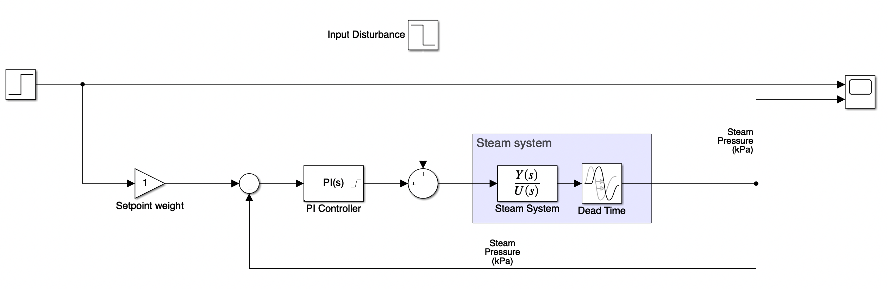
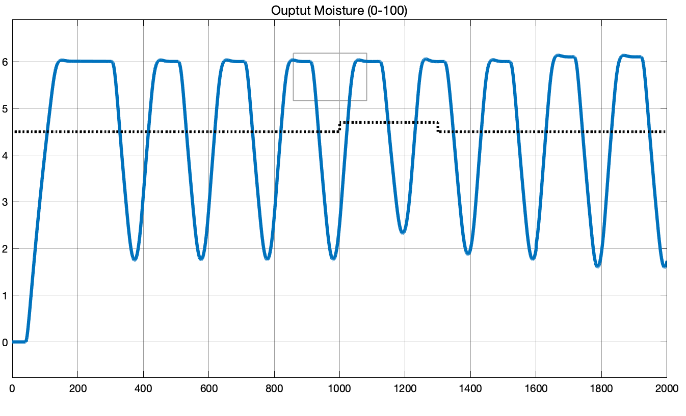
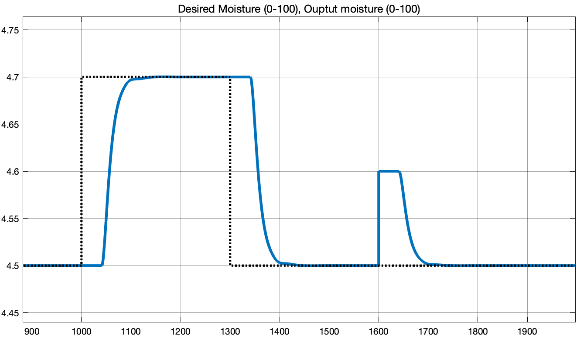

## Setup


The systems are linearized around the operating point:
- valve opening: 80%
- steam pressure: 100 kPa
- moisture: 4.5%

The system's linear model is given as:

$$
G_s(s) = \frac{0.006(1 + 200 s) e^{-s}}{s(1+80s)} \\

G_d(s) = \frac{0.06 e^{-40s}}{1 + 5s}
$$

## Part I

For part 1, we are tasked to design and simulate the PI controller for the inner loop of the casecade system. The paper by Slätteke on PI/PID tuning for IPZ processes suggests the following two implementations:

$$
(1)\quad K_c = \frac{0.17 T_2}{(T_1 K_v L)},~
T_i = \frac{3L(31T_2 + 4 L)}{(7T_2 + 88L)}\\
(2)\quad K_c = \frac{0.18 T_2}{(T_1 K_v L)},~T_i = \frac L 3 \frac{(94 T_2 + 13 L)}{(2 T_2 + 29 L)}
$$

Where the IPZ process is generalized as:

$$
G_{IPZ}(s)=K_v\frac{1+T_1 s}{s(1 + T_2 s)}e^{-Ls}
$$

I choose to implement option 1 as it is described to be better for rejecting disturbance. The system block model for the inner system looks like this:



The PI controller is using the SimuLink built-in PID block with D component disabled, and with a saturation of [0, 100]. The calculated P and I gains from the Slätteke is as follows:

```matlab
% Extract parameters for tuning from plant
L = steam_delay;
k_v = 0.006;
T_1 = 200;
T_2 = 80;

% Implementation 1 (disturbance rejection, Slätteke 2002)
k_c = 0.17 * T_2 / (T_1 * k_v * L);  % k_c = 11.3333
T_i = 3 * L * (31 * T_2 + 4 * L) / (7 * T_2 + 88 * L); % T_i = 11.5000
```

### System Response

To test the response of the system, we set the initial condition of the steam system to have a pressure of 100 kPa. But because the system is linear, it is the Then we apply a step response of +10 kPa change to the setpoint. Here is the step response:


Next, we show that the system properly rejects a -10% valve openning input disturbance to the plant.


## Part II

Now that we have the inner cascade system controlled to a reasonable degree, we can approxiamate it as part of our “outer plant” so that we can design the outer controller. As seen in the block diagarm below, let us denote $G_{eq}(s)$ as the plant transfer function that include the inner control loop as well as the dryer system.


The equivalent transfer function is given by:

$$
G_{eq}(s)=\frac{C_{inner}(s)G_{steam}(s)}{1 + C_{inner}(s)G_{steam}(s)}\cdot G_{dryer}(s)
$$

To make the math a little easier, we neglect the dead-time for the inner system (remove the $e^{-s}$ term). The resulting equivalent transfer function is:

$$
G_{eq}(s)=\frac{0.00204(s+0.08696)(s+0.005)}{(s+0.2)(s+0.005014)(s^2+0.1775s + 0.01474)}e^{-40s}
$$

We will also define the equivalent plant transfer function *without* dead time as:

$$
\overline G_{eq}(s)=\frac{0.00204(s+0.08696)(s+0.005)}{(s+0.2)(s+0.005014)(s^2+0.1775s + 0.01474)}
$$

The root locus and bode plots for the above open-loop TF is as follows:


From the phase plot, we have an upper limit of our bandwidth of about 0.11 rad/s.

### Using Q-Design as PID

From the above linearized equivalent transfer function of the plant (including the inner PI controller), we can devise a Q-design controller. $\bar G_{eq}$ is invertable with two zeros and four poles, so we need to add a filter $F_Q$ with two poles and unity gain:

$$
F_Q(s)=\frac{0.01}{s^2+1.2s+0.01}
$$

Where we have chosen $\omega_n=0.1$ rad/s and damping $\zeta=0.6$ as it fits our model. Following the standard procedures for Q-design, we then have a controller

$$
C_Q(s)=\frac{Q(s)}{1-F_Q(s)},\quad Q(s)=F_Q(s) G_eq^{-1}(s)\\
$$

Using MATLAB to complete the numerical calculations for us, we finally get a PID controller for $C_Q$:

$$
C_Q(s)=\frac{7.0588(s^2+0.1775 s + 0.01474)}{s(s+0.08696)}
$$

This corresponds to the form

$$
K_P+K_I\frac{1}{s}+K_D\frac{s}{\tau_f s+1}
$$

Where $K_P=0.448$, $K_I=0.831$, $K_D=51.2$, and $\tau_f=11.5$. 

Here is the block diagram implementation:


Note that we are expecting this design to do **poorly** because we have not yet accounted for the 40 second dead time. The actual response of the system is as follows:



We see that the system is oscillating undesirably. Now let’s address the dead time by wrapping the PID controller inside a Smith Predictor as shown in the following block diagram:


This block diagram encapsulates the entire system which is briefed in the project description. Now we are using a typical Smith Predictor to account for the 40 second dead time. The PID controller we obtained using Q-Design is now placed inside the MBC block with along with a linearized plant model `Linear G` feedforward block. The response is as follows:



As we can observe that the same PID controller results in a much better behaved system thanks to the addition of the smith predictor. The desired setpoint rises from 4.5% to 4.7% moisture (0.2% increase) at time 1000. The entire system rises to desired setpoint within 100 seconds with 0% overshoot.

At time 1300, setpoint decrease back to 4.5% (0.2% decrease). We see that the system also responds adequately.

At tiem 1600, we apply an output disturbance of +0.1% moisture. Again, after a dead time of 40 seconds, the system quickly rejects output disturbance, and returns to the setpoint of 4.5% moisture.

## MATLAB Code

Here are the MATLAB code used for setting up the variables in the workplace to be used in SimuLink.

```matlab
% ELEC 441 Project
% Name: Muchen He
% Student ID: 44638154
%
% This file holds the model parmeters of the system in the project

% The following model parameters are derived with
% the system at a particular operating point:
% Valve opening: 80%
% Steam pressure: 100 kPa
% Moisture: 4.5%

clear;

% DSP tool box
s = tf('s');

% [PLANT] steam system
steam_num = [1.2, 0.006];
steam_den = [80, 1, 0];
steam_delay = 1;
steam_plant = tf(steam_num, steam_den, 'InputDelay', steam_delay);
steam_plant_lin = tf(steam_num, steam_den);

% [PLANT] dryer system
% dryer_num = [-0.06];
dryer_num = [0.06];
dryer_den = [5, 1];
dryer_delay = 40;
dryer_plant = tf(dryer_num, dryer_den, 'InputDelay', dryer_delay);
dryer_plant_lin = tf(dryer_num, dryer_den);

% Extract parameters for tuning from plant
L = steam_delay;
k_v = 0.006;
T_1 = 200;
T_2 = 80;

% Implementation 1 (disturbance rejection, Slätteke 2002)
k_c = 0.17 * T_2 / (T_1 * k_v * L);
T_i = 3 * L * (31 * T_2 + 4 * L) / (7 * T_2 + 88 * L);

% Implementation 2 (reference tracking, Slätteke 2002)
% k_c = 0.18 * T_2 / (T_1 * k_v * L);
% T_i = (L / 3) * (94 * T_2 + 13 * L) / (2 * T_2 + 29 * L);

% Compute PI controller parameters
K_P = k_c;
K_I = k_c / T_i;

% Ideal TF of the inner PI controller
C_inner = K_P + K_I / s;

% Equivalent cascade system
TF_inner = C_inner * steam_plant / ( 1 + C_inner * steam_plant );
TF_inner_lin = C_inner * steam_plant_lin / ( 1 + C_inner * steam_plant_lin );

% Equivalent plant (including dryer)
G_eq = minreal(TF_inner_lin * dryer_plant);

% Equivalent plant without dead time
G_eq_lin = minreal(TF_inner_lin * dryer_plant_lin);

% [Q-Design] Inverted non-dead-time model
G_eq_lin_inv = 1 / G_eq_lin;

% [Q-Design] F_Q filter
omega_n = 0.1;
damping = 0.6;
F_Q = omega_n ^ 2 / (s ^ 2 + 2 * omega_n * damping * s + omega_n ^ 2);

% [Q-Design] Controller
Q = F_Q * G_eq_lin_inv;
C_lin = minreal(Q / (1 - ( Q * G_eq_lin)));
C_lin_pid = pid(minreal(zpk(C_lin), 0.07));
```

