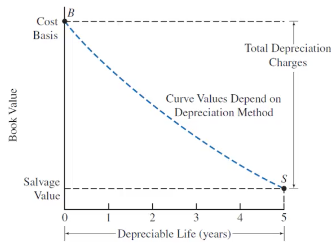
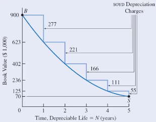
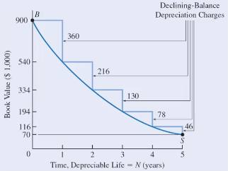

- toc
{:toc}

# Depreciation

**Depreciation** is decrease in value of an asset over time. In an accounting context, depreciation is to systematically allocate the cost of an asset over its depreciable life as the asset deterioates/becomes obsolute.

**Causes of Depreciation (Physical)**

- Physical loss/deteriation/wear (i.e. cars)
- Time-dependent loss even if it's not used (i.e. food)
- Functional loss where asset is less able to meet expectations. Perhaps new and better assets are available that raises expecations, which makes the current assets less valueable.

**Causes of Depreciation (Accounting)**

Depreciation are allowed by government to offset one-time costs to several periods for businesses because of the physical depreciation nature of depreciable assets.

**Depreciable lifetime **is the periods over which an asset is depreciated.

## Depreciation and Expenses

Business costs can either be depreciated or expensed.

Recall that *[expenses](documents/MECH431/l3)* are consumed over the normal course of business/projects. They are considered in a short period of time. This include wages, materials, etc.

**Capital assets** (buildings, equipment) are not expensed when they occur. They are used over longer period of time, so we depreciate it over its life time. (i.e. it wouldn't be representitive to express the cost of a machine that costs \$4M and lasts 20 years into the expense of a single year).

Depreciation get **subtracted** from business revenues as if it is an expense (this is a **book cost** and does not represent real exchance of money).

Depreciating the 'book value' of assets reduces **asset base**, which increases *return on assets* (ratio of profit/assets). So it will make the ratio more appealing to investors. On the otherhand, banks and loaners might see low asset base as risky.

> **Example**: (simple) expensing vs. depreciating
>
> Suppose we have a project: \$5M in capital cost, \$1M annual benefit for 20 years, and 15% MARR.
>
> - *If we choose to expense:* then we pay \$5M upfront, and get steady stream of \$1M for 20 years. The NPV is
>
> $$
> \text{NPV}=1\text{M}(P/A,15\%,20)-5\text M=1.26\text M
> $$
>
> - *If we choose to depreciate:* then we spread the total cost over the life time. Each year we pay \$250k and receive \$1M.
>
> $$
> \text{NPV}=(1\text{M}-0.25\text{M})(P/A,15\%,20)=4.69\text M
> $$
>

## Taxes

Generally, legitimate business expenses are not taxes (i.e. company buying a data-center to host its servers is a legitamate business expense; using company money to buy oneself some sick 24k gold fidget spinners, is not - can be taxed).

Government requires capital expenditures to be deprecaited over useful life time to reflect the benefit of the capital expenditure.

Depreciation is treated as an expense and deducted from revenue. Which reduces *taxable* income and thus reduces tax amount. This is a **tax shield** or tax benefit.

## Depreciable Property

**What should be depreciated?**

Some basic requirements for assets to be depreciated:

- Must be used for business purposed to produce income.
- Must have a long useful life that can be determined.
- Must be an asset that decays/wears out/become obsolete/lose value to the owner.

Exceptions to depreciation include land and leased property.

### Tangible Property

**Tangible properties** are properties that are physical and can be seen and touched. There are two types of tangible properties.

- **Real properties** include land and buildings, these are properties attached to land.
- **Personal properties** are any tangible properties that do not classify as *real property*. (i.e. vehicles, machines)

### Intangible Property

**Intangible properties** are any property that has a value to the owner but non-physical and cannot be directly seen or touched. These properties include intellectual properties, patents, copyrights, etc.

## Depreciation Models

A good model of deprecation should:

- Get value of owned assets accurately
- Get cost of current production accurately
- Reflect tax and profits accurately
- Indicate when to keep or sell assets (support planning)

### Depreciation Guidelines

- We want to deprecaite an asset as quickly as we can and get the largest benefit from tax shield as early as possible in an asset's life (early because time value of money).
- **Cost basis** for deprecaiting of an asset is the initial capital cost for acquiring the asset and putting it into service.
- **Book value** is the net value of the asset while accounting for the depreciation. It is

$$
\text{Book value}=\text{inital capital cost}-\sum_\text{start}^{\text{to date}}\text{depreciation expenses}
$$

- The book value decreases as the asset ages.

### Methods

There are several depreciation methods. **Historical methods of depreciation** include straight-line, sum-of-year-digits, and declining balance. For **tax reporting depreciation methods**, there is capital cost allowance  (CCA) for Canada, and modified accelerated cost recovery system (for USA).

#### Straight-Line

**Straight-line** depreciation is constant annual depreciation (like the example above). It is defined as:

$$
\text{Constant Annual Depreciation}=\boxed{d_i=\frac{B-S}{N}}
$$

Where $$B$$ is the inital capital cost, $$S$$ is the salvage value, and $$N$$ is the depreciable life.

The book value at the end of any period $$t=1,\dots,N$$, is given by

$$
BV_t=B-td_i
$$

> **Example**: meme economy
>
> 9gag just purchased a meme database for \$420,000. The installation cost is \$69,000. The expected life of the database is 9 years with salvage value of \$3.50.
>
> ---
>
> The first cost $$B$$ is just the total initial cost, which is $$\$$420\text k + \$69\text k=489\text k$.
>
> The annual depreciation is $$d_i=\frac{B-S}{N}=\frac{489000-3.5}{9}=54.3\text k$$
>
> The book value at the end of year 4 is $$BV_4=B-td_i=489000-(54333)(4)=271.7\text k$$

#### Sum-of-Year-Digits

**Sum-of-year-digits** (SOYD) depreciation follows geometric characteristc and shifts the depreciation expenses slightly towards early periods. The depreciation is a function of time and is defined as:

$$
d_t=\frac{N-t+1}{\text{SOYD}}\cdot(B-S)
$$

Where $$\text{SOYD}=\frac{N(N+1)}{2}$$, the sum of years' digits (for 4 years of lifetime, the sum is 4+3+2+1).

And where $$d_t$$ is the depreciation value at any time $$t$$, $$N$$ is the depreciable life, $$B$$ is cost basis, and $$S$$ is salvage value.

The book value subtracts all depreciation up to that time so it is:

$$
BV_t=B-\sum_i^t d_i
$$

> **Example**: meme economy
>
> /r/funny imports reposts from 9gag for an initial cost of \$12000, and has a salvage value of \$1 after 4 years. Find book value at the end of year 2.
>
> ---
>
> Listing all variables:
>
> $$
> \text{SOYD}=\frac{4(4+1)}{2}=10,\qquad B=12000,\qquad S=1, \qquad N=4
> $$
>
> The depreciations are:
>
> $$
> d_1=\frac{4-1+1}{10}(12000-1)=4799.6\\
> d_2=\frac{4-2+1}{10}(12000-1)=3599.7
> $$
>
> Finally the book value is:
>
> $$
> BV_2=12000-4799.6-3599.7=3600.7
> $$
>

#### Declining Balance

**Declining balance** depreciation tends to be used widely becase

- Required method for corportate tax purposes (see [CCA](#Capital-Cost-Allowances)).
- Can provide the greatest present value of depreciable tax shields (early money$$\implies$$better).

Declining balance model follows exponential characteristics. It has a **constant deprecaiton rate** $$D$$. The model front-loads the depreciation expenses (where values are lost more early on).

The depreciation at the end of any time $$n$$ is

$$
d_n=D\cdot B\cdot (1-D)^{n-1}=D\cdot BV_{n-1}
$$

This formula is very similar to the *discount rate* formula (recall [time value of money](https://www.muchen.ca/documents/MECH431/l5)).

The book value at the end of any time $$n$$ is

$$
BV_n=B(1-D)^n
$$

#### CCA

*Refer to [section below](#Capital-Cost-Allowance) for CCA.*

## Capital Cost Allowance

**Capital cost allowance** (CCA) is the method for deprecaiting assets for tax purposes (Canada only) using [declining balance](#Declining-Balance) method.

### Asset Class

Assets are grouped into classes with single accounts, the classes get depreciated together. Different classes have different depreciation rate.

Assets may be added to or subtracted from accounts each year.

CCA for any year $$n$$ is given as:

$$
\text{CCA}_n=\text{UCC}_n\times d
$$

Where $$d$$ is the CCA rate (depends on the asset class), $$\text{UCC}_n$$ is the **undepreciated capital cost** or book value (BV) of the asset class eligible for depreciation for year $$n$$.

### Procedure

1. Find or determine the UCC for the beginning of the period

   - This establishes the balance in the UCC account for that asset class. The UCC balance initially could start at 0.

2. Add the *cost basis* of any assets acquired to the UCC

   - Recall [cost basis](#Depreciation-Guidelines) include any initial purchases, installation cost, materials, training, etc.

   - **Required**: half of the cost basis of an asset can be added to the UCC in the year of purchase, the remaining half gets added the following year.

3. Reduce the UCC by the proceeding of any *dispositions* (i.e. selling assets gets assets removed from the class)

   - If the asset market value (sold price) is more than the book value, then the difference is **recaptured CCA**, we need to pay tax on this.
   - If the asset market value is less than the book value, then we have a **loss on disposal**. This means we did not claim enough depreciation expense. We can claim this as an expense and receive tax credit.
   - If the asset market value is greater than the cost basis (sold for more than we initially paid for), then the surplus is **capital gains**. We need to pay tax on this.

4. Calculate the CCA for the period ($$\text{CCA}_n$$) based on UCC balance ($$\text{UCC}_n$$) and the CCA rate ($$d$$) for the class. The UCC balance at the end of that year is reduced by $$\text{CCA}_n$$.

5. If no assets remain in the class, reconcile the remaining UCC balance, and close the account.

   - If the remaining UCC is positive, we have some *loss on disposal* and we can claim it as expense.
   - If the remaining UCC is negative, we have some *recaptured CCA* or *capital gains*. Thus, we treat this as income and would need to pay tax.

