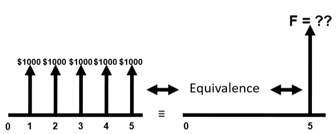
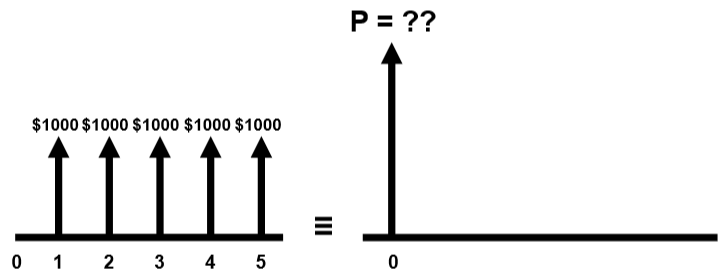
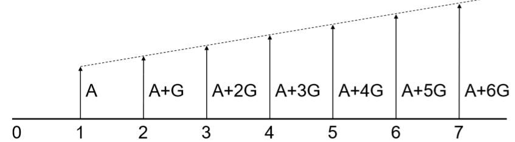
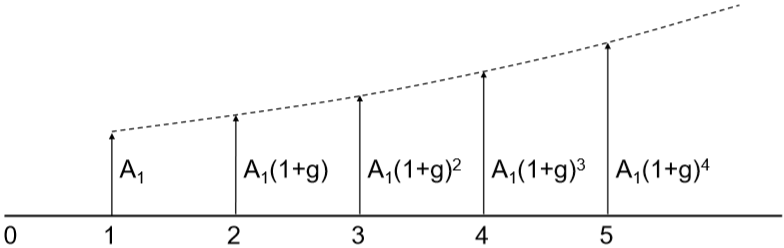
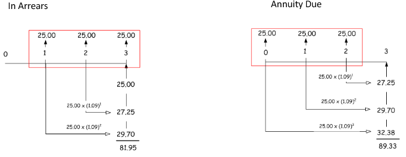

- toc
{:toc}

# Lesson 7: Cashflow Series

Recall **compound interest** in **single payment**:

$$
F=P(1+i)^n,\qquad P=F(1+i)^{-n}
$$

Where $$P$$ is present value, $$F$$ is future value, $$i$$ is interest rate per compounding period, and $$n$$ is number of periods.

For more complex problems, we need to consider added components such as uniform series (constant cashflow over periods) and arithmetic series.

## Uniform Series

**Annuity** are equally-spaced and equally-valued cash flows, continuing for $$n$$ periods. The entire series is equivalent to $$P$$ or $$F$$, with interest $$i$$. **Ordinary annuities** has cashflow at the *end* of each period.

Consider the equivalence of getting some periodic payment (annuity) in the future in present value, because the periodic cashflow occurs at different periods, we expect each individual cashflow to have different present equivalent value:

$$
P_\text{total}=P_1+P_2+\dots
$$

Where $$P_\text{total}$$ is the total equivalent present value, and $$P_j$$ is the equivalent present value for that particular payment/cashflow, for $$j=1,2,\dots$$

Plugging in the formula for present value we get the following. Where $$A$$ is the annuity.

$$
\begin{aligned}
P_\text{total}&=\sum_j F_j(1+i)^{-j}=F\sum_j (1+i)^{-j}=A\sum_j(1+i)^{-j}\\
&=A\left(\frac{(1+i)^n-1}{i(1+i)^n}\right)
\end{aligned}
$$

### Formulas

| Name                          | Notation      | Formula                                      | Notes                                               |
| ----------------------------- | ------------- | -------------------------------------------- | --------------------------------------------------- |
| ***Compound Amount Factor***  | $$(F/A, i, n)$$ | $$F=A\left(\frac{(1+i)^n-1}{i}\right)$$        |                                                     |
| ***Sinking Fund Factor***     | $$(A/F, i, n)$$ | $$A=F\left(\frac{i}{(1+i)^n-1}\right)$$        | Inverse of *compound amount factor*                 |
| ***Capital Recovery Factor*** | $$(A/P, i, n)$$ | $$A=P\left(\frac{i(1+i)^n}{(1+i)^n-1}\right)$$ | Substituting $$F=P(1+i)^{n}$$ from *sink fund factor* |
| ***Present Worth Factor***    | $$(P/A, i, n)$$ | $$P=A\left(\frac{(1+i)^n-1}{i^(1+i)}\right)$$ | Inverse  of *capital recovery factor*               |

> **Example:**
>
> Suppose the following scenario with 10% interest compounded annually.
>
> 
>
> In this case, we can use the *compound amount factor* to determine the equivalent figure value.
>
> $$
> \begin{aligned}
> F&=A\left(\frac{(1+i)^n-1}{i}\right)\\
> &=(1000)\frac{(1+0.10)^5-1}{0.10}\\
> &=\boxed{6105.10}
> \end{aligned}
> $$
>

> **Example:**
>
> Suppose the following scenario with 10% interest compounded manually.
>
> 
>
> In this case, we will use the *present worth factor*:
>
> $$
> \begin{aligned}
> P&=A\left(\frac{(1+i)^n-1}{i(1+i)^n}\right)\\
> &=1000\frac{(1+0.10)^5-1}{0.10(1+0.10)^5}\\
> &=\boxed{3790.8}
> \end{aligned}
> $$
>

## Arithmetic Series

When the cashflow isn't constant, uniform series won't work. **Arithmetic series** assumes that we have a linearly increasing cashflow AKA **arithmetic gradient**.

The series consists of two components:

1. Uniform series component ($$A$$)
2. Gradient component ($$G$$)

Thus, the present value (similarly future value) calculations will have two components:

$$
P= P'+P''
$$

Where $$P'$$ is the *present worth factor* for the uniform series, as seen in [here](#uniform-series). And $$P''$$ is the *present worth factor* for the gradient. $$P''$$ follows the notation $$P''=G(P/G, i, n)$$.

$$
P''=G\left(\frac{(1+i)^n-i\cdot n-1}{i^2(1+i)^n}\right)
$$

### Gradient Equivalent Annuity

It's possible to treat the gradient series as an equivalent annuity, $$A_{eq}$$, AKA **arithmetic gradient uniform series factor**. Using $$A_{eq}$$ we can treat gradient series component as a uniform series.

$$
A_{eq}=G\left(\frac{1}{i}-\frac{n}{(1+i)^n-1}\right)
$$

## Geometric Series

The period-by-period cashflow grows by a constant rate, $$g$$, expressed as percentage. And $$A_1$$ is the first annuity.

**Case 1.** interest rate and growth rate is the same ($$i=g$$):

Then the present value equivalence of future cashflow is

$$
P=A_1\frac{n}{(1+i)}
$$

**Case 2.** interest rate and growth rate differs ($$i \neq g$$):

*Compound amount factor* is given by:

$$
F=A_1\left(\frac{(1+i)^n-(1+g)^n}{i-g}\right)
$$

*Present worth factor* is given by:

$$
P=A_1\left(\frac{1-(1+g)^n(1+i)^{-n}}{i-g}\right)
$$

> **Example:**
>
> A machine requires repair every 4 months. The first repair is \$1000. The cost will grow by 5% every 4 months after the first repair. Find the present value of all repairs for the next 6 years. Interest rate is 12.5% compounded every 4 months.
>
> List of all givens: $$A_1=1000$$, $$g=0.05$$, $$i=\frac{0.125}{3}=0.0417$$, $$n=6(3)=18$$.
>
> Because $$i\neq g$$, this falls under case 2. Then plug in numbers:
>
> $$
> \begin{aligned}
> P&=A_1\left(\frac{1-(1+g)^n(1+i)^{-n}}{i-g}\right)\\
> &=(1000)\left(\frac{1-(1+0.05)^{18}(1+0.0417)^{-18}}{0.0417-0.05}\right)\\
> &=18.58\text k
> \end{aligned}
> $$
>

## Annuities Due

So far all the costs/payments are at the end of the period (recall **ordinary annuity / annuity in arrears**). **Annuity due** just means that the cashflow is at the beginning of the period. Therefore will slightly change the formulas.

[3]: http://www.frickcpa.com/tvom/tvom_annuity_due.asp	"Diagrams by David Fric"

Because essentially we can treat annuity due as shifting one period forward, the relationship is simple. To obtain annuity due values, multiply existing formula by $$\boxed{1+i}$$.

> **Example:**
>
> Want to lease a vehicle valued at \$42,500. Make monthly payments in advance for 4 years at an interest rate of 2.75% compounded monthly. Calculate payment required.
>
> *What's known:*
>
> - We know that we have to pay monthly payment, so this is a *uniform series* problem
> - Present value $$P=42500$$
> - Number of periods $$n=4\times 12=48$$
> - Interest rate is $$i=0.0275\div 12=0.0023$$
> - Annuity $$A$$ is what we're after as it is the uniform monthly payment value.
>
> Using *present worth factor* formula **multiply with $$1+i$$ because of annuity due**:
>
> $$
> \begin{aligned}
> P&=A\left(\frac{(1+i)^n-1}{i(1+i)^n}\right)(1+i)\\
> 42500&=A\left(\frac{(1+0.0023)^{48}-1}{0.0023(1+0.0023)^{48}}\right)(1+0.0023)\\
> \end{aligned}
> $$
>
> Isolating for $$A$$, we get:
>
> $$
> A=\frac{42500}{\left(\frac{(1+0.0023)^{48}-1}{0.0023(1+0.0023)^{48}}\right)(1+0.0023)}=934
> $$
>

## Perpetuities

**Perpetuities** or **perpetual annuities** are series with perpetual payments (self-sustaining). Because future value is $$\infin$$ we only consider present value:

$$
P=\frac Ai
$$

Same logic of annuities due applies for perpetuities:

$$
P=\frac Ai \times(1+i)
$$

For geometric growth, also account for $$g$$ in the equation. (the growth will compensate the interest):

$$
P=\frac{A}{i-g}
$$

Note that $$i>g$$ for perpetuity. Otherwise we will eventually run out of money if the growth is faster than interests.

## Differing Periods

When *payment period* (such as for annuities) and *compounding period* (such as for interests) is not the same, we need to either:

1. compute effective interest rate for each payment period; use the formula:

   $$
   (1+i_{eq})^p=(1+i)^c
   $$

   Where $$i_{eq}$$ is the equivalent / effective interest rate, and $$p$$ is number of payment periods per year, and $$c$$ is the number of compounding periods per year. Interest rate $$i_{eq}$$ can then be used as $$i$$ in formulas.

2. compute equivalent payment amounts for each compounding period

[^1]: Engineering Economic Analysis 10th Edition
[^2]: Mark Hollet’s slides

