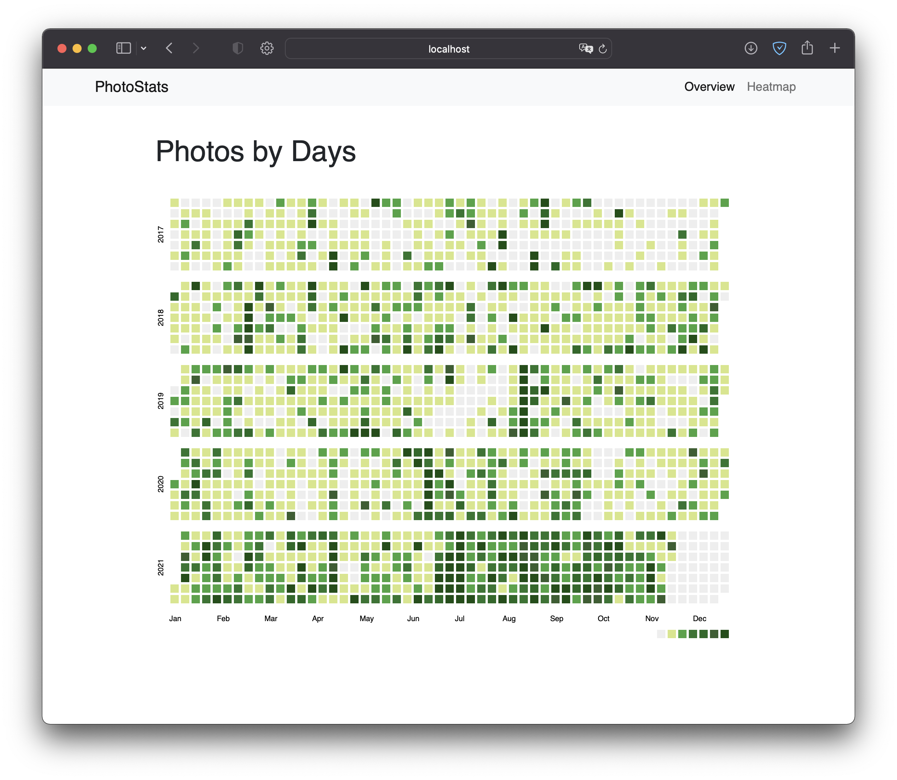
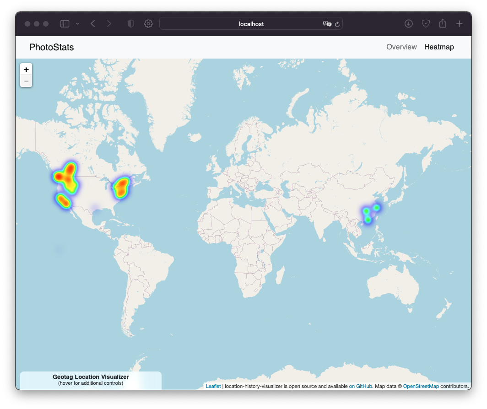
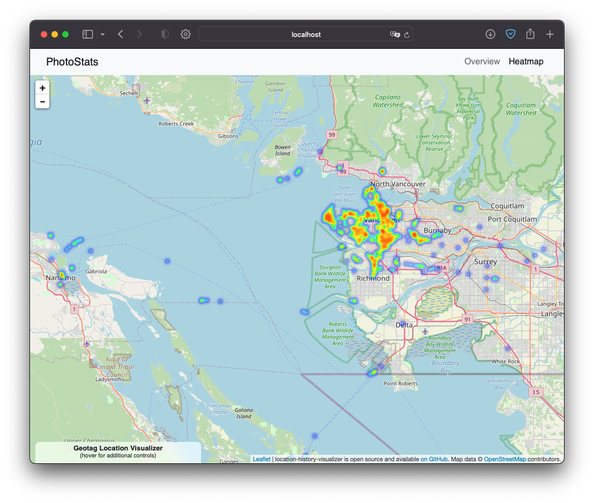
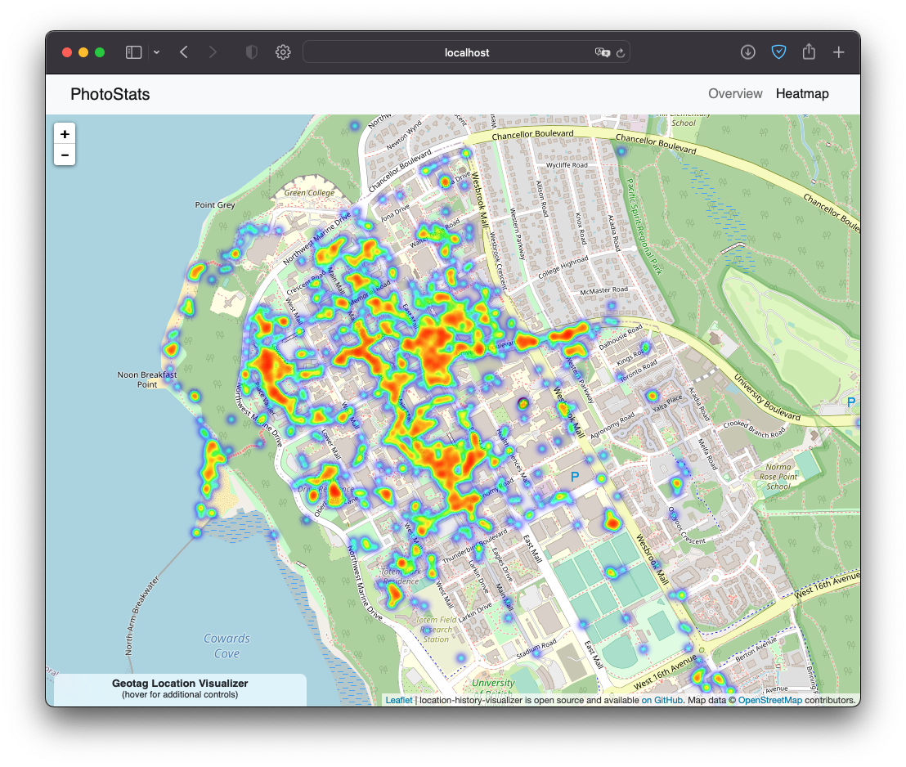
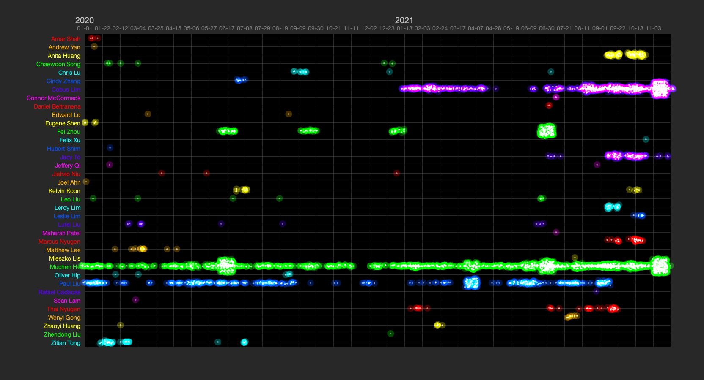

# Nostalgic Trip using Photo and Data Journalling

This is the creative portion of the NURS 180 project. This is a show-and-tell-style blog depicting of how I find comfort in data and data visualization, featuring my own data I collected in my life.

---

I consider myself to be a nostaligic person and a data-hoarder -- meaning that I love taking photos, logging in journals, and collecting all kinds of data.

Whenever I get overwelmed with work and stress, I find myself often going to my photo library reliving the memories. You might say that this photos library just look like any other -- but actually it's more than that.

For starters, I put everything into a single library -- sorted by date captured (not date saved or modified). This allows me to **spatially** traverse my memory in chronological order. I also try to geotag (adding GPS data) and facial recognition data to each photo so I know exactly where and who is in the story the photos tell.

The result is the ability to fetch a photographic memory from any point in time almost instantly. I could go back to the summer of 2018 and relive the moments spent with my family. I could then time-travel to 2010, when I first started junior high school and recognize and pride myself on how far I've come.

Because I'm a computer nerd, I've also decided to write code to hack my photo library and output some interesting visualizations that are pretty to look at. For example, in one experiment I plotted a calendar-heatmap view of the photos I've taken:

The GPS data? I can use them to plot a heat map of all the places I've taken places at. The more concentrated that place is, the hotter it'll look. 

I consider this a form of self-care as I often find myself spending an hour or two looking at the heat map -- recalling the places I've been.

What about the face data? I wrote another program to plot their appearences in my photos. The x-axis is time, and the more they vibrant and bright their row looks, the more photos I have of them around that time -- a pretty good indication of how frequent our social interactions are. This serve as a visual reminder of the people that bring me joy, and that I should message them if it's been too long.

Along with my written journals Finally, I also track my daily mood from the scale of 1-5, represented on the next image from red to green dot:

---

Grounding myself in data is a way for me to reduce stress -- perhaps because for me forgetting things and being uncertain is one of my biggest fears (especially considering you won't even know you had forgotten it). 

The programs I wrote myself are open-source and free to use: <https://github.com/FSXAC/PhotoStats>

